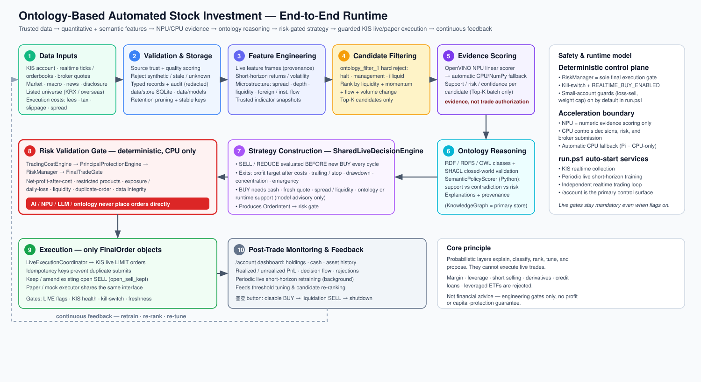

# Personal Investment Agent

KIS 실시간 데이터, 온톨로지 기반 근거 추론, 단기 학습 모델, 결정론적 리스크 게이트를 묶은 개인용 자동 투자 분석/운영 시스템입니다. 현재 기준의 대표 실행 경로는 Windows의 `run.ps1`이고, Raspberry Pi에서는 CPU-only 런타임과 LCD 키오스크 GUI를 별도로 제공합니다.

> 핵심 원칙: LLM, NPU, ML, 온톨로지는 분류, 랭킹, 설명, 보조 점수만 제공합니다. 실제 주문은 `RiskManager`, 비용/원금보호/신선도/중복주문/KIS 런타임 게이트를 모두 통과한 `FinalOrder`만 제출합니다.



## 현재 런타임 요약

`run.ps1`은 로컬 Windows 운영용 표준 런처입니다. 기본 포트는 `8010`이고, 서버 준비 후 `http://127.0.0.1:8010/account`를 관리 브라우저 창으로 엽니다. 이 창을 닫으면 서버도 같이 종료됩니다.

시작 시 기본적으로 수행되는 일:

- KIS 실계좌 읽기, 잔고/현금/보유종목 스냅샷 갱신
- KIS 실시간 체결가/호가 수집과 브로커 quote 갱신
- 실시간 feature frame 생성과 live short-horizon 모델 주기 학습
- 독립 실시간 자동거래 루프 시작
- SELL/REDUCE 평가를 BUY보다 먼저 실행
- 기존 미체결 SELL 주문은 의미 있는 가격 변화가 있을 때만 정정, 아니면 유지
- BUY는 현금, spread, 유동성, quote freshness, 온톨로지/런타임 근거, 리스크 게이트를 통과해야 제출

Windows 기본값은 live-capable입니다. `run.ps1`은 `TRADING_MODE=live_trading`, `LIVE_TRADING_ENABLED=true`, `KIS_LIVE_ENABLED=true`, `LIVE_ORDER_SUBMIT_ENABLED=true`, `AUTO_START_REALTIME_TRADING=true`를 프로세스 환경에 설정합니다. 안전성은 live flag를 끄는 방식이 아니라, 계좌/시장 데이터 신뢰도와 최종 게이트에서 보장합니다.

## 빠른 실행

```powershell
python -m venv .venv
.\.venv\Scripts\Activate.ps1
pip install -e .
.\run.ps1
```

수동 서버 실행:

```powershell
python .\run.py --host 127.0.0.1 --port 8010
```

KIS 실계좌 연동 전에는 `config/secrets/kis_api_keys.env.example`을 `config/secrets/kis_api_keys.env`로 복사한 뒤 값을 채웁니다. 토큰/계좌 확인은 아래처럼 따로 검증할 수 있습니다.

```powershell
python scripts/check_kis_connection.py --account
python scripts/live_readiness_check.py
```

## 웹 GUI

현재 운영 중심 화면은 `/account`입니다. 기존 루트 화면(`/`)은 연구/진단/수동 실행용 기능이 남아 있고, 실제 계좌 기반 운용에서는 `/account`를 먼저 봅니다.

주요 화면:

- `/account`: 계좌/자산 대시보드. 총자산, 현금, 외화 현금, 보유종목, 실현/평가손익, 자산 배분, 최근 거래, 진단 로그를 보여줍니다.
- `/account`의 실시간 판단 흐름: 자동거래 루프의 cycle, SELL/BUY 평가 수, 제출/정정/차단 건수, 최근 실행 판단, 최근 보류 사유를 표시합니다.
- `/account`의 종료 버튼: 먼저 `REALTIME_BUY_ENABLED=false`로 신규 BUY를 막고, 라이브 게이트를 통과하는 profit-seeking SELL 청산 주문을 제출한 뒤 서버 종료를 예약합니다.
- `/display/ontology`: 온톨로지 지식 그래프와 추론 상태를 전체 화면으로 보여주는 시각화 화면입니다.
- `/display`: Raspberry Pi LCD에 맞춘 trade-reason board입니다. 최근 자동거래 판단과 사람이 읽을 수 있는 이유 카드를 표시합니다.

주요 API:

- `GET /api/account/dashboard`
- `GET /api/account/asset-history?range=1D|1W|1M|3M`
- `GET /api/realtime-trading/status`
- `POST /api/live-trading/terminate?shutdown=true`
- `GET /api/trade-explanations`
- `GET /api/ontology/graph`
- `GET /api/realtime/runtime`
- `GET /api/npu/runtime`

## Raspberry Pi GUI와 배포

Pi 패키지는 `packaging/raspberrypi/`에 있습니다. Pi에서는 OpenVINO/NPU 없이 CPU-only로 실행되며, 기본값은 read-only입니다.

```bash
bash packaging/raspberrypi/bootstrap.sh
bash packaging/raspberrypi/run.sh
```

Pi 런처 특징:

- `APP_HOST=0.0.0.0`, `APP_PORT=8010`으로 LAN에서 `http://<pi-ip>:8010/account` 접속
- `ONTOLOGY_ACCELERATOR=CPU`, `ONTOLOGY_NPU_ENABLED=false`
- `TRADING_MODE=read_only`, `LIVE_ORDER_SUBMIT_ENABLED=false`
- 기존 `data/`, `data/store/`, `data/models/`를 그대로 재사용
- `pi.env`로 포트, live flag, workload 크기, LLM 설정을 지속적으로 오버라이드

LCD/키오스크 GUI:

```bash
bash packaging/raspberrypi/pi-dashboard-launch.sh
```

이 스크립트는 `personal-investment.service`를 시작한 뒤 `/api/trade-explanations`가 준비될 때까지 기다리고, Chromium을 `--kiosk --app=http://127.0.0.1:8010/display`로 실행합니다. 온톨로지 전체 화면은 `PI_DASHBOARD_URL=http://127.0.0.1:8010/display/ontology`로 바꿔 띄울 수 있습니다.

자세한 내용은 [docs/raspberry_pi_deployment.md](docs/raspberry_pi_deployment.md)와 [packaging/raspberrypi/README.md](packaging/raspberrypi/README.md)를 참고하세요.

## 시스템 흐름

```text
KIS account + realtime ticks/orderbooks + broker quotes
  + public market/macro/news/disclosure data
  -> source trust, freshness, provenance, local SQLite/model storage
  -> live feature frames, indicators, short-horizon artifacts
  -> candidate filtering and NPU/CPU evidence scoring
  -> RDF/RDFS/OWL semantic labels + SHACL validation + Python policy scoring
  -> SharedLiveDecisionEngine
       SELL/REDUCE first
       BUY second only with cash, freshness, spread/liquidity, and supporting evidence
  -> TradingCostEngine + PrincipalProtectionEngine + RiskManager + FinalTradeGate
  -> LiveExecutionCoordinator
  -> KIS limit orders, order journal, audit logs, dashboards, feedback artifacts
```

## 안전 모델

- LLM 또는 LLM-like 컴포넌트는 주문을 실행하지 않습니다.
- NPU/OpenVINO 출력은 숫자 근거 점수일 뿐 주문 승인 권한이 아닙니다.
- live short-horizon 모델은 기본적으로 advisory-only입니다. `REALTIME_MODEL_AUXILIARY_ONLY=true`이면 모델 단독 BUY는 거부됩니다.
- synthetic/sample/hash-derived 데이터는 오프라인 fixture에서만 허용하고, paper/live 판단 근거로 쓰지 않습니다.
- margin, leverage, derivatives, short selling, credit loan, leveraged ETF는 거부 대상입니다.
- live 주문은 `LiveExecutionCoordinator`를 통해 limit order로만 제출합니다.
- audit log는 credential, token, account number, broker secret을 재귀적으로 마스킹합니다.

## 주요 디렉터리

| 경로 | 역할 |
| --- | --- |
| `src/app/web.py` | FastAPI 앱, 루트 GUI, API, realtime/live runtime orchestration |
| `src/app/web_account_routes.py` | `/account` 대시보드 라우트 |
| `src/app/account_dashboard.py` | 계좌/현금/보유종목/거래/자산 히스토리 payload 구성 |
| `src/app/static/account_dashboard.*` | `/account` 전용 프론트엔드 |
| `src/app/trading/` | realtime engine, shared decision engine, execution policy, runtime guard |
| `src/app/execution/` | KIS broker adapter, live coordinator, order journal/status tracking |
| `src/app/graph/` | custom graph, RDF/OWL/SHACL layer, NPU/CPU evidence scorers |
| `src/app/features/` | indicator, semantic feature, live feature frame, short-horizon features |
| `src/app/models/` | live training, artifact registry, CPU/OpenVINO inference backend |
| `config/` | strategy, cost, risk, source, live safety example configs |
| `packaging/raspberrypi/` | CPU-only Pi install/run/service/kiosk scripts |
| `docs/` | architecture, live trading, safety gates, Pi deployment, ontology docs |

## 문서 지도

- [docs/README.md](docs/README.md): 문서 인덱스
- [docs/architecture.md](docs/architecture.md): 모듈/엔드포인트/운영 모드 상세
- [docs/live_trading_runbook.md](docs/live_trading_runbook.md): 실거래 운영 절차
- [docs/live_trading_safety_gates.md](docs/live_trading_safety_gates.md): 제출/BUY/SELL 게이트와 rejection code
- [docs/realtime_short_horizon_policy.md](docs/realtime_short_horizon_policy.md): 실시간 단기 모델 정책
- [docs/ontology_standardization_report.md](docs/ontology_standardization_report.md): RDF/OWL/SHACL 온톨로지 설계
- [docs/npu_runtime_architecture.md](docs/npu_runtime_architecture.md): NPU/CPU 경계와 fallback
- [docs/raspberry_pi_deployment.md](docs/raspberry_pi_deployment.md): Pi CPU-only 배포와 키오스크

## 테스트

전체 테스트:

```powershell
python -m pytest
```

문서 변경 후 빠르게 확인하기 좋은 테스트:

```powershell
python -m pytest tests/test_web_live_flags.py tests/test_web_graph_payload.py tests/test_account_dashboard.py tests/test_kiosk_display_overview.py
```

환경에 따라 OpenVINO/NPU, KIS 실계좌, local LLM 관련 테스트는 optional dependency나 secrets 상태에 영향을 받을 수 있습니다.
