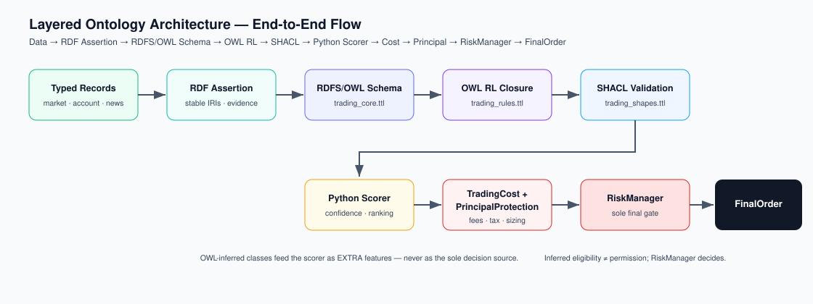

# Architecture

## Current Runtime Contract

As of the current `run.ps1` entry point, the system is a guarded KIS live-capable realtime runtime. KIS realtime collection, read-only account probing, periodic live short-horizon training, and the independent realtime trading loop can start automatically. Numeric ontology/candidate evidence scoring requests OpenVINO `NPU` and falls back to CPU when unavailable; final action selection, graph explanations, risk checks, order gating, idempotency, and broker submission remain deterministic CPU-controlled paths. NPU output is evidence, not trade authorization.

## Principle

The system separates probabilistic reasoning from deterministic control. Classifiers, semantic layers, ontology screening, and strategy scoring can explain, classify, rank, tune, and propose. They cannot directly execute live trades.

Every proposed order must pass `RiskManager` before it can become a `FinalOrder`. Approved live orders are limit orders submitted only through `LiveExecutionCoordinator`. The current app supports mock, local paper, KIS paper, live-readiness, hypothetical, in-memory simulation, and KIS live auto-trading paths. In the `run.ps1` runtime, live flags are enabled for the local process, but live submission is still constrained by runtime gates, KIS health checks, idempotency, cost/risk rules, source freshness, and kill-switch controls.


The diagram is the high-level companion to this document. The sections below map each box in that flow to the concrete modules and API boundaries in the repository.

## Runtime Flow

```text
KIS live account + KIS realtime ticks/orderbooks + KIS broker quotes
  -> realtime SQLite stores and account dashboard
  -> live feature frames + live short-horizon model artifacts
  -> ontology/NPU evidence and realtime candidate discovery
  -> SharedLiveDecisionEngine
  -> RiskManager / FinalTradeGate
  -> LiveExecutionCoordinator
  -> KIS live limit orders, open-order keep/amend, audit/status surfaces
```

Detailed flow:

1. Public collectors load listed-stock universes and fetch configured market, macro, disclosure, news, RSS, HTML, and dynamic-page data.
2. Normalizers convert source output into typed records with source metadata.
3. `LocalResearchStore` persists normalized records in `data/store/research.sqlite3`.
4. `build_analysis_context` merges stored research, fresh research, sample fallback data, realtime quotes/executions, indicators, temporal frames, ontology graph, reasoning paths, signals, intents, and risk results.
5. `ontology_filter_1` screens a large universe with low-cost liquidity/momentum/flow features before heavier analysis.
6. Indicator engines calculate interpretable metrics.
7. The ontology layer links companies, sectors, tickers, indicators, events, time buckets, risks, tuning modes, and signals.
8. The ontology reasoner infers buy candidates, risk-adjusted sizing, contradictions, and reasoning paths.
9. Strategy modules combine indicator, ontology, and domestic investor-flow evidence to produce `StrategySignal` and `OrderIntent` records.
10. `RiskManager` validates each intent against hard rules.
11. `FinalOrder` objects are submitted through mock/paper executors or through `LiveExecutionCoordinator` for live KIS limit orders when all live gates pass.
12. The realtime engine evaluates SELL/REDUCE before BUY, keeps existing open SELL orders when the replacement price is effectively unchanged, and blocks BUY when `REALTIME_BUY_ENABLED=false`.
13. Audit logging records inputs, mode changes, refreshes, decisions, rejections, submissions, and outputs, with recursive redaction for credentials, tokens, account numbers, and broker secrets.

## Current Acceleration Boundary

The current system uses NPU only for compatible dense numeric evidence work. It does not move the trading control plane to NPU.

Current verified path:

1. `run.ps1` sets `ONTOLOGY_ACCELERATOR=NPU`, `OPENVINO_DEVICE=NPU`, `OPENVINO_HINT_PERFORMANCE_MODE=LATENCY`, and `ONTOLOGY_NPU_BATCH_SIZE=4096`.
2. `src/app/graph/runtime.py` checks OpenVINO devices and reports `active_backend=NPU` when `NPU` is available.
3. `src/app/graph/npu_classifier.py` builds an OpenVINO linear scorer and compiles it to the requested device for ontology candidate evidence.
4. `src/app/trading_pipeline.py` calls that scorer in `_rank_accepted_with_npu` to rank accepted lightweight candidates.
5. `src/app/graph/builders.py` can also call the same classifier while building graph evidence.
6. If OpenVINO import, device discovery, compile, or inference fails, the same schema falls back to CPU and reports the fallback reason.

CPU-only authoritative paths:

- source validation and synthetic/stale-data blocking
- graph traversal and explanation construction
- strategy action selection
- `TradingCostEngine`, `PrincipalProtectionEngine`, `RiskManager`, and FinalTradeGate
- idempotency, open-order keep/amend logic, and broker submission through `LiveExecutionCoordinator`

Runtime status is exposed through `/api/ontology/runtime`, `/api/realtime/runtime`, and `/api/npu/runtime`.

## Public Data Layer

Implemented in `src/app/research/service.py` and `src/app/data`.

- `RssNewsCollector` collects RSS events and can optionally fetch linked articles.
- `HtmlResearchCollector` fetches allowed static pages.
- `DynamicPageCollector` uses browser rendering when Playwright is installed.
- `StooqMarketDataCollector`, `YahooChartMarketDataCollector`, and `AlphaVantageDailyMarketDataCollector` collect daily/latest market snapshots where available.
- `OpenDartDisclosureCollector`, `EcosMacroCollector`, and `FredMacroCollector` use optional environment API keys.
- `ResearchService` loads the configured US/overseas and KRX listed universe, stores a `listed_universe_catalog` record, and creates deterministic `listed_universe_reference` snapshots for the current rotating batch.
- `RawArchive` stores raw source records as JSON when configured.
- Failed sources can be retried with configurable attempts and backoff.

The full listed universe is tracked, but expensive per-symbol collection is bounded by a rotating cursor so the app does not block on thousands of symbols during one refresh.

## Storage Runtime

The active runtime uses one realtime-only data layout:

```text
data/store/research.sqlite3
data/raw/
data/models/<model_family>/
data/reports/
data/synthetic_disabled/
```

`LocalResearchStore` stores records in a generic SQLite table keyed by `(kind, record_key)`. It prunes old records according to `RESEARCH_RETENTION_DAYS`, deduplicates with stable keys, and rejects synthetic/simulated records.

`ModelArtifactStore` writes versioned JSON artifacts and `<model>.latest.json` files under `data/models`. It rejects simulated model artifacts.

`app.data.source_policy` centralizes source-type inference, trust defaults, quality scoring, and live-decision eligibility. Official broker/exchange/disclosure sources receive the highest trust, while dynamic pages, unofficial chart endpoints, sample, synthetic, and unknown sources are downgraded or blocked for live decisions.

## Web Runtime

`run.py` inserts `src` into `sys.path` and calls `app.run.main`. `src/app/run.py` performs startup checks, selects a port unless strict mode is requested, then starts `uvicorn app.web:app`.

`run.ps1` starts the app on strict port `8010` by default, opens a managed browser window when possible, and stops the server when that window closes.

Startup services in the current `run.ps1` runtime:

- `AUTO_START_KIS_REALTIME_COLLECTOR=true` starts KIS realtime tick/orderbook collection.
- `AUTO_START_LIVE_TRAINING=true` starts periodic live short-horizon model retraining.
- `AUTO_START_REALTIME_TRADING=true` starts the independent realtime trading loop.
- `AUTO_START_LIVE_READINESS=true` starts a read-only KIS live-readiness account check automatically.
- The web UI does not require manual learning, refresh, or live-readiness buttons; `/account` is the primary operations dashboard.

Important UI/API paths:

- `GET /`: single-page web UI
- `GET /api/status`: account, report, risk, and refresh status
- `GET /api/research`: configured research result, events, graph triples, and reasoning paths
- `POST /api/research/refresh`: background refresh trigger
- `GET /api/research/diagnostics`: source, store, runtime, and data-policy diagnostics
- `GET /api/research/volume`: local store volume summaries
- `GET /api/ontology/graph`: graph payload for visualization
- `GET /api/ontology/runtime`: ontology runtime status
- `GET /api/realtime/runtime`: acceleration, event LLM, NPU, risk-policy, and operation-mode diagnostics
- `POST /api/live-snapshot`: goal-aware live snapshot, executed in a threadpool
- `POST /api/assess-goal`: target feasibility and compromise goals
- `POST /api/start`: accepted-goal mock KIS paper-trading run
- `POST /api/operation-mode/start`: learning, legacy testing, KIS paper-trading, live-readiness, or live-trading mode start
- `GET /api/operation-mode/status`: operation and learning state
- `POST /api/operation-mode/stop-learning`: stop realtime learning collection
- `POST /api/paper-trading/start`: start the current paper-trading simulation session
- `POST /api/paper-trading/step`: advance the current paper-trading simulation when due
- `GET /api/paper-trading/status/{demo_id}`: current paper-trading session state
- `POST /api/paper-trading/pause/{demo_id}`: pause a paper-trading session
- `POST /api/paper-trading/resume/{demo_id}`: resume a paper-trading session
- `POST /api/paper-trading/cleanup/{demo_id}`: remove an expired paper-trading session
- `POST /api/mock-kis/orders`: mock KIS limit order endpoint
- `GET /api/mock-kis/orders/{order_id}`: mock order status
- `GET /api/mock-kis/portfolio`: mock portfolio state
- `POST /api/mock-trading/run`: deterministic mock trading cycle
- `GET /api/mock-trading/performance`: mock-trading performance summary
- `GET /account`: KIS account dashboard, holdings, cash, asset history, realtime decision flow, rejection reasons, and termination button
- `GET /api/account/dashboard`: live account dashboard payload
- `GET /api/account/asset-history`: minute-bucketed total-asset history
- `GET /api/realtime-trading/status`: independent realtime trading engine status, recent events, and decision diagnostics
- `GET /api/ai/validation`: event LLM, live model, training, and ontology/NPU validation
- `GET /api/live-training/status`: live short-horizon training status
- `POST /api/live-trading/terminate`: disable BUY, submit profit-seeking liquidation SELL orders, and optionally schedule server shutdown

## Operation Modes

Implemented in `src/app/realtime/mode_manager.py`.

- `learning`: realtime collection with supervised PnL-label artifact updates.
- `testing`: backward-compatible legacy paper-trading replay.
- `paper_trading` / `paper_trading_test`: KIS paper-trading API check plus local paper-trading flow.
- `live_readiness` / `live_trading_test`: KIS live authentication/readiness check; no broker orders are submitted.
- `live_trading`: realtime KIS live auto-trading loop; live brokerage execution remains guarded by runtime, KIS, risk, source, cost, and idempotency gates.

All modes use the unified realtime data store and model root. Synthetic data is not allowed as input to these modes.

KIS realtime collection, live training, read-only live-readiness, and realtime trading are automatic startup services in the `run.ps1` runtime. The operation-mode API still supports explicit starts for diagnostics, tests, and controlled manual rechecks.

## Agent Boundaries

### Portfolio and Capital Management Agent

Reads portfolio state and produces allocation suggestions, exposure summaries, and rebalancing candidates. It does not access secrets and does not call brokerage order APIs.

### Data Crawling and Classification Agent

Classifies official API, RSS, disclosure, HTML, dynamic-page, and news data into structured event records. It must not fabricate missing values and must preserve source metadata.

### Ontology-Based Strategy and Execution Planning Agent

Uses typed indicators and graph relationships to generate explainable signals and order intents. It must separate facts, assumptions, inferred relationships, and conclusions.

For domestic stocks, the ontology layer also evaluates investor-flow records when they are available. KRX-style foreign, institutional, and individual net buying/selling are normalized by trading value and converted into ontology evidence. The formulas are intentionally transparent:

- `imbalance_g = net_buy_g / trading_value`
- `informed_imbalance = 0.55 * foreign + 0.45 * institution - 0.20 * retail + 0.15 * program`
- `retail_absorption = -retail * (0.55 * foreign + 0.45 * institution)`
- `kyle_lambda_proxy = price_change_rate / total_imbalance`, only when imbalance is large enough to avoid division noise
- `signed_impact_efficiency = price_change_rate * informed_imbalance`

The graph stores these as `hasFlowMetric` triples and then emits semantic evidence such as `InformedOrderFlowImbalance`, `RetailSupplyAbsorbedByInformedFlow`, `OrderFlowPriceConfirmation`, or distribution/risk counterparts. Unusual volume/program-pressure patterns are labeled only as `SUSPECTED_SMART_MONEY`; this is a cautious inference, not a confirmed investor identity. These adjustments remain advisory and still flow through `OrderIntent -> RiskManager -> FinalOrder`.

### Goal-Directed Planner

Uses the selected target return and target period to create a goal execution plan. It may rank BUY, SELL, REDUCE, and HOLD signals, but every generated intent still has to pass `RiskManager`.

## Deterministic Modules

### Candidate Filter

`ontology_filter_1` evaluates lightweight snapshots before chart-heavy analysis. It rejects halted, management-status, illiquid, or very low-liquidity names. It ranks candidates using liquidity score, volume change, price momentum, foreign/institution/retail flow, suspected smart-money accumulation/distribution, and breakout flags.

### Risk Manager

Rejects orders that violate live-trading disablement, action/type rules, daily loss, trade count, liquidity, volatility, duplicate-order, data-integrity, restricted-product, single-stock, intraday, sector, cash, or deposit checks.

### Order Executor

Accepts only `FinalOrder` objects. The current implementation supports mock/paper interfaces. `KisDevelopersApiClient` implements KIS domestic cash-stock REST calls for token issuance, hashkey creation, cash limit orders, order-status polling, and balance lookup. It loads ignored local secrets from `config/secrets/kis_api_keys.env`, chooses paper or live base URLs by mode, and remains disabled unless `KIS_LIVE_ENABLED=true`.

### Paper-Trading Simulation

`StreamingAcceleratedDemo` is the current in-memory paper-trading engine despite the legacy class name. It generates synthetic one-minute charts for selected universe candidates, screens/ranks candidates, builds ontology evidence, generates goal-directed intents, validates them through `RiskManager`, and updates simulated cash/holdings/trades.

If a stale or missing `demo_id` is sent to `/api/paper-trading/step`, the API returns HTTP 200 with `status = expired` so the UI can stop cleanly.

Simulation initial cash is automatically resolved from the latest read-only KIS live account basis when available. If a paper-trading start request uses `initial_cash_source = auto` and no basis is cached, the backend attempts one read-only live account refresh before falling back to the default. Profit-gain scaling is not a UI setting; it is derived from target return, target horizon, account size, and live cash weight.

### Audit and Monitoring

Audit logs are append-only JSONL records with timestamps and structured payloads. Recursive redaction masks common credential, token, account, authorization, and broker-secret fields before data is written.

### Model and Inference Hooks

The model layer currently provides no-lookahead dataset rows, training-plan summaries, ranked-signal evaluation summaries, a CPU NumPy signal backend, an OpenVINO/NPU signal backend with CPU fallback, and an OpenVINO export hook. Concrete production model conversion is still intentionally explicit and must be supplied by a trained model adapter.

## Current Implementation Choice

The current workspace uses FastAPI/Uvicorn for the web runtime, SQLite for local persistence, JSON model artifacts for lightweight learning outputs, and an in-memory graph. PostgreSQL, TimescaleDB, Neo4j/RDF4J, pgvector, APScheduler, and Prometheus can still be added phase-by-phase once the core contracts are stable.

## Standards-Based Ontology Framework (Hybrid RDF/RDFS/OWL + SHACL)



### Before / after


- **Before:** a custom in-memory triple store (`app.graph.KnowledgeGraph`) of `(subject, predicate, object,
  evidence_id)` string tuples, with a rule-based scorer named `OntologyReasoner` and a flat list of class /
  predicate name strings in `ontology.py`. No IRIs, no class/property hierarchy, no OWL reasoner, no SHACL,
  no SPARQL, no named graphs, no formal provenance.
- **After:** the custom graph remains the primary store, and an *additive* standards-based layer projects it
  into RDF (`rdflib`), materializes semantic classes with OWL RL (`owlrl`), validates operational
  constraints with SHACL (`pyshacl`), and represents provenance with explicit evidence individuals. The
  scorer is renamed `SemanticPolicyScorer` (alias `OntologyReasoner` retained) to make explicit that it does
  numerical policy scoring, not logical reasoning.

### Layers

1. **RDF assertion graph layer** (`rdf_graph.py`, `rdf_adapter.py`). Converts internal records / custom
   triples / evidence into RDF with stable IRIs (`res:`, `ev:`) under a named graph per analysis cycle
   (`rdflib.Dataset`). Emitted signal/risk object strings map to canonical `tr:` individuals so OWL rules fire.
2. **RDFS/OWL schema layer** (`src/app/ontology/trading_core.ttl`). Classes, `rdfs:subClassOf` hierarchy,
   object/data properties, `rdfs:domain`/`rdfs:range`, `rdfs:subPropertyOf`, and `owl:disjointWith`
   (Approved vs Rejected, Buy vs Sell intent, Eligible vs Forbidden). OWL 2 RL compatible.
3. **OWL RL materialization layer** (`owl_reasoner.py`, `semantic_materializer.py`). Merges the cached schema
   with the scoped assertion graph and runs `owlrl` closure. Returns the enriched graph plus the separately
   identified inferred triples. Classification axioms live in `trading_rules.ttl` (`owl:hasValue` restriction
   subclasses; e.g. `increasesRiskOf Risk_TradeForbidden` ⇒ `TradeForbiddenAsset`).
4. **SHACL validation layer** (`trading_shapes.ttl`, `shacl_validator.py`). Closed-world checks: required
   fields, positive broker price, stale/synthetic blocking for live candidates, account/order structure,
   approved-and-rejected conflict, final-order preconditions. `mode="live"` blocks; `mode="paper"` warns.
5. **Python semantic policy scoring layer** (`reasoner.py::SemanticPolicyScorer`). Support/contradiction/risk
   weights, confidence, ranking, thresholds, short-horizon policy. Consumes OWL-inferred classes as *extra*
   features only.
6. **Trading safety and execution gate layer** (unchanged). `TradingCostEngine`, `PrincipalProtectionEngine`,
   `RiskManager`, live-readiness checks, broker adapter, `LiveExecutionCoordinator`.

Orchestration is `ontology_layer.py`, wired into `app.pipeline.build_analysis_context` after the existing
graph/scorer steps; its result is attached to `AnalysisContext.ontology_layer` (advisory only).

### Data provenance and evidence representation

Each source- or model-derived assertion links to an `ev:{evidence_id}` `tr:EvidenceItem` via
`tr:hasEvidence` / `tr:derivedFromEvidence`, carrying source name, source type, timestamp, quality score,
synthetic/stale flags, confidence, and analysis-cycle id. NPU/CPU/heuristic scorer output is preserved as
evidence data properties (`hasSupportScore`, `hasRiskScore`, `hasConfidence`, …) tagged with the backend —
never as a trade authorization. Per-cycle scoping uses named graphs; no reification / RDF-star.

### Real-time performance considerations

The schema graph is parsed once and cached by file mtime; SHACL shapes are lru-cached; materialization is
scoped to the current candidate universe (not full history); the per-cycle result is computed once and
stored on the frozen `AnalysisContext`; timings for RDF build, OWL materialization, and SHACL validation are
exposed. In the live runtime the analysis context is built on a background refresh thread, so API requests
read a cached payload and the GUI does not block. `ONTOLOGY_REASONING_PROFILE=rdfs` offers a cheaper closure
and `ONTOLOGY_RDF_LAYER=0` disables the layer entirely.

### Known limitations and future improvements

- OWL is open-world: missing data is unknown, not false — so OWL never blocks or authorizes a trade;
  closed-world constraints must remain in SHACL and Python.
- OWL RL closure over the full ontology adds hundreds of milliseconds per cycle; it is intentionally kept off
  the tightest real-time tick loop and scoped to candidates.
- Future work: incremental/delta materialization, a persistent triple store (e.g. RDF4J/GraphDB) for
  cross-session provenance, SPARQL-backed explainability queries, and richer SHACL-SPARQL rules.
