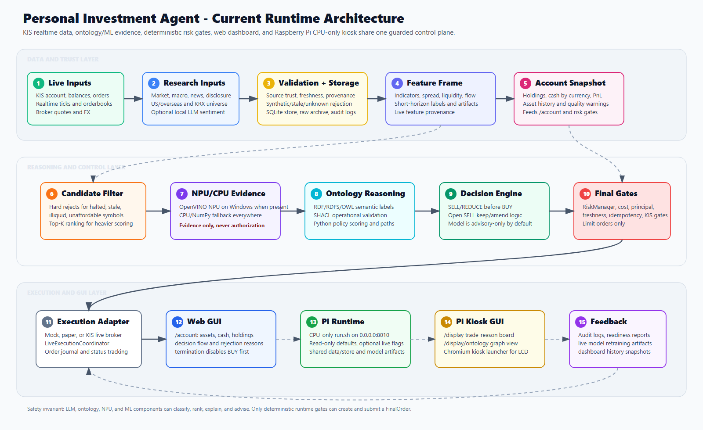

# Architecture

현재 코드 기준의 런타임 구조 문서입니다. 개념 설계가 아니라 `src/app` 아래에서 실제로 실행되는 경로를 기술합니다.



## 1. 원칙

시스템은 **확률적 추론**과 **결정론적 통제**를 분리합니다.

- 온톨로지는 도메인 관계와 허용 전략을 결정하고, strategy-utility GNN은 그 관계 가중치와 전략 효용을 학습하여 실제 전략 선택에 직접 참여합니다.
- GNN 선택은 실시간 모델 보정과 전략별 양수 순효율 검증을 통과한 경우에만 신규 진입 권한을 얻습니다. LLM과 NPU 장치 자체에는 주문 권한이 없습니다.
- 주문을 만들 수 있는 것은 `RiskManager`를 통과한 `FinalOrder`뿐이고, 실제 제출은 `LiveExecutionCoordinator`의 limit order 경로만 가능합니다.
- 가속기(OpenVINO/NPU/CUDA)는 숫자 evidence 가속일 뿐이며, 실패하면 동일 스키마로 CPU fallback합니다. 가속기 출력은 주문 권한이 아닙니다. 판단을 만들어내는 워크로드는 `device_plan.py`에서 `accelerable=False`로 CPU에 고정됩니다.
- **선택과 실행 승인은 다른 질문입니다.** "어떤 전략인가"는 선택 계층이, "이 주문을 안전하게
  낼 수 있는가"는 실행 계층이 답합니다. 두 층이 한 클래스에 섞여 있던 것이
  [strategy_selection_v2.md](strategy_selection_v2.md) 리팩터의 출발점이며, 새 선택 계층은
  `app.execution`/`app.risk`를 **import 할 수 없도록** 만들어 두었습니다(AST 테스트로 고정).

데이터가 어떤 단계를 거쳐 어떤 판단에 쓰이는지는 [data → process → decision map](diagrams/data_to_decision_flow.svg)에, 온톨로지/GNN 계층 구조는 [ontology and GNN layers](diagrams/ontology_gnn_layers.svg)에 정리되어 있습니다.

## 2. 실행 진입점

| 진입점 | 역할 |
| --- | --- |
| `run.ps1` | 표준 런처(Windows·Linux 공용). 포트 `8010` 고정, live 프로세스 플래그 설정, 관리 브라우저 창 연결, 창 종료 시 서버 종료 |
| `setup.ps1` | OS별 가상환경 생성·의존성 설치·import 검증(Windows `.venv`, Linux `.venv-linux`) |
| `run.py` → `app.run:main` | `src`를 `sys.path`에 넣고 startup 점검 후 `uvicorn app.web:app` 기동 |
| `packaging/raspberrypi/run.sh` | Pi CPU-only 런처 (read-only 기본값) |
| `scripts/*.py` | readiness 점검, dry-run, 학습, 리플레이, 벤치마크, arming/disarming |

`run.ps1`이 프로세스 환경에 **강제로** 설정하는 값(`Set-RunEnv`):

```text
TRADING_MODE=live_trading      LIVE_TRADING_ENABLED=true
KIS_LIVE_ENABLED=true          KIS_PAPER_TRADING=false
LIVE_ORDER_SUBMIT_ENABLED=true REQUIRE_MANUAL_ARMING=false
REALTIME_BUY_ENABLED=true      LIVE_TERMINATION_SELL_ONLY_ON_START=false
```

즉 **`run.ps1` 기본 실행은 플랫폼과 무관하게 실주문 제출이 가능한 상태**입니다. 안전성은 flag를 끄는 방식이 아니라 계좌/시세 신뢰도, 비용·리스크 게이트, KIS health check에서 확보합니다. 자세한 조작은 [live_trading.md](live_trading.md)를 참고하세요.

기타 startup 서비스(`Set-DefaultEnv`이므로 override 가능):

- `AUTO_START_KIS_REALTIME_COLLECTOR` — KIS 실시간 체결/호가 수집
- `AUTO_START_REALTIME_TRADING` — 독립 실시간 자동거래 루프
- `AUTO_START_LIVE_TRAINING` — live short-horizon 모델 주기 재학습 (`LIVE_TRAINING_INTERVAL_SECONDS=60`)
- `AUTO_START_LIVE_WORKER` — live refresh 워커 (`LIVE_REFRESH_SECONDS=15`)

## 3. 런타임 흐름

```text
KIS 실시간 체결/호가 (WebSocket) + KIS REST 계좌·주문·해외시세 + 브로커 quote/FX
  + 공개 시장/거시/뉴스/공시 데이터
  → source_policy 신뢰도·신선도·provenance 판정, synthetic/sample 차단
  → RealtimeMarketDataStore / LocalResearchStore / AccountSnapshotStore (SQLite)
  → IndicatorEngine · microstructure feature
  → LiveFeatureFrame(live_short_horizon_v5_state_only, 40컬럼 + book_quality)
  → [자문] TechnicalPredictionEngine (regime + 방법론 + 보수적 expected exit price)
  → [자문] 거시–미시 온톨로지: MacroMarketReasoner → MicroSymbolReasoner(병렬)
            → OntologyCoordinator → GlobalTradeArbiter (SELL/REDUCE를 BUY보다 먼저 랭킹)
  → [자문] RDF/RDFS/OWL semantic label + SHACL 검증 + SemanticPolicyScorer
  → [자문] live short-horizon 모델 (CPU/OpenVINO, auxiliary-only)
  → ClosedWorldOntologyGate(허용 전략 마스크)
  → strategy-utility R-GCN(조건부 승/패 기대값과 제비용 차감 순효율)
  → GnnRealtimeTrustEvaluator
        1) 모델 보정(calibrated) 검증
        2) 전략별 forward 실현 순효율(entry_authorized) 검증
  → StrategySessionManager(종목·전략 단일 소유권 잠금)
  → SharedLiveDecisionEngine
        1) SELL/REDUCE 평가
        2) BUY 평가 (현금·신선도·spread·유동성·근거 충족 시에만)
  → TradingCostEngine + ProfitabilityGate + DynamicExitPolicy
  → PositionSizer + PrincipalProtectionEngine + RiskManager + FinalTradeGate
  → order_pricing_policy + exchange_resolver → LiveExecutionCoordinator
  → KIS limit order · order journal · status polling · 계좌 재동기화
  → /account · /display 대시보드 · audit log · 재학습 artifact
```

`StrategySessionManager` 는 위 경로에서 선출과 주문 가능한 proposal 소유권을 함께 관리합니다.
**선택 계층을 분리한 V2 파이프라인은 SHADOW에서 시작해 증거 기반으로 권한을 자동 획득할 수
있습니다.** 클래스 자체 기본값은 비활성이지만 Windows `run.ps1`은 V2와 자동 승격을 켭니다:

```text
(위와 동일한 evidence 를 그대로 재사용)
  → MarketContextBuilder            (symbol, cycle)당 스냅샷 1개 + context_id
  → StrategyEligibilityEngine       실제 strategy id 기준 hard mask M_s + soft score O_s
  → StrategyProposalEngine          mask 통과분만 알고리즘 실행 → StrategyProposal
  → utility predictor               gross / downside / duration / uncertainty (비용 제외)
  → TradingCostAdapter              C_s = TradingCostEngine 왕복 비용
  → StrategyBanditAdapter           B_s = 실현이력 보정, ±20bps 유계
  → StrategySelectorV2              U_s 랭킹 + NO_TRADE 비교 → StrategySelectionResult
  → CoverageAnalyzer · CounterfactualEngine   (telemetry / 반사실 표본)
  → SelectorPromotionController     SHADOW → LIVE_PROBE → LIVE / 자동 강등
  → StrategySessionManager          권한 보유 시 기존의 실주문 승인 proposal에만 선택 결과 매칭
```

V2 모듈은 주문을 만들거나 broker를 호출하지 않습니다. 승격된 선택 결과도 세션 계층이 이미
`submits_orders=true`로 승인한 proposal과 일치할 때만 채택되고, 이후 비용·리스크·최종 주문 게이트를
그대로 통과해야 합니다. 자세한 계약과 항별 권한은
[strategy_selection_v2.md](strategy_selection_v2.md).

## 4. 모듈 지도

| 경로 | 역할 |
| --- | --- |
| `src/app/web.py` | FastAPI 앱, 루트 GUI, API, realtime/live runtime orchestration |
| `src/app/web_account_routes.py`, `account_dashboard.py` | `/account` 라우트와 payload 구성 |
| `src/app/data/` | KIS 실시간 수집, 이벤트 파이프라인, realtime store, source policy, **세션·capability 단일 권한 (`market_capabilities.py`)**, REST fallback |
| `src/app/features/` | indicator engine, live feature frame, short-horizon/semantic feature, provenance |
| `src/app/context/` | **통합 MarketContext 단일 생성 권한.** (symbol, cycle)당 스냅샷 1개, `context_id`, field별 source/freshness. IO 없음 |
| `src/app/technical/` | 근거 기반 기술적 예측 레이어 (regime, 방법론, 예측, 리플레이) — 자문 전용 |
| `src/app/graph/` | custom KnowledgeGraph, FactTable, RDF/OWL/SHACL 레이어, 거시–미시 추론, theory vote, NPU evidence scorer |
| `src/app/ontology/` | TTL 스키마와 closed-world 운영 게이트, trading domain reasoner, **전략 eligibility (hard mask + soft score, 실제 strategy id 기준)** |
| `src/app/models/` | 라벨링, 학습 파이프라인, artifact registry, CPU/OpenVINO backend, strategy-utility R-GCN |
| `src/app/strategy/`, `routing/` | 카탈로그 전략 expert(롱 17 + 숏 3, `STRATEGY_IDS` 기준), 소유권 가드, strategy router, GNN 실시간 신뢰도, shadow comparison |
| `src/app/strategy/spec.py`, `registry.py` | 전략 선언 계약(`StrategySpec`)과 실코드 파생 registry. lifecycle 권고는 migration flag 로만 적용 |
| `src/app/strategy/proposal.py`, `proposal_engine.py` | `StrategyProposal` (수량·side·venue field 부재) 과 mask 이후 실행되는 proposal 생성기 |
| `src/app/strategy/coverage.py` | 6축 context 버킷과 `STRATEGY_COVERAGE_GAP` 집계 |
| `src/app/routing/strategy_selector.py` 외 | `StrategySelectorV2`, 효용 예측/비용 adapter, ontology mask adapter, bandit adapter, NO_TRADE 정책, observer/authority runner |
| `src/app/routing/selector_v2_promotion.py` | V2 자동 권한 사다리, 보수적 통계 게이트, 빠른 강등, 원자적 상태·증거·전이 영속화 |
| `src/app/evaluation/` | 이벤트 시뮬레이터 평가, purged walk-forward, reality check, **반사실 shadow 포지션·selector regret·증거원 분리** |
| `src/app/monitoring/` | strategy / context / model drift 모니터. 강등을 **제안**만 하고 적용은 별도 |
| `src/app/strategy_validation/` | 단일 audit runner, purged CV, 비용 스트레스, 파라미터 안정성, 레짐 분해, lifecycle 원장 |
| `src/app/cost/`, `risk/` | TradingCostEngine, ProfitabilityGate, position sizing, principal protection, RiskManager |
| `src/app/trading/` | realtime engine, shared decision engine, dynamic exit policy, execution policy, runtime guard |
| `src/app/trading/directional.py` | 방향 축 계약: `PositionDirection`/`PositionEffect`/`ExecutionProduct`/`StrategyDeploymentState`, `DirectionalStrategyKey`, 방향별 exit geometry, 전이 화이트리스트 |
| `src/app/trading/borrow.py` | 대주 locate의 point-in-time 저널과 공유 admissibility 규칙(`evaluate_borrow`), 연율→거래별 안분 |
| `src/app/trading/borrow_source.py` | 대주 가용성 소스 인터페이스. 기본값은 명시적 "소스 없음"; 파일/callable 구현 |
| `src/app/trading/borrow_polling.py` | 수요 기반·예산 제한 폴링으로 저널을 채움 |
| `src/app/trading/shadow_evaluation_service.py` | shadow plan을 심볼별로 채점해 승격 증거로 전환 |
| `src/app/features/short_indicators.py` | 계산 가능한 숏 보조 지표 + 소스 없는 지표의 명시적 보고 |
| `src/app/trading/directional_shadow.py` | forward shadow 평가: plan 동결, bid/ask 체결 시뮬레이터, 3중 누수 방어 |
| `src/app/trading/short_strategy_promotion.py` | 배포 사다리 authority: confidence score, hard gate, 자동 승격/강등, 원자적 상태+audit 기록 |
| `src/app/ontology/short_rules.py` | 숏 closed-world 사실 평가와 레짐별 방향 허용 마스크 |
| `src/app/execution/` | KIS adapter(국내/해외), 주문 가격 정책, 거래소 라우팅, live coordinator, 저널, idempotency |
| `src/app/backtesting/` | 이벤트 시뮬레이터, 가속 리플레이, 스트리밍 데모 |
| `src/app/storage/` | local store, lifecycle store, model store, 마이그레이션 |
| `config/` | 수익성·청산·사이징·비용·리스크·거시미시·기술예측 정책, **전략 선택 V2 정책 6종**, 런타임 프로파일 |
| `packaging/raspberrypi/` | Pi CPU-only 설치/실행/서비스/키오스크 스크립트 |

## 5. 저장소 레이아웃

```text
data/store/realtime_market_data.sqlite3   실시간 체결·호가·분봉
data/store/research.sqlite3               정규화된 리서치 레코드
data/store/account_dashboard.sqlite3      계좌/자산 히스토리
data/store/trading-lifecycle.sqlite3      전략 인스턴스·포지션·TradePlan
data/store/strategy-performance.sqlite3   실현 outcome (v2: direction/execution_product/evaluation_source 컬럼)
data/store/strategy-deployment.sqlite3    arm별 배포 상태 + promotion_audit (한 트랜잭션)
data/store/borrow-snapshots.sqlite3       대주 locate append-only 저널 (과거 시점 조회용)
data/store/directional-shadow.sqlite3     shadow plan과 채점된 forward outcome
data/store/causal-order-journal.jsonl     intent → verdict → order 인과 저널
data/store/strategy-coverage.json         V2 coverage 버킷 tally (호스트별, 명시적 flush)
data/store/strategy-validation.json       lifecycle 원장 + validation record + 전이 이력
data/store/selector-v2-promotion.json     V2 권한 상태 + context별 증거 + 최근 전이
data/models/<family>/                     버전 artifact + <model>.latest.json
data/reports/                             readiness, 벤치마크, counterfactual 리포트
logs/                                     서버 로그, live-orders.jsonl, feature frame 저널
```

뒤의 두 JSON 파일이 sqlite 가 아닌 것은 의도입니다. 실시간 writer 가 sqlite 파일을 소유하고 있고,
그쪽의 대형 read 가 writer 를 방해한다는 것이 이미 측정된 사실이기 때문입니다. `MarketContext`
자체는 아예 영속화하지 않고 in-memory LRU(기본 512개 / 3600초)에만 둡니다 — 컨텍스트는 분 단위로
가치가 있고, 판단의 영속 기록은 `context_id` 와 항별 분해를 담은 selection 행입니다.

`LocalResearchStore`는 `(kind, record_key)` 기반 dedup과 `RESEARCH_RETENTION_DAYS` 정리를 수행하고, synthetic/simulated 레코드를 거부합니다. `ModelArtifactStore`도 simulated artifact를 거부합니다. audit logger는 credential/token/계좌번호/broker secret을 재귀적으로 마스킹합니다.

## 6. API 표면

운영에서 실제로 보는 것:

- `GET /account` — 운영 대시보드 (계좌, 현금, 보유, 손익, 자산 히스토리, 판단 흐름, 거부 사유)
- `GET /display` — Pi LCD용 trade-reason 카드 보드
- `GET /display/ontology` — 온톨로지 그래프 전체 화면
- `GET /` — 연구/진단/수동 실행 화면

주요 API:

| 엔드포인트 | 내용 |
| --- | --- |
| `GET /api/account/dashboard` | 계좌/현금/보유/손익 payload |
| `GET /api/account/asset-history?range=1D\|1W\|1M\|3M` | 분 단위 총자산 히스토리 |
| `GET /api/account/technical` | 기술적 예측 패널 (자문) |
| `GET /api/account/macro-micro` | 거시–미시 온톨로지 패널 (자문) |
| `GET /api/realtime-trading/status` | 실시간 엔진 상태, 최근 이벤트, 거부 사유 분포. 최상위 `strategy_session.selector_v2`에 V2 실효 권한·랭킹·항별 분해·NO_TRADE·legacy 비교가 실림 |
| `GET /api/refactor/dashboard` | 정적 프로파일·게이트·legacy/ontology/GNN shadow 비교. live strategy session의 권위 소스는 아님 |
| `GET /api/refactor/market-view?symbol={symbol}&limit=180` | 로컬 차트/마켓 뷰 + 현재 live `strategy_session` overlay |
| `POST /api/live-trading/terminate?shutdown=true` | BUY 차단 → 청산 SELL 제출 → 서버 종료 예약 |
| `GET /api/trade-explanations` | `/display`용 사람이 읽는 판단 카드 |
| `GET /api/ontology/graph`, `/api/ontology/runtime` | 그래프 payload, 온톨로지 런타임 상태 |
| `GET /api/realtime/runtime`, `/api/npu/runtime` | 가속·모델·NPU 모듈 상태와 fallback 사유 |
| `GET /api/ai/validation`, `/api/live-training/status` | 이벤트 LLM/모델/학습 검증 상태 |
| `GET /api/gnn/realtime-trust` | GNN 전체/전략별 보정 점수, forward 표본, 진입 권한 |
| `GET /api/system-diagnostics` | 서버·계좌·시장 데이터·온톨로지·학습·거래 엔진 통합 진단 |
| `GET /api/auto-reliability/status` | `learning` ↔ `live_trading` 자동 전환 점수와 사유 |
| `GET /api/short-strategies/status` | 숏 arm별 배포 상태, 실주문 권한, confidence, 대주 건강도 |
| `GET /api/short-strategies/{id}/validation` | 전체 지표·임계값과 **실패한 hard gate 전량** (승격까지 남은 조건) |
| `GET /api/short-strategies/{id}/deployment-history` | 자동 승격/강등 audit 이력 (변경 당시 지표 포함) |
| `GET /api/short-strategies/{id}/shadow-outcomes` | forward shadow outcome (실행 불가 신호 포함) |
| `GET /api/short-strategies/entry-blockade` | 숏 진입을 **가장 먼저** 막은 단계 |
| `GET /api/borrow/{symbol}/availability`, `/api/borrow/health` | 대주 locate와 데스크 건강도 |
| `GET /api/directional-bandit/evaluations` | LONG vs SHORT vs NO_TRADE 보수적 엣지 비교 |
| `POST /api/short-strategies/{id}/suspend` | 수동 중단. **승격 endpoint는 존재하지 않음** |

`/api/refactor/market-view`의 LIVE DECISION ONTOLOGY source 노드는 고정 플래그가 아니다.
`event_feed`는 뉴스 저장소 조회 건수, `cross_section`은 shadow 판단에 보존된
`sector_rank_table`과 대상 종목 순위, `session_context`는 시계 사실과 가격 사실을 각각
측정한다. 시계는 계산 가능하지만 30분 가격 구간이나 과거 변동성 표본이 부족하면
`session_context.status=PARTIAL`이며, UI도 이를 `DATA MISSING`과 구분한다.

KRX 세션 가격 사실의 단일 계산 권한은 `app.features.session_structure`이다. 라이브 frame과
stored counterfactual은 모두 이 모듈의 30분 시초 범위, 전일 종가 기준 첫 30분 수익률,
과거 세션만을 사용한 변동성 percentile을 호출한다. 15:20~15:30 종가 단일가 매매는
연속매매 구간으로 취급하지 않는다.

## 7. 운영 모드

`src/app/realtime/mode_manager.py`:

| 모드 | 의미 |
| --- | --- |
| `learning` | 실시간 수집 + 실현손익 라벨 artifact 갱신 |
| `testing` | 하위 호환 legacy paper replay |
| `paper_trading` / `paper_trading_test` | KIS 모의 API 점검 + 로컬 paper 흐름 |
| `live_readiness` / `live_trading_test` | KIS 인증/계좌 read-only 점검, 주문 없음 |
| `live_trading` | 실시간 KIS 자동거래 루프 (모든 게이트 필수) |

모든 모드가 동일한 realtime store와 model root를 사용하며 synthetic 데이터는 입력으로 허용되지 않습니다.

별도로 `config/refactor_profile.json`이 비교/진단 경로의 posture를 선언합니다. 실행 시 실제 주문 가능 여부는 이 파일 하나가 아니라 `run.ps1`의 live 플래그, 자동 신뢰도 컨트롤러, GNN 전략별 진입 권한, 전략 세션, 최종 비용·리스크·KIS 게이트의 합성 결과로 결정됩니다. legacy/ontology/GNN 비교 로그는 계속 shadow comparison으로 남지만, 검증된 GNN 판단은 `StrategySessionManager`를 통해 실거래 전략 선택에 연결됩니다.

런타임 플래그는 `RefactorFeatureFlags.from_env()`가 환경변수에서 읽습니다. 기본값은 legacy 경로만 활성이며, 잘못된 조합(예: ontology router 없이 GNN rerank)은 로드 시점에 실패합니다.

전략 선택 V2 는 별도 flag 집합(`SelectorV2Flags.from_env()`)을 씁니다. Python 클래스 기본값은
**전체 무동작**이고, Windows 런처는 `enabled=true`, `shadow_only=true`, `auto_promote=true`를
설정합니다. 즉 설정상 shadow-only는 안전한 **초기 상태**이며, 실효 권한은 영속화된 승격
컨트롤러가 결정합니다. `validate()`는 안전하지 않은 조합을 로드 시점에 거부합니다.

| 플래그 | 기본 | 의미 |
| --- | --- | --- |
| `STRATEGY_SELECTOR_V2_ENABLED` | `false` | 끄면 모듈이 아예 돌지 않음 |
| `STRATEGY_SELECTOR_V2_SHADOW_ONLY` | `true` | 운영자 강제 live 권한을 막고 초기 SHADOW를 보장 |
| `STRATEGY_SELECTOR_V2_AUTO_PROMOTE` | `false` (`run.ps1`: `true`) | 측정된 증거로 실효 권한을 `SHADOW → LIVE_PROBE → LIVE` 자동 전환 |
| `STRATEGY_ONTOLOGY_MASK_V2_ENABLED` | `true` | 실제 id 기준 hard mask. live 모드에서 필수 |
| `STRATEGY_NO_TRADE_ENABLED` | `true` | NO_TRADE 1급 arm. live 모드에서 필수 |
| `STRATEGY_COUNTERFACTUAL_ENABLED` | `true` | 반사실 표본. live 모드에서 필수 (regret 측정 유지) |
| `STRATEGY_BANDIT_ADAPTER_ENABLED` | `true` | 유계 실현이력 보정 |
| `STRATEGY_UTILITY_GNN_ENABLED` | `false` | 켜면 기존 GNN 벡터가 gross/downside/uncertainty 공급 |
| `STRATEGY_LIFECYCLE_APPLY_RECOMMENDATIONS` | `false` | lifecycle 권고를 **실제로 적용**. 낮추는 방향만 |

`shadow_only=false`로 강제 권한을 주거나 `auto_promote=true`로 자동 승격을 허용하려면
mask·NO_TRADE·counterfactual이 모두 켜져 있어야 하고, 아니면 `ValueError`로 기동이 실패합니다.
권장 운영은 `shadow_only=true`를 유지한 채 자동 승격 컨트롤러가 권한을 결정하게 하는 것입니다.
상세는
[strategy_selection_v2.md](strategy_selection_v2.md) §5.

## 8. 가속 경계

| 단계 | 장치 | 비고 |
| --- | --- | --- |
| 데이터 수집·저장 | CPU | broker/news/공시/거시/저장소 |
| 하드 필터 | CPU | 거래정지·관리종목·유동성·데이터 무효 결정론적 거부 |
| 후보 evidence 스코어링 | NPU + CPU fallback | `OntologyNpuLinearScorer`, `trading_pipeline._rank_accepted_with_npu` |
| theory vote / conflict / evidence cluster | NPU + CPU fallback | `graph/npu_*` 모듈, `/api/npu/runtime`에 상태 노출 |
| short-horizon 예측 | CPU 기본, OpenVINO 선택 | 모델은 auxiliary-only |
| strategy-utility R-GCN | OpenVINO CPU(실시간 검증) / NPU(미승격) | 온톨로지 마스크 안에서 전략 선택; 진입 권한은 CPU 실시간 forward 검증 |
| 그래프 탐색·설명·행동 선택 | CPU | 분기 많고 설명 가능성 필수 |
| 비용·리스크·주문 게이트·브로커 제출 | CPU | 안전 임계 경로 |

Windows 성능 카운터는 이 워크로드의 NPU 사용을 별도 엔진으로 표시하지 않을 수 있습니다. OpenVINO device discovery와 `/api/*/runtime` 상태를 기준으로 판단하세요. 세부는 [ontology_and_gnn.md](ontology_and_gnn.md)에 있습니다.

## 9. 안전 모델

- LLM 또는 LLM-like 컴포넌트는 주문을 실행하지 않습니다.
- NPU/OpenVINO 출력은 숫자 근거 점수이며 주문 승인 권한이 아닙니다.
- live short-horizon 모델은 기본 advisory-only입니다. `REALTIME_MODEL_AUXILIARY_ONLY=true`면 모델 단독 BUY는 거부됩니다.
- synthetic/sample/hash 파생 데이터는 오프라인 fixture 전용이며 paper/live 판단 근거로 쓰이지 않습니다.
- margin, leverage, derivatives, short selling, credit loan, leveraged ETF는 거부 대상입니다.
- live 주문은 `LiveExecutionCoordinator`를 통해 limit order로만 제출됩니다.
- audit log는 credential/token/계좌번호/broker secret을 재귀적으로 마스킹합니다.
- **전략 선택 V2 계층은 실행 계층을 import 할 수 없습니다.** `app.execution`, `app.risk`,
  `app.cost.profitability_gate`, realtime engine, shared decision engine 어느 것도 import 하지
  않으며 이것은 관례가 아니라 AST 테스트로 강제됩니다
  (`tests/test_strategy_selector_v2.py::test_selection_layer_cannot_reach_execution`).
  import 경로가 없는 코드는 리스크 게이트를 우회할 수 없습니다.
- **반사실(shadow) 포지션은 산술일 뿐입니다.** `app.evaluation.shadow_position`에는 broker 경로가
  없고, V2가 선택한 전략의 live outcome은 실체결에서 별도로 받습니다 — 시뮬레이션을 같은 arm의
  posterior에 두 번 넣지 않기 위한 구조입니다.
- **오류 처리도 권한 상태를 따릅니다.** SHADOW 관측 오류는 legacy 판단을 막지 않습니다. 반면
  승격 평가 오류는 컨트롤러를 `SUSPENDED`로 만들고, 승격 상태 영속화 실패는 권한 부여를
  취소합니다. V2가 이미 권한을 가진 사이클에서 선택 결과가 없으면 BUY는 NO_TRADE로 fail-closed
  처리됩니다.

## 10. 알려진 구조적 한계

정직하게 기록해 둡니다.

1. `app.web`이 UI·orchestration·수집·계좌 접근·live 실행을 함께 들고 있어 latency 격리와 재시작 복구가 어렵습니다.
2. 해외 종목은 REST polling(기본 12초)에 의존하므로 fast-path 불변식을 만족하지 않습니다.
3. legacy 저널과 causal strategy-owned 저널이 함께 남아 있어 복구 시 두 경로의 상태를 함께 대조해야 합니다.
4. decision/feature JSONL 로그가 수백 MB 규모까지 자라며 문서화된 retention/compaction 정책이 없습니다.
5. 소액 계좌 단타는 왕복 비용을 고려하면 구조적으로 기대값이 음수에 가깝습니다. 게이트는 엔지니어링 통제일 뿐 수익을 보장하지 않습니다.
6. 이벤트·횡단면 상대강도·갭 전략은 해당 point-in-time 사실이 실시간 feature schema에 없으면 closed-world로 차단됩니다. 결측 사실을 합성해 0이 아닌 적합도를 만들지 않습니다.
7. **feature schema 변경에 대한 방어가 얇습니다.** `LIVE_FEATURE_NAMES`를 한 번 바꾸자 학습 행
   해시 필터, 승격 지표 비교, 프레임 품질 게이트 세 곳이 **모두 조용히** 실패했습니다(2026-08-05,
   [validation.md](validation.md) §12.4). 특히 프레임 저널의 `values`가 곧 모델 벡터이므로 거기서
   값을 읽는 검사는 feature 제거에 함께 무너집니다. 세 곳은 고쳤고 회귀 테스트를 붙였지만
   구조적 보호(스키마 변경 시 의존처를 열거하는 장치)는 없습니다.
8. **구독 예산이 두 목적을 동시에 만족시키지 못합니다.** KIS는 approval key당 등록 수가
   제한되고 호가는 종목당 등록을 2배로 씁니다. 그런데 호가 없는 종목은 feature frame을 만들 수
   없고(`MISSING_SOURCE_RECORDS`) `ok_for_live_buy`도 통과할 수 없어, **학습 데이터 유입과 매수
   자격이 동시에 호가에 걸립니다.** macro breadth(체결만으로 충분)와 학습 폭(호가 필요) 사이의
   교환이며 `REALTIME_DEPTH_TIER_MIN`으로 하한만 고정해 둔 상태입니다. 근본 해결은 아닙니다.
9. **approval key 1개로 국내·해외 세션을 번갈아 씁니다.** 한쪽이 세션을 점유하면 다른 쪽
   수집기는 대기하므로, 미국장 시간대에는 KRX feature frame이 0이고 그 반대도 같습니다.
   장 마감 시간대에 학습 표본이 사실상 멈추는 이유입니다.
10. 숏 전략 3개는 코드에 존재하지만 **전량 `SHADOW`이며 실주문 권한이 없습니다.** 승격에는 최소 20 거래일의 forward 표본이 필요하므로 정상 상태입니다. 또한 KIS 대주 조회 TR id와 응답 필드명은 실계좌 응답으로 검증되지 않았고(read-only 경로), GNN 방향별 utility head는 미구현입니다 — 숏 arm은 현재 realized posterior와 규칙 신호로만 평가됩니다. 상세는 [short_selling_deployment.md](short_selling_deployment.md) §15.
11. **라이브 카탈로그가 실체결 1건 위에 서 있습니다.** 2026-08-11 첫 통합 audit 결과: LIVE
    권한을 가진 전략 13개 중 **9개가 관측 0건**이고, 표본이 있는 유일한 전략
    (`liquidity_shock_reversal`, 약 740건이며 계속 증가)은 평균 순 약 −120bps 로 손실 중이며 walk-forward 창 중
    양수가 0개입니다. 그 행 전부가 shadow·US 이므로 시뮬레이션 증거이고, 그래서 audit 은
    RETIRE 가 아니라 RESEARCH 로 분류합니다. 권고 2건은 기록됐고 적용은
    `STRATEGY_LIFECYCLE_APPLY_RECOMMENDATIONS` 를 요구합니다 (그중 하나는 config 변경으로 이미
    충족). 수치와 범위는 [validation.md](validation.md) §1.1, 방법은
    [strategy_selection_v2.md](strategy_selection_v2.md) §6.
12. **전략 선택 경로가 둘 있습니다.** V2가 SHADOW인 동안 legacy(`_bandit_choice`)가 권한을
    유지하고, V2가 자동 승격되면 세션 경계가 V2 결과를 승인 proposal에 매칭합니다. 강등 시 즉시
    legacy fallback이 다시 필요하므로 두 구현은 아직 함께 존재합니다. `StrategySessionManager`는
    큰 소유권·실행 계약 경계이고, generic methodology alias(`METHODOLOGY_STRATEGY_ALIASES`)도
    legacy fallback 때문에 남아 있습니다.

관련 문서: [ontology_and_gnn.md](ontology_and_gnn.md) · [decision_and_risk.md](decision_and_risk.md) · [strategy_selection_v2.md](strategy_selection_v2.md) · [live_trading.md](live_trading.md) · [short_selling_deployment.md](short_selling_deployment.md) · [validation.md](validation.md)


## 세션·거래소 capability 계층 (국내·미국 전 세션)

세션 판정의 **유일한 source of truth** 는 `src/app/data/market_capabilities.py` 의
`MarketSessionService` 다. 이전에는 같은 판정이 `market_session.py`, `web.py`(2곳),
`realtime_trading_engine.py`, `kis_real.py`, `kis_realtime.py`, `llm_classifier.py` 에
독립적으로 존재하고 경계값이 서로 달랐다 (`docs/realtime_session_gap_analysis.md` §3).

정보는 두 층으로 분리된다:

| 층 | 위치 | 내용 | 변경 가능성 |
|---|---|---|---|
| 검증된 API 사실 | `market_capabilities.py` 의 `_VERIFIED_*` 테이블 | TR ID, 엔드포인트, `EXCG_ID_DVSN_CD`, `ORD_DVSN` 허용값, subscription key 형식 | **설정으로 덮어쓸 수 없다** |
| 거래소 규정 / 우리 정책 | `config/market_sessions.yaml` | 세션 시각창, 휴장·조기폐장 스냅샷(버전 기록), 세션별 정책 임계값 | 설정 |

검증 근거는 `research_notes/한국투자증권_오픈API_전체문서_*.xlsx` 이고 정리본은
`docs/kis_market_session_capability_matrix.md` 다.

주요 구성 요소:

* `MarketCapability` — (market, venue, session) 조합의 완전한 능력 서술.
  `data_available` / `trade_available` / `new_entry_allowed` / `exit_allowed` 를 **분리**한다.
* `KisSessionOrderRouter` (`src/app/execution/kis_session_order_router.py`) — 주문 route
  결정의 유일한 지점. 정정·취소는 원주문 route family 를 유지한다.
* `FeedMetadata` (`realtime_types.py`) — 모든 실시간 이벤트에 market/venue/session/
  feed_scope/TR/subscription_key 를 부착. `stream_id` 가 분 bar identity 와 `record_id` 에
  들어가 KRX·NXT·통합 피드가 구조적으로 섞이지 않는다.
* 실시간 저장소 스키마 v2 — `schema_version` / `schema_migrations` 테이블과 무손실
  versioned migration. v1 시절 행은 `metadata_inferred=1` 로 표시되어 신규 진입 근거에서 제외된다.

`market_session.py` 는 PRE/REGULAR/AFTER/CLOSED 4단계를 쓰는 기존 호출자를 위한
backward-compatible wrapper 로 축소됐다. 신규 코드는 `SessionId` 와 `MarketCapability` 를 직접 쓴다.
