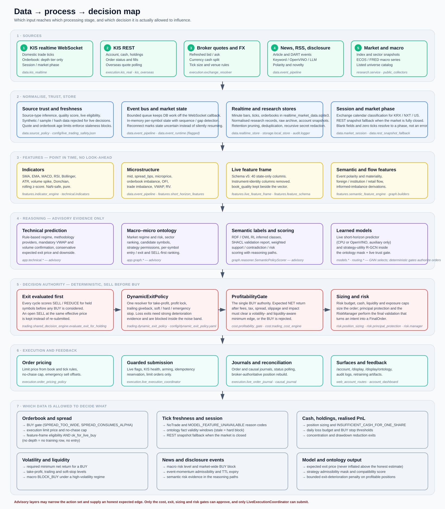
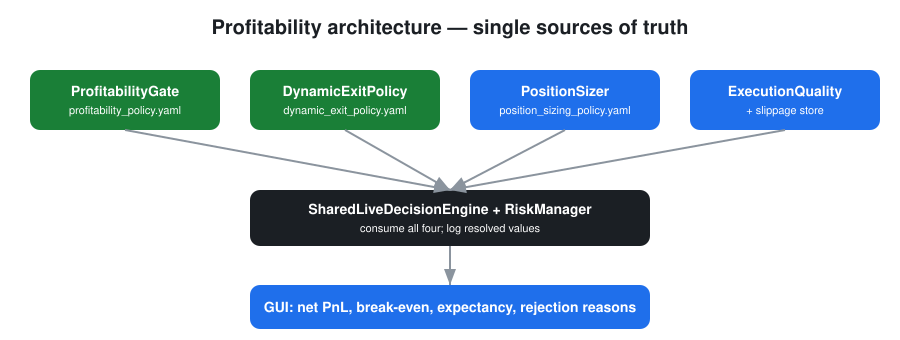
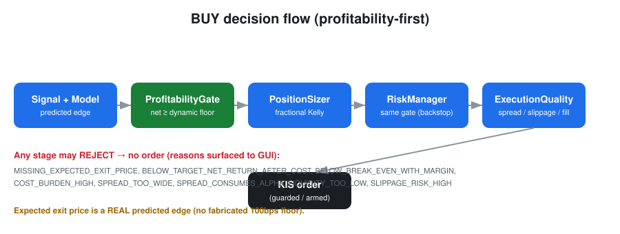
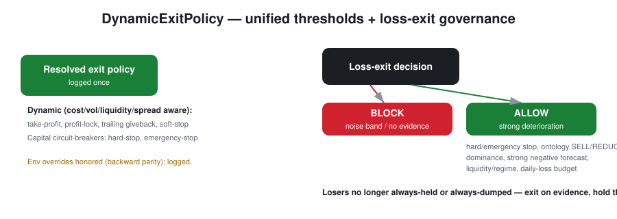
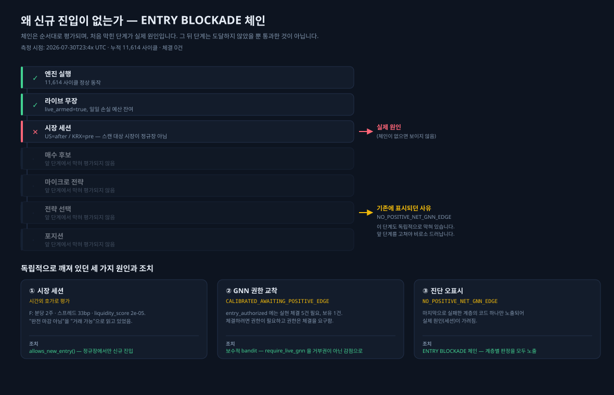

# Decision and Risk

어떤 데이터가 어떤 판단에 쓰이고, 무엇이 실제로 주문을 승인하는지에 대한 문서입니다.



핵심 규칙 두 가지:

- **모든 신규 진입은 단 하나의 순수익 게이트(`ProfitabilityGate`)로 판단합니다.**
- **모든 청산은 단 하나의 동적 청산 정책(`DynamicExitPolicy`)으로 판단합니다.**

두 규칙은 이제 **effect 기준**이며 broker side 기준이 아닙니다. 숏이 추가된 뒤 `action != "BUY"`로
게이트 여부를 판정하면 양방향으로 위험합니다 — 숏 진입(side=SELL)은 게이트를 **건너뛰어** 음의
기대값으로 열릴 수 있고, 숏 청산(side=BUY)은 진입으로 오인되어 **차단**될 수 있습니다. 손실 중인
숏의 상환을 막는 것은 이 시스템에서 절대 허용되지 않는 결과입니다.



## 1. 판단 순서

`RealtimeTradingEngine.run_once()`의 한 사이클:

1. 최신 KIS 계좌 스냅샷을 읽습니다.
2. 보유 종목의 **SELL/REDUCE를 먼저** 평가합니다.
3. 이미 열린 SELL 주문이 있고 대체 가격이 사실상 동일하면 `open_sell_kept`로 기록하고 중복 제출하지 않습니다.
4. `REALTIME_BUY_ENABLED=true`일 때만 BUY 후보를 평가합니다.
5. quote 신선도, 1주 매수 현금, spread/유동성, 온톨로지/런타임 근거, 리스크 승인을 요구합니다.
6. 승인된 `FinalOrder` limit 주문만 `LiveExecutionCoordinator`로 제출합니다.

`SharedLiveDecisionEngine.consume_bundle`은 거시–미시 번들(이미 SELL/REDUCE 우선 정렬됨)을 받아 같은 `evaluate_exit_for_holding` / `evaluate_buy` 경로로 라우팅하는 어댑터입니다. 게이트 흐름은 바뀌지 않습니다.

## 2. 자문 레이어: 기술적 예측

`src/app/technical/`는 근거 기반 단기 예측 레이어입니다. **산출물은 전부 자문 근거이며 주문을 만들거나 게이트를 완화하지 않습니다.**

| 모듈 | 역할 |
| --- | --- |
| `technical/indicators.py` | SMA/EMA/MACD/RSI/Bollinger/ATR/volume-spike는 `features/indicator_engine.py`에 위임(단일 진실원). VWAP, Donchian, rolling z-score, spread-bps, orderbook imbalance 추가. 순수 함수, NaN-safe, pandas 없음 |
| `technical/regime.py` | 규칙 기반 `TechnicalRegimeClassifier` → 8개 regime + confidence + 사유 + feature 기여도. 리스크 게이트 우선 |
| `technical/signals.py` | 방법론 provider + `CompositeTechnicalSignalEngine` (regime gating, VWAP/거래량 확인 필수, 단일 지표 BUY 금지) |
| `technical/feature_builder.py` | OHLCV(+호가) → `TechnicalFeatureSet`, live feature frame 매핑 |
| `technical/labels.py` | no-look-ahead 지도 라벨 + `TradingCostEngine` 기반 net-after-cost, synthetic source 가드 |
| `technical/prediction.py` | `TechnicalPredictionEngine`: 보수적 expected exit price / net return / downside. 약하면 `NO_TRADE` |
| `technical/replay.py` | walk-forward, no-look-ahead 리플레이 평가 |
| `technical/policy.py` | `config/technical_prediction_policy.yaml` 로드 (env override, 로깅) |
| `graph/technical_evidence.py` | 신호를 `KnowledgeGraph` 트리플 + RDF evidence로 투영 |

### 방법론

각 provider는 signed score `[-1,1]`, confidence `[0,1]`, **보수적** 기대 edge(bps; 측정된 변동성 × horizon에 1 미만의 capture fraction — **조작된 alpha 하한 없음**), horizon, 지지/반대 feature, 사유 코드를 냅니다.

1. **모멘텀 / 추세추종** (Jegadeesh–Titman, Brock–Lakonishok–LeBaron MA rules). EMA gap, MACD 히스토그램, 단기 수익률, 지속성. `TREND_UP` / `BREAKOUT_CANDIDATE`에서 활성, 하락추세에서는 SELL 근거로 기여.
2. **돌파 / 박스 상단 돌파**. Donchian 고점 + 거래량 + VWAP + false-breakout risk. **거래량 확인 없으면 차단.**
3. **평균회귀** (단기 reversal). RSI / Bollinger %b 극단, VWAP 이탈 거리. `RANGE_BOUND` / `MEAN_REVERSION_CANDIDATE`에서 활성, **강한 하락추세에서는 차단**(`MEAN_REVERSION_BLOCKED_BY_DOWNTREND`).
4. **VWAP / 거래량 / 유동성** — **필수 확인 레이어**. 모멘텀/돌파 BUY는 VWAP 위 + 우호적 흐름을 요구하고, 아니면 `VWAP_BREAKDOWN`으로 BUY 근거가 사라집니다.
5. **변동성 밴드 / regime** — 리스크 지향. regime 분류기와 동적 청산 악화 신호에 기여하며, `HIGH_VOLATILITY_RISK` regime은 BUY를 차단합니다.

`HIGH_VOLATILITY_RISK` / `LOW_LIQUIDITY_RISK` / `NO_TRADE` regime → **BLOCK_BUY**. 그 외에는 regime이 선호 방법론을 고르고, 비적합 방법론은 조용히 버려지지 않고 가중치가 낮아집니다.

## 3. BUY 권한: ProfitabilityGate

- 코드: `src/app/cost/profitability_gate.py`
- 설정: `config/profitability_policy.yaml`
- 비용 수식: `src/app/cost/trading_cost_engine.py` (단일 비용 모델)



### 판정 규칙

```text
allow_buy = (
    expected_exit_price     >= break_even_exit_price × (1 + min_net_profit_buffer_rate)
    and net_expected_return >= required_min_net_return
    and cost_to_alpha_ratio <= max_cost_to_alpha_ratio
    and spread_rate         <= max_spread_rate
    and spread_alpha_ratio  <= max_spread_alpha_ratio
    and liquidity_score     >= min_liquidity_score
    and expected_slippage_rate <= max_slippage_rate
)
```

### 수식

```text
mid                   = (bid + ask) / 2
spread_rate           = (ask − bid) / mid
gross_expected_return = (expected_exit_price − entry_price) / entry_price
all_in_cost_rate      = buy_fee + sell_fee + sell_tax + entry_slippage + exit_slippage
                        + market_impact + spread_cost + safety_margin
net_expected_return   = gross_expected_return − all_in_cost_rate
cost_to_alpha_ratio   = all_in_cost_rate / max(|gross_expected_return|, eps)
spread_alpha_ratio    = spread_rate       / max(|gross_expected_return|, eps)

required_min_net_return = max(
    min_required_net_return[market],                     # 시장별 하한 (KR/US)
    min_net_profit_buffer_rate
      + volatility_buffer_k  × realized_volatility
      + liquidity_buffer_max × (1 − liquidity_score)
      + account_buffer(소액 계좌인 경우)
)
```

전략별 `target_net_return`은 요구치를 **더 조일 수만** 있고 시장 하한 아래로 내릴 수 없습니다.

### 기술 예측 연동

`SharedLiveDecisionEngine`은 자문 기술 레이어가 tradable BUY를 낼 때 **보수적 기술 expected exit price**를 게이트에 넣습니다. 게이트의 기대 청산가는 기술 net edge를 **선호**하지만 정직한 모델 추정치 위로 절대 부풀리지 않습니다(`min` 규칙). 양(+)의 기술 신호가 있어도 비용 차감 후 순수익이 동적 최소 edge 아래면 **거부**됩니다.

매 BUY 판단마다(성공/거부 모두) `technical_prediction`, `technical_methodology`, `technical_regime`, `profitability_decision`이 진단에 남습니다.

수익률 단위 계약은 엄격합니다.

- `expected_net_return_bps` — 제비용 차감 후 순효율
- `expected_gross_return` / `expected_gross_return_bps` — 예상 청산가가 뜻하는 총 가격 이동
- `ProfitabilityGate` — 총 가격 이동에서 `TradingCostEngine`의 제비용을 한 번만 차감

순효율을 총수익으로 넣으면 게이트가 제비용을 이중 차감하므로 금지합니다. net-only 모델을 게이트에 연결할 때는 동일 비용 엔진으로 추정한 제비용을 더해 총 기대수익/청산가로 복원합니다.

### 거부 사유 코드

| 코드 | 의미 |
| --- | --- |
| `MISSING_EXPECTED_EXIT_PRICE` | 예측 청산가 없음/무효 |
| `BELOW_BREAK_EVEN_WITH_MARGIN` | 손익분기 + 버퍼 미달 |
| `BELOW_TARGET_NET_RETURN_AFTER_COST` | 동적 최소 순수익 미달 |
| `COST_BURDEN_HIGH` | 비용이 alpha를 지배 |
| `SPREAD_TOO_WIDE` | 절대 spread 상한 초과 |
| `SPREAD_CONSUMES_ALPHA` | alpha 대비 spread 과다 |
| `LIQUIDITY_TOO_LOW` | 유동성 점수 하한 미달 |
| `SLIPPAGE_RISK_HIGH` | 기대 슬리피지 상한 초과 |
| `PROFITABILITY_GATE_REJECTED` | 엔진이 붙이는 상위 코드 |

### 설정 우선순위

기동 시 1회 로깅됩니다. 높은 것이 이깁니다.

1. 환경변수 — `REALTIME_MIN_BUY_NET_RETURN_KR/_US`, `REALTIME_MIN_NET_PROFIT_BUFFER_RATE`
2. `config/profitability_policy.yaml`
3. `profitability_gate.py` 내장 기본값

`config/profitability_policy.yaml`의 **현재** 값:

```yaml
min_required_net_return:  default 0.0   KR 0.0   US 0.0003
min_net_profit_buffer_rate: 0.0
max_spread_rate: 0.003          max_slippage_rate: 0.003
max_spread_alpha_ratio: 0.35    max_cost_to_alpha_ratio: 1.05
min_liquidity_score: 0.3
volatility_buffer_k: 0.05       liquidity_buffer_max: 0.001
account_buffer: small_account_equity_krw 200000, small_account_extra_net 0.0
```

`run.ps1`은 `REALTIME_MIN_BUY_NET_RETURN_KR/_US=0.0005`, `REALTIME_MIN_NET_PROFIT_BUFFER_RATE=0.0`으로 pin하므로 실제 런타임 하한은 KR/US 모두 5 bps입니다.

> **완화 이력 (2026-07).** 초기 하한(KR 0.008 / US 0.012)과 초기 버퍼는 ~20만원 계좌에서 BUY를 100% 차단했습니다. 이후 단계적으로 완화되어 현재 값에 도달했습니다: 시장 하한은 사실상 "비용 차감 후 양(+)"까지 내려갔고, `volatility_buffer_k`는 0.5 → 0.05, `liquidity_buffer_max`는 0.001, `max_cost_to_alpha_ratio`는 0.5 → 1.05, `small_account_extra_net`은 0.002 → 0.0이 되었습니다.
>
> **이것은 튜닝된 최적값이 아니라 거래가 발생하도록 낮춘 값입니다.** 특히 `max_cost_to_alpha_ratio: 1.05`는 비용이 기대 alpha와 거의 같은 거래도 통과시킨다는 뜻이라 실질 보호가 얇습니다. 실현 손익([validation.md](validation.md))으로 재조정해야 하며, net expectancy가 음수로 유지되면 되돌리는 것이 맞습니다.

### 적용 지점

- `risk/manager.py` — BUY 비용 검사는 `ProfitabilityGate.evaluate` 한 번의 호출. 실패 시 `approved=False`, `metadata.profitability_decision` 기록
- `trading/shared_decision_engine.py::evaluate_buy` — 모델 예측 edge(또는 보수적 fallback 추정)에서 **실제** 기대 청산가를 유도한 뒤 주문 구성 전에 게이트 호출
- `strategy/candidate_factory.py` — 자체 검사 대신 동일 게이트 사용

## 4. 청산 권한: DynamicExitPolicy

- 코드: `src/app/trading/dynamic_exit_policy.py`
- 설정: `config/dynamic_exit_policy.yaml`
- 소비: `SharedLiveDecisionEngine.evaluate_exit_for_holding`



감사에서 발견된 ~12개 분산 소스(RealtimeTradingConfig, adaptive_exit_policy, 인라인 `REALTIME_*` 읽기 ~15곳, ExecutionPolicy 기본값)를 하나의 객체로 통합했고, 유효 정책이 항상 감사 가능하도록 **1회 로깅**합니다.

### 동적 레벨

```text
take_profit_rate    = max(min_take_profit_rate,
                          all_in_cost_rate + min_net_profit_buffer
                          + k_vol_take_profit × realized_volatility
                          + liquidity_take_profit_buffer × (1 − liquidity_score)
                          + spread_take_profit_buffer_k × spread_rate)
trailing_giveback   = max(min_trailing_giveback, k_trail_volatility × realized_volatility)
soft_stop_rate      = max(min_soft_stop_rate,
                          k_downside_soft_stop × predicted_downside_risk + realized_volatility)
hard_stop_rate      = hard_stop_loss_rate        # 자본 서킷브레이커
emergency_stop_rate = emergency_stop_loss_rate   # 자본 서킷브레이커
```

익절·이익 잠금·트레일링·소프트 스톱은 비용/변동성/유동성/spread를 반영해 동적으로 움직이고, 하드/긴급 스톱은 설정 상수 근처에 고정됩니다.

`config/dynamic_exit_policy.yaml`의 현재 값과 `run.ps1` pin:

| 키 | YAML | run.ps1 pin | env |
| --- | ---: | ---: | --- |
| `min_take_profit_rate` | 0.008 | 0.014 | `REALTIME_QUICK_TAKE_PROFIT_NET` |
| `min_net_profit_buffer` | 0.004 | 0.008 | `REALTIME_MIN_NET_PROFIT_EXIT` |
| `profit_lock_arm_net` | 0.010 | 0.012 | `REALTIME_PROFIT_LOCK_ARM_NET` |
| `min_trailing_giveback` | 0.35 | 0.30 | `REALTIME_PROFIT_LOCK_GIVEBACK` |
| `stop_loss_net` | 0.0 (off) | 0.008 | `REALTIME_STOP_LOSS_NET` |
| `min_soft_stop_rate` | 0.006 | — | — |
| `hard_stop_loss_rate` | 0.08 | **0.02** | `REALTIME_HARD_STOP_LOSS` |
| `emergency_stop_loss_rate` | 0.05 | 0.05 | `REALTIME_EMERGENCY_STOP_LOSS` |
| `allow_loss_exit` | false | **true** | `REALTIME_ALLOW_LOSS_EXIT` |
| `block_sell_below_breakeven` | true | **false** | `REALTIME_BLOCK_SELL_BELOW_BREAKEVEN` |
| `noise_band_loss_rate` | 0.004 | — | — |
| `ontology_sell_dominance` | −0.55 | — | — |
| `strong_negative_forecast_bps` | 8.0 | — | — |

YAML 기본값은 하위 호환용(이전 인라인 기본값과 동일)이고, **실제 프로덕션 동작은 `run.ps1` pin이 결정합니다.** 특히 하드 스톱이 8% → 2%로 조여져 있고 손실 청산이 허용되어 있습니다. 이는 손실을 −3%까지 끌고 가던 이전 동작(1주 손실 차단이 패자를 붙잡던 문제)에 대한 대응입니다.

### 손실 청산 거버넌스

`loss_exit_decision(levels, evidence)` → `(allowed, reason)`

- **항상 허용** (`allow_loss_exit`와 무관한 자본 서킷브레이커): 하드 스톱 돌파, 긴급 스톱 돌파, net tight-stop 돌파
- **차단**: `allow_loss_exit`가 false이거나 손실이 노이즈 밴드 내(`|loss| <= noise_band_loss_rate`)
- **강한 악화 근거가 있으면 허용**: 온톨로지 SELL/REDUCE 우세, 강한 음(−)의 모델 전망(`predicted_net_return_bps <= −strong_negative_forecast_bps`), 급격한 유동성/spread 악화, 고위험 시장 regime, 일일 손실 예산 임박, 소프트 스톱 돌파

이것이 "물린 포지션" 문제에 대한 답입니다. 손실 포지션을 넓은 하드 스톱까지 무조건 들고 가지도, 무조건 던지지도 않습니다. 근거가 강하면 나가고, 노이즈면 버팁니다.

사유 코드: `hard_stop_loss`, `emergency_stop_loss`, `stop_loss_net`, `LOSS_EXIT_DISABLED`, `LOSS_WITHIN_NOISE_BAND`, `ontology_sell_dominance`, `strong_negative_forecast`, `liquidity_deterioration`, `market_regime_high_risk`, `daily_loss_budget_near_breach`, `soft_stop_loss`, `HOLD_INSUFFICIENT_DETERIORATION_EVIDENCE`.

해결된 레벨은 각 청산 판단의 `strategy_metadata.resolved_exit_policy`에 붙어 GUI와 감사 로그로 갑니다.

### 기술적 악화 근거

`evaluate_exit_for_holding`은 `CompositeTechnicalSignalEngine.evaluate_exit_deterioration`을 조회합니다. VWAP 붕괴, 모멘텀 상실(음의 MACD 히스토그램), 변동성 확대, 높은 false-breakout risk, 유동성 악화가 `TECHNICAL_EXIT_DETERIORATION`, `VWAP_BREAKDOWN`, `MOMENTUM_WEAKENED` 등의 코드로 나옵니다.

강한 악화는 유효 온톨로지 점수에 **상한 있는 페널티(≤ 0.5)** 를 적용해 **이익 중인** 포지션을 기존 `invalid_signal_exit` 분기로 더 빨리 보낼 수 있습니다. **손실 청산을 강제하지는 않습니다** — 하드/긴급 스톱과 `REALTIME_ALLOW_LOSS_EXIT` 게이트가 손익분기 아래 청산의 유일한 권한으로 남습니다.

## 5. 사이징과 리스크

| 컴포넌트 | 역할 |
| --- | --- |
| `risk/position_sizing.py` | edge/confidence/유동성/드로다운 기반 fractional-Kelly. 음의 기대값에는 사이즈를 주지 않음 |
| `risk/principal_protection.py` | 원금 보호선과 drawdown 예산 |
| `risk/manager.py` | 최종 검증. live 비활성, 행동/타입 규칙, 일일 손실, 거래 횟수, 유동성, 변동성, 중복 주문, 데이터 무결성, 제한 상품, 단일 종목, 인트라데이, 섹터, 현금, 예수금 검사 |
| `execution/execution_quality.py` | spread/슬리피지가 alpha를 먹는 매수 거부, no-chase 가드, 실현 슬리피지 저장 |

수량 제약:

```text
Q_final = max(0, min(Q_proposed, Q_risk, Q_cash, Q_liquidity,
                     Q_position_limit, Q_portfolio_limit))
```

사이징은 음수이거나 교정되지 않은 edge를 구제할 수 없습니다. 기대 순효용이 임계 아래면 수량은 0입니다.

`config/live_trading_safety.json`의 현재 한도:

```text
max_quote_age_ms 15000        max_orderbook_age_ms 15000
minimum_source_quality_score 0.8   minimum_model_confidence 0.52
minimum_probability_success 0.51   minimum_expected_net_return_bps 10
maximum_spread_bps 40         maximum_volatility_5m_bps 1000
maximum_single_order_pct_of_cash 0.8   maximum_position_pct_of_equity 0.8
maximum_orders_per_day 60     maximum_orders_per_symbol_per_day 8
order_cooldown_seconds 20     market_orders_allowed false
require_trained_model true    allow_heuristic_fallback_in_live false
require_principal_protection true
require_recent_readiness_report true (max age 1800s)
require_manual_arming false   arming_ttl_seconds 900
```

## 6. 실행

### 주문 가격 정책

`execution/order_pricing_policy.py`가 호가와 틱 규칙에서 limit 가격을 정합니다. `run.ps1` 기본값:

```text
EXEC_REQUIRE_ORDERBOOK_FOR_BUY=true         EXEC_REQUIRE_FRESH_ORDERBOOK_FOR_BUY=true
EXEC_MAX_ORDERBOOK_AGE_SEC=3.0              EXEC_UNKNOWN_SPREAD_PENALTY_RATE=0.006
EXEC_BUY_MAX_CHASE_BPS=20                   EXEC_ALLOW_NO_ORDERBOOK_EMERGENCY_SELL=true
EXEC_SELL_EMERGENCY_OFFSET_TICKS=1          EXEC_SELL_STOP_OFFSET_TICKS=1
EXEC_SELL_EMERGENCY_FALLBACK_OFFSET_RATE=0.003
```

BUY는 신선한 호가를 요구하지만, **긴급 SELL은 호가가 없어도 fallback offset으로 나갈 수 있습니다.** 진입 차단과 청산 능력을 분리한 것입니다.

### 거래소 라우팅

`execution/exchange_resolver.py`가 심볼/계좌로 거래소를 결정합니다. `KIS_US_EXCHANGE_STRICT=true`, `KIS_ALLOW_DEFAULT_US_EXCHANGE_IN_LIVE=false`이므로 live에서 미국 거래소를 추측으로 채우지 않습니다. KRX-only 신호 가격을 설명되지 않은 통합/SOR 체결 가격과 비교하지 않습니다.

### 제출 경계

`LiveExecutionCoordinator`가 유일한 KIS 제출 경계입니다. 필수 조건은 [live_trading.md](live_trading.md)에 정리되어 있습니다.

### 전략 소유 실행 경로

새 경로의 인과 순서:

```text
StrategyInstance → OrderIntent 영속화 → RiskGate → RiskVerdict 영속화
→ ExecutionEngine → KIS gateway → BrokerOrder/OrderUpdate/Fill 영속화
→ 계좌 재동기화 → origin StrategyInstance가 소유하는 Position
```

- `CausalOrderJournal`이 중요한 레코드를 fsync합니다.
- idempotency store는 broker 제출 **전에** 키를 예약하고 fsync합니다. 동일 intent로 키를 재사용하면 no-op, 다른 payload면 fail-closed.
- intent가 없으면 risk verdict를 저장할 수 없습니다.
- `LifecycleStore` 마이그레이션 v1/v2가 전략 인스턴스·포지션·TradePlan을 durable하게 저장합니다. 재시작 테스트가 소유자를 복원하고 원래 plan의 청산 로직을 실행합니다.

현재 live 런타임에서는 온톨로지 허용 집합과 실시간 trust를 통과한 GNN 전략이 `StrategySessionManager`에 의해 단일 종목·단일 전략 세션으로 잠긴 뒤 이 경로에 연결됩니다. `GNN_REALTIME_MODEL_TRUST_PASSED`만으로는 부족하며 선택 전략에 `GNN_REALTIME_TRUST_PASSED`가 있어야 합니다. 이후에도 승인 수량, idempotency, 신선한 호가, 수익성, 리스크, KIS 제출 게이트는 독립적으로 적용됩니다.

`logs/refactor-shadow-comparison.jsonl`의 shadow는 legacy/ontology/GNN 판단을 비교 기록한다는 의미입니다. GNN이 항상 관측 전용이라는 뜻은 아닙니다.

### 복구 순서

1. 신규 진입 비활성화
2. 인과 lifecycle 저널 로드, 레코드 해시/스키마 버전 검증
3. KIS 주문·체결·잔고·현금·포지션 조회
4. idempotency/correlation과 broker 주문 상태로 애매한 제출 해소
5. 전략 소유권과 포지션 상태 재구성
6. 소유자가 없거나 중복 소유된 포지션은 fail-closed, 설정된 긴급 관리만 허용
7. 활성 포지션의 청산/관리 재개
8. 차단 불일치가 없을 때만 신규 라우팅 활성화

legacy 저널과 idempotency 파일은 롤백/비교를 위해 손대지 않습니다.

## 7. 무엇이 무엇을 결정하는가

| 데이터 | 영향을 주는 판단 |
| --- | --- |
| 호가·spread | BUY 게이트(`SPREAD_TOO_WIDE`, `SPREAD_CONSUMES_ALPHA`), limit 가격과 no-chase 상한, 실행 품질 거부 |
| 체결 신선도·세션 | NoTrade와 `MODEL_FEATURE_UNAVAILABLE`, 온톨로지 사실 유효 구간(stale = hard block), 장 마감 시 REST 스냅샷 fallback |
| 현금·보유·실현손익 | 포지션 사이징과 `INSUFFICIENT_CASH_FOR_ONE_SHARE`, 일일 손실 예산과 BUY 정지, 집중도/드로다운 축소 청산 |
| 변동성·유동성 | BUY 최소 순수익 요구치, 익절/트레일링/소프트스톱 레벨, 고변동성 regime의 macro `BLOCK_BUY` |
| 뉴스·공시 이벤트 | macro risk level과 시장 전체 BUY 차단, event-momentum 적격성과 TTL 만료, reasoning path의 semantic 리스크 근거 |
| 모델·온톨로지 출력 | 온톨로지 전략 적격 마스크, 학습된 관계 가중치와 조건부 기대 순효율, 전략별 실시간 진입 권한, 기대 청산가(정직한 추정치 위로 부풀리지 않음) |

## 8. Before / after


리팩터 전에는 방향성 신호 강도만으로 BUY가 나갈 수 있었고, 비용 검사가 여러 곳에 흩어져 gross는 양수인데 net은 음수인 거래가 반복됐습니다. 리팩터 후에는 하나의 순수익 게이트와 하나의 청산 정책이 그 판단을 독점합니다. 리플레이 지표는 [validation.md](validation.md)에 있습니다.

## 9. 레짐 변화 대응: 변화점 감지, 고변동성 세분화, 보수적 선택기

2026년 7월 KOSPI 급락(하루 -10.84%, 장중 서킷브레이커)과 이후 반등 구간에서 드러난 문제는
"전략 종류가 부족하다"가 아니라 **비용 차감 후 순수익 기대값이 거의 모든 전략에서 음수로
측정되는데도 시스템이 그것을 표현할 수 없다**는 것이었습니다. 다음 다섯 가지가 그 표현 수단입니다.

### 9.1 BOCPD 변화점 감지 — `app.graph.change_point`

전략을 점수화하기 **전에** "지금 모델과 누적 성과 이력을 계속 믿어도 되는가"를 먼저 묻습니다.
Adams & MacKay(2007) 방식의 온라인 베이즈 변화점 감지를 채널별로 돌립니다.

* 채널을 원 스케일로 넣으면 사전분포가 데이터보다 수십 배 평평해 성장 분기가 항상 이겨
  `P(run length = 0)`이 hazard에 고정됩니다(= 아무것도 감지하지 못함). 따라서 각 채널을
  **인과적 z-score로 표준화**한 뒤 필터에 넣습니다.
* 감지 통계량은 `P(run length = 0)`이 아니라 **`P(run length <= k)`** 입니다. 급변 직후
  살아남는 확률질량은 run length 0이 아니라 1로 옮겨가므로, 전자로는 영원히 감지되지 않습니다.
* 채널 결합은 뉴스 쇼크와 동일한 **corroboration 규칙**(기본 2개 채널)입니다. 최대값을 쓰면
  노이즈 채널 하나가 전체 매수를 멈출 수 있고, 평균을 쓰면 단일 요인 급변이 보이지 않습니다.

출력(`change_point_probability`, `regime_stability`, `current_regime_age_seconds`)은 macro
sub-regime 분류, bandit의 이력 할인, 모델 만료 판정에 쓰입니다. 감지된 급변은 신규 진입을
중단시키고, 새 레짐이 안정되면 자동으로 해제됩니다(영구 정지가 아님).

### 9.2 고변동성 4분할 — `app.graph.macro_reasoner`

기존에는 `HIGH_VOLATILITY_RISK` 하나가 모든 신규 매수를 차단했습니다. 변동성 **수준**만 보고
**이유**를 보지 않았기 때문에, 유일하게 변동폭이 있던 세션마다 구조적으로 거래가 불가능했습니다.

| sub-regime | 판정 근거 | 허용 |
| --- | --- | --- |
| `HIGH_VOL_DISLOCATED` | spread percentile ≥ 0.9 **또는** 평균 상관 ≥ 0.85 **또는** 변화점 확률 ≥ 0.5 | 매도/축소만 (`BLOCK_BUY`) |
| `HIGH_VOL_RECOVERY` | 지수 상승 + 시장 폭 ≥ 0.55 + 외국인 수급 회복 | 상대강도·VWAP 회귀 (소규모 탐색) |
| `HIGH_VOL_TRENDING` | \|지수 추세\| ≥ 0.004 + 일방적 시장 폭 | 상대강도·확인된 모멘텀 |
| `HIGH_VOL_MEAN_REVERTING` | \|지수 추세\| < 0.004 + 호가 정상 | 정규화 회귀 계열 |
| `HIGH_VOLATILITY_RISK` | 분류에 필요한 시장 맥락 부족 | 매도/축소만 (`BLOCK_BUY`) |

분류 순서가 중요합니다. **dislocation을 먼저** 검사하므로, 호가가 사라진 시장이 지수가 평평하다는
이유로 "좋은 평균회귀 기회"로 재분류되지 않습니다. `classify_high_volatility_subregimes: false`로
이전 단일 상태 동작을 복원할 수 있습니다.

### 9.3 보수적 contextual bandit — `app.trading.conservative_bandit`

선택 규칙이 **평균이 아니라 하단 신뢰한계**로 바뀌었고, `no_trade`가 실제 arm입니다.

```
ConservativeEdge = posterior_expected_net_bps - uncertainty_penalty_bps
admissible       = ConservativeEdge > 0
```

불확실성 페널티는 (1) 실현 표본 수·분산·연속 손실, (2) `change_point_probability`에 의한
유효 표본 수 할인, (3) dislocation/저유동성/맥락 불명에 대한 명시적 가산으로 구성됩니다.

**Cold-start 탐색이 반드시 필요합니다.** 비관만으로는 이력이 없을 때 모든 arm이 큰 페널티를
받아 아무것도 선택되지 않고, 그래서 이력이 영원히 쌓이지 않는 교착이 발생합니다. 따라서 표본이
`cold_start_max_sample_count` 이하이고 **연속 손실이 없는** arm은 전방 기대값만으로 선택될 수
있으며, `is_exploration=True`로 표시되어 최소 비중으로 다뤄집니다. 결정적인 비대칭은
**이미 음수로 측정된 arm은 탐색 대상이 아니라는 것**입니다 — 그 arm은 이미 답을 내놓았습니다.

실현 결과는 포지션이 flat이 되는 순간 `app.trading.strategy_performance_store`에 기록됩니다.
같은 저장소가 `SharedLiveDecisionEngine`의 `recent_performance` / `recent_same_strategy_loss`를
공급합니다 — 두 값은 이전까지 각각 `0.0`과 `False` 리터럴이어서 온라인 피드백 경로가 죽어 있었습니다.

#### 9.3.1 arm은 전략이 아니라 (전략 x 방향 x 시장 x 상품)

arm 식별자가 `strategy_id`에서 `DirectionalStrategyKey`
(`opening_range_breakdown:SHORT:KR:CREDIT_BORROW`)로 바뀌었습니다. **롱과 숏 posterior를 절대
합산하지 않습니다.** 합산하면 롱에서 +60bps, 숏에서 -60bps를 내는 전략 쌍이 break-even으로
읽혀 **양방향 모두 영구 거래 불가**가 되고, 반대로 진짜 한쪽 우위는 희석되어 보이지 않게 됩니다.

이력이 없는 숏 arm은 prior(0.0)로 후퇴하며 **롱 arm의 실현 시계열을 빌리지 않습니다.** 빌리면
미검증 숏이 벌지 않은 양수 하단값을 물려받습니다.

숏 arm에는 posterior가 볼 수 없는 비대칭에 대해 추가 페널티를 매깁니다 — 무제한이고 **가속하는**
하방, 그리고 recall 가능성. 비용이 아니라 **비관**으로 부과해 cost engine이 수수료로 이중
계상하지 않게 합니다. 상승장에서의 방향성 숏에는 추가 감점이 붙지만 **거부권은 아닙니다**:
베타 중립 논지(`residual_relative_weakness`)는 상승장에서도 정당하게 유효하므로 하드 차단은
남겨야 할 arm을 정확히 제거합니다.

**배포 권한은 페널티가 아니라 전제조건입니다.** `SHADOW` arm은 순위가 매겨지고 보고되지만
(`shadow_arms`) 실행 후보가 되지 않고, cold-start 탐색 경로로도 도달할 수 없습니다. 상세는
[short_selling_deployment.md](short_selling_deployment.md).

매 선택마다 `directional_comparison`(최고 롱 엣지 / 최고 숏 엣지 / `short_rescued`)이 기록되므로
"숏이 있었으면 도움이 됐을까"를 사후에 답할 수 있고, 그것이 사다리를 올라갈 증거입니다.
`BOTH_DIRECTIONS_NEGATIVE`는 "양방향을 봤고 둘 다 안 된다"는 발견이며 방향 하나만 있었던
커버리지 공백과 구분됩니다.

### 9.4 CostCoverageRatio — `app.cost.cost_coverage`

```
CostCoverageRatio = predicted_gross_edge_bps / expected_all_in_cost_bps
```

`max_cost_to_alpha_ratio: 1.05`는 비용이 알파를 **초과**하는 거래까지 허용합니다. 두 항 모두
추정치이므로 등호는 기대값 기준 손실입니다. 밴드: `<1.0` 미회수, `1.0~1.3` 오차범위 내(거래 안 함),
`1.3~1.7` 얇음(shadow 또는 최소 비중), `>=1.7` 진입 후보. 라이브 정책은
`min_cost_coverage_ratio: 1.3`을 하드 거부선으로 쓰고(`COST_COVERAGE_INSUFFICIENT`),
내장 기본값은 1.0으로 두어 설정 없이는 동작이 바뀌지 않습니다.

### 9.5 모델 만료 — `app.models.model_staleness`

챌린저가 실패하면 이전 적격 모델이 계속 서빙되던 구조는 파일 안전에는 맞지만 레짐 변화에는
틀립니다. 실제로 4개 종목·722 예제로 적합된 incumbent(AUC 0.84)가, 23개 종목·8,126 예제에서
AUC 0.49 / 상위 25개 -54bp를 측정한 챌린저들이 반복 실패하는 동안 계속 라이브였습니다.

이제 다음 중 하나라도 성립하면 `shadow_only`로 강등됩니다: 나이 초과, feature drift 초과,
**최근 N개 챌린저가 모두 음수**, 학습 레짐과 현재 레짐 불일치, 생성 시각 불명(불명은 신선함이
아닙니다). 아티팩트는 감사를 위해 디스크에 남고, `LIVE_MODEL_ENFORCE_STALENESS=false`로
강제 해제할 수 있습니다.

### 9.6 라벨과 실행 규칙 정렬 — `app.strategy.exit_geometry`

공용 라벨은 `TP=25bps / SL=100bps / 600s`였고 실제 실행은 `-22bps / +100bps / 1800s`였습니다.
**방향이 반대**입니다: "25bps 반등 후 하락"은 학습상 성공이고 실행상 손절입니다. 즉 모델은
실행기가 손실을 내는 패턴을 찾도록 보상받고 있었습니다.

이제 stop/target/trailing/보유시간 표가 하나(`exit_geometry`)이며, 세션·experts·학습 라벨이
모두 그것을 읽습니다. 전략별 라벨은 `LIVE_LABEL_PER_STRATEGY=true`, 이전 동작은
`LIVE_LABEL_STRATEGY=legacy`입니다. 학습 행에는 `market`이 기록되어 KR(왕복 ~28bp)과
US(~60-87bp)를 분리 적합합니다(`LIVE_MODEL_SPLIT_BY_MARKET`).


## 10. 진입 차단 지점 진단 (2026-07-31)



11,614 사이클 동안 체결이 0건이었고, 표시된 사유는 계속 `NO_POSITIVE_NET_GNN_EDGE`였습니다.
실제로는 **서로 독립적인 세 가지**가 동시에 막혀 있었고, 마지막으로 실패한 계층의 코드 하나만
노출되는 구조 때문에 원인이 GNN으로 잘못 지목되고 있었습니다.

### 10.1 시장 세션 — `allows_new_entry`

`is_market_fully_closed()`가 False라는 이유로 "거래 가능"으로 읽고 있었습니다. 그러나 측정값은:

| 종목 | 분당 거래량 | 스프레드 | liquidity_score |
|---|---:|---:|---:|
| F (미국 애프터마켓 23:4x UTC) | 2주 | 33.6bp | 0.00002 |

이 데이터에서 모든 후보가 `LOW_LIQUIDITY_TECHNICAL_BLOCK` / `hold`로 귀결됐고, 그 결과 선택
계층에 **BUY intent가 하나도 도달하지 않았습니다.** `allows_new_entry()`는 신규 진입을
**정규장으로 한정**하고, 막힌 이유를 `NEW_ENTRY_OUTSIDE_REGULAR_SESSION:US=after`처럼 위상과
함께 보고합니다. 판정은 **스캔 중인 종목의 시장 기준**입니다 — 국내 장중에 미국 종목만 스캔하는
상황에서 "장이 열렸다"는 말은 의미가 없기 때문입니다. 청산은 이 게이트의 영향을 받지 않습니다.
`TRADING_ALLOW_EXTENDED_HOURS_ENTRY=true`로 이전 동작을 복원할 수 있습니다.

### 10.2 GNN 권한 순환 교착

`/api/gnn/realtime-trust` 측정값: 모델 단위 신뢰는 통과(`score 0.83`, `sample_count 152`)하지만
전 전략이 `entry_authorized: false`, 단계는 `CALIBRATED_AWAITING_POSITIVE_EDGE`였습니다.
`breakout_volume`은 `minimum_positive_prediction_samples: 5`를 요구하는데 `trade_sample_count: 1`.

**체결해야 권한이 생기고, 권한이 있어야 체결한다** — §9.3의 cold-start 교착과 같은 구조가
GNN 권한 계층에도 있었습니다. 보수적 bandit이 `require_live_gnn`을 절대 거부권이 아니라
불확실성 감점으로 바꾸면서 이 고리가 끊깁니다.

### 10.3 진단 표면 — ENTRY BLOCKADE 체인

`GET /api/realtime-trading/entry-blockade`가 순서 있는 체인을 반환하고 `/account` 상단 패널이
이를 렌더링합니다.

```text
엔진 실행 → 라이브 무장 → 시장 세션 → 진입 후보 → 마이크로 전략 → 전략 선택 → 포지션
```

숏 진입에는 별도 체인이 있습니다 (`GET /api/short-strategies/entry-blockade`):

```text
directional_candidates → short_signal → shadow_validation → deployment_authorization
→ borrow_preflight → profitability → short_risk → credit_order_contract → broker_execution
```

순서가 진단을 가능하게 합니다: `deployment_authorization` 차단은 "아직 학습 중, 고칠 것 없음"이고
승인된 arm의 `borrow_preflight` 차단은 운영 문제입니다. 마지막에 나온 이유를 보고하면 이 둘이
뒤섞입니다.

**처음 막힌 단계가 답**이며, 그 뒤 단계는 "실패"가 아니라 "도달하지 않음"으로 흐리게 표시됩니다.
셋이 동시에 깨져 있었으므로 앞 단계를 고쳐야 다음 원인이 드러납니다 — 한 번에 하나씩만 보이는
구조 자체가 이 진단 패널이 필요한 이유입니다.

## 11. 방향 (LONG / SHORT / NO_TRADE)

전략 선택 공간이 방향을 포함합니다. 요약만 두고 상세는
[short_selling_deployment.md](short_selling_deployment.md)에 있습니다.

### 11.1 SELL의 모호성

`SELL`은 "보유 롱 청산" 또는 "신규 숏 진입" 둘 중 하나이고, 두 결과는 계좌가 flat이 되는지
**주식을 빚지는지**로 갈립니다. 따라서 네 축을 분리합니다.

| 의미 | direction | effect | product | broker side |
| --- | --- | --- | --- | --- |
| 롱 진입 | LONG | OPEN | CASH | BUY |
| 롱 청산 | LONG | CLOSE | CASH | SELL |
| 숏 진입 | SHORT | OPEN | CREDIT_BORROW | SELL |
| 숏 청산 | SHORT | CLOSE | CREDIT_BORROW | BUY |

수량은 항상 양의 절댓값이며 방향은 별도 필드입니다. 방향을 수량 부호로 넣으면 리팩터 한 번을
살아남은 뒤 어딘가에서 조용히 매수로 바뀝니다.

`position_effect`의 기본값은 `"OPEN"`이 아니라 **빈 문자열(추론)**입니다. `"OPEN"` 기본값은
구현 중 실제로 회귀를 일으켰습니다 — shorts 이전에 만들어진 모든 롱 SELL/REDUCE 청산이 진입으로
재분류되어 자기 broker side와 모순되고, 계약 일치 검사가 **모든 위험 축소 주문을 거부**했습니다.

### 11.2 숏 비용은 롱 비용의 부호 반전이 아니다

`ProfitabilityGate`는 숏 진입에 대해:

- 예상 청산가가 **수익 방향**(진입가 아래)인지 검사. 아니면 자기 논지가 손실을 예측하는 거래이므로 거부
- 대주 이용료를 **보유시간 비례 안분**해 all-in 비용에 포함. **미상 = 0이 아니라 거부**
- borrow uncertainty / recall risk 버퍼를 요구수익이 아니라 **비용**으로 부과 —
  `cost_coverage_ratio`가 승격 게이트가 읽는 지표이므로, 요구수익에 숨기면 그 비율이 거래를
  미화합니다
- `LIVE_PROBE`는 cost coverage **2.0**을 요구(정책 기본 1.7보다 높음). 자기 비용 모델에 대한
  증거가 가장 적은 칸이 가장 넓은 마진을 요구하며, 신뢰가 쌓이면 요구가 **완화**됩니다

숏 청산은 어떤 경우에도 게이트되지 않습니다.

### 11.3 숏 리스크 검사 (롱에 대응물이 없는 것)

`restricted_products_blocked` 단일 검사가 방향·상품별 독립 검사로 분해되었습니다. 기존 검사는
"margin·short·derivatives·leverage ETF·credit **전부** 금지"를 모든 주문에 요구했으므로, 숏을
켜면 파생상품과 레버리지 ETF까지 함께 허용되는 구조였습니다.

추가된 검사: 대주 가용성/수량/비용/신선도, `loan_date` 정합성, 숏 포지션 수·단일/총 비중,
gross/net 노출, 스퀴즈 위험, recall 마감, 숏 일일 손실(계좌 한도의 절반), 손절 주문 가능성,
오버나이트 금지.

사이징은 **네 독립 상한의 최소값**입니다.

```
min(position_sizer, borrow_available, state_limit, risk_budget)
```

최소값이므로 가장 타이트한 상한이 항상 이기고, 한 계산 오류가 포지션을 넓힐 수 없습니다.
숏 거래당 위험예산은 롱의 **50% 이하에서 시작**하며, 연속 손실 2회부터 절반, 4회부터 신규 진입
중단입니다(롱 경로보다 엄격).

숏 **청산**은 리스크 한도로 막지 않습니다. 한도 위반을 이유로 상환을 거부하면 무제한 손실
포지션이 갇히며, 그것은 어떤 한도 위반보다 나쁩니다.
