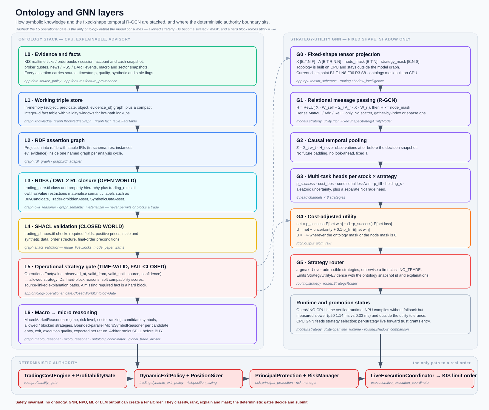
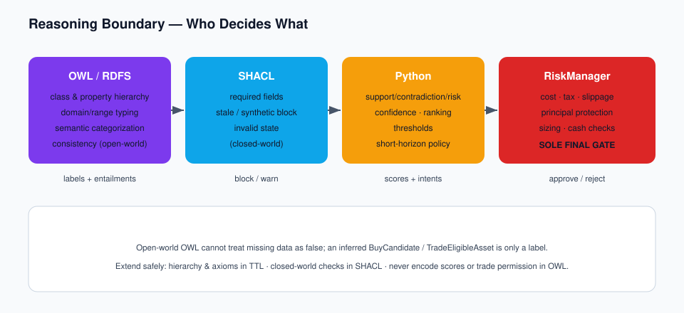

# Ontology and GNN

지식 표현(온톨로지)과 학습 기반 전략 효용 추정(GNN)이 어떻게 쌓여 있고, 어디까지 권한을 갖는지에 대한 문서입니다.



## 1. 왜 하이브리드인가



```text
OWL / RDFS  → 클래스·속성 계층, domain/range 타이핑, semantic 분류, disjoint 일관성
SHACL       → closed-world 데이터 품질/라이브 준비도 검증
Python      → support/contradiction/risk/confidence 점수, 랭킹, 임계값
Engines     → TradingCostEngine, PrincipalProtectionEngine, position sizing
RiskManager → 유일한 최종 실행 게이트
```

- **OWL은 open-world**입니다. 사실이 없다는 것은 *거짓*이 아니라 *모름*입니다. 따라서 OWL은 거래를 막지도 허가하지도 않습니다. risk assertion이 없다는 사실이 안전을 뜻하지 않습니다.
- **SHACL은 closed-world**입니다. "없으면 무효"가 맞는 곳(필수 필드, live 후보의 stale/synthetic 데이터)에만 씁니다.
- **숫자는 전부 Python이 소유**합니다. 점수·가중치·비용·세금·슬리피지·원금보호 금액을 OWL 공리로 인코딩하지 않습니다.
- 추론된 `tr:TradeEligibleAsset`이나 `tr:BuyCandidate`는 *semantic label*이며, 실행 판단은 여전히 RiskManager가 합니다.

## 2. 온톨로지 계층

### L0 — 사실과 근거

KIS 실시간 체결/호가/세션, 계좌·현금 스냅샷, 브로커 quote, 뉴스/RSS/DART 이벤트, 거시·섹터 스냅샷이 입력입니다. 모든 assertion은 `ev:{evidence_id}` `tr:EvidenceItem`에 연결되며 source name, source type, timestamp, data-quality score, synthetic flag, stale flag, confidence, analysis-cycle id를 갖습니다. RDF reification이나 RDF-star는 쓰지 않습니다 (OWL RL 친화성 유지).

관련: `app.data.source_policy`, `app.features.feature_provenance`

### L1 — 작업용 트리플 스토어

`app.graph.knowledge_graph.KnowledgeGraph`는 `(subject, predicate, object, evidence_id)` 문자열 튜플의 in-memory 스토어입니다. 핫 경로 조회는 `app.graph.fact_table.FactTable`이 담당합니다. 문자열 대신 정수 id(`FactDictionary`)와 유효 구간·플래그 비트를 쓰는 compact 표현이며, subject/predicate 인덱스로 조회를 가속합니다. 결과는 문자열 그래프와 동일하고 `to_human_readable()`로 되돌릴 수 있습니다.

### L2 — RDF assertion graph

`app.graph.rdf_graph` / `rdf_adapter`가 내부 레코드와 custom 트리플을 rdflib으로 투영합니다.

| Prefix | IRI | 용도 |
| --- | --- | --- |
| `tr:` | `https://example.com/ontology/trading#` | 스키마 용어 (클래스, 속성) |
| `res:` | `https://example.com/resource/` | 런타임 인스턴스 (종목, 스냅샷, 후보, 판단) |
| `ev:` | `https://example.com/evidence/` | provenance를 담는 `tr:EvidenceItem` |

인스턴스 IRI는 티커/id를 슬러그화한 **결정론적** 값이라 사이클이 바뀌어도 같은 엔티티는 같은 IRI를 갖습니다. 사이클마다 `rdflib.Dataset`의 named graph로 스코프됩니다.

### L3 — RDFS / OWL 2 RL 클로저 (open world)

- `src/app/ontology/trading_core.ttl` — 클래스와 `rdfs:subClassOf` 계층, object/data property, `rdfs:domain`/`rdfs:range`, `rdfs:subPropertyOf`, `owl:disjointWith` (Approved↔Rejected, Buy↔Sell intent, Eligible↔Forbidden).
- `src/app/ontology/trading_rules.ttl` — `owl:hasValue` restriction 클래스를 target 클래스의 subclass로 선언합니다. OWL RL 규칙 `cls-hv2`로 `x p v` → `x a <restriction>`, `cax-sco`로 `x a <target>`이 도출됩니다.

```turtle
[ a owl:Restriction ; owl:onProperty tr:increasesRiskOf ; owl:hasValue tr:Risk_TradeForbidden ]
    rdfs:subClassOf tr:TradeForbiddenAsset .
```

`app.graph.owl_reasoner`가 스키마 그래프를 파일 mtime 기준으로 캐시해 병합하고 `owlrl` 클로저를 돌립니다. `app.graph.semantic_materializer`가 추론된 트리플을 asserted 트리플과 분리해 반환합니다. `ONTOLOGY_REASONING_PROFILE=rdfs`는 더 싼 클로저, `ONTOLOGY_RDF_LAYER=0`은 레이어 전체 비활성화입니다.

거시/미시 어휘는 `macro_market_ontology.ttl` / `micro_symbol_ontology.ttl`이 `trading_core.ttl`을 import해서 확장합니다.

### L4 — SHACL 검증 (closed world)

`trading_shapes.ttl` + `app.graph.shacl_validator`가 필수 필드, 양수 broker price, live 후보의 stale/synthetic 차단, 계좌/주문 구조, approved-and-rejected 충돌, final-order 전제조건을 검사합니다. `mode="live"`는 차단, `mode="paper"`는 경고입니다. shapes 그래프는 lru-cache됩니다.

### L5 — 운영 전략 게이트 (closed world, fail-closed)

`app.ontology.operational_gate.ClosedWorldOntologyGate`가 거래 허가의 실제 기준입니다. OWL의 open-world 부재가 거래 허가로 둔갑하지 않도록, 검증된 point-in-time 스냅샷을 별도로 materialize합니다.

```python
OperationalFact(name, value, observed_at, valid_from, valid_until, source, confidence)
StrategyGateRule(strategy_id, required_true=(...), ...)
```

게이트 출력:

- ontology snapshot id와 유효 구간
- 허용 전략 ID 집합
- 전략별 hard-block 사유 코드
- soft compatibility score
- source가 연결된 explanation path

**필수 사실이 없으면 그 전략은 hard block**입니다. stale, not-yet-valid, 낮은 confidence, boolean 요구 미충족은 각각 결정론적 사유 코드를 만듭니다.

#### L5-S — 숏 closed world (`app.ontology.short_rules`)

숏 arm에는 **반대 방향의** closed-world 규약이 적용됩니다. 롱 측 사실은 의도적으로 open-world인
곳이 있습니다 — 답할 수 없는 권한 검사는 `None`을 반환하고 이를 거부로 읽지 않습니다. 숏은
그 반대입니다: **미기재는 거짓**이며, 결측 필드 조합으로 실행 가능한 숏이 나오는 경로는 없습니다.

비대칭의 근거: 결측 롱 사실의 비용은 **놓친 거래 한 번**이고, 결측 대주 사실의 비용은
**브로커가 거부하거나 — 더 나쁘게 — 수락한 뒤 임의 가격에 강제 청산**하는 주문입니다.

신규 숏 arm이 executable이 되려면 다음 전부가 **명시적으로 참**이어야 합니다.

```text
ShortSalePermitted                    공매도 규제/브로커 허용
BorrowAvailable                       locate 존재 AND snapshot 신선 (30초)
BorrowQuantitySufficient              수량 미상 = 불충분
BorrowCostAcceptable                  이용료 미상 = 수용 불가 (0이 아님)
RecallRiskAcceptable                  마감 여유 + 스퀴즈/days-to-cover
ShortExecutionLiquiditySufficient     청산은 매수이므로 롱보다 엄격
ShortStrategyShadowValidated          forward shadow 기준 통과
+ ShortStrategyLiveProbeAuthorized 또는 ShortStrategyLiveAuthorized
```

권한 사실을 **3개로 분리**한 것이 핵심입니다: 모델 보정 / shadow 검증 / live 권한. 하나의
`authorized` boolean으로 합치면 모델 레벨 플래그가 모든 숏 전략을 한꺼번에 허가합니다. 잘 보정된
모델이 대주 비용 차감 후 손실인 전략을 예측한다면, 그것은 **나쁜 거래에 대한 올바른 모델**입니다.

#### 레짐별 방향 허용 마스크

| regime | 허용 arm |
| --- | --- |
| `TREND_UP` | `intraday_momentum:LONG`, `opening_range_breakout:LONG`, `residual_relative_strength:LONG`, `market_intraday_momentum:LONG`, `residual_relative_weakness:SHORT` |
| `TREND_DOWN` | `market_intraday_momentum_short:SHORT`, `opening_range_breakdown:SHORT`, `residual_relative_weakness:SHORT`, `vwap_mean_reversion:LONG` |
| `HIGH_VOL_TRENDING_DOWN` | `market_intraday_momentum_short:SHORT`, `opening_range_breakdown:SHORT` |
| `HIGH_VOL_DISLOCATED` | **없음** — `CLOSE_LONG` / `CLOSE_SHORT` / `NO_TRADE`만 |

두 가지가 의도적입니다.

- `TREND_DOWN`이 롱(`vwap_mean_reversion`)을 여전히 허용합니다. 지수 하락이 구조적 숏 전용의
  근거는 아니며 — 평균회귀는 정확히 하락 추세에서 살아남는 롱 논지입니다 — 제거하면 방향 필터가
  방향 베팅으로 변합니다.
- `HIGH_VOL_DISLOCATED`는 **양방향** 신규 진입을 막고 청산만 허용합니다. 붕괴된 호가창은 숏
  기회가 아니라 **가격이 정보가 아닌 시장**이고, "테이프를 읽을 수 없다"에 대한 올바른 대응은
  "그러니 반대로 걸겠다"가 아닙니다.

알 수 없는 레짐 이름은 **빈 집합**(fail closed)입니다. 레짐 분류기의 오타가 조용히 양방향 모든
arm을 열면 안 됩니다.

`residual_relative_weakness`는 `TREND_UP`에서도 허용되는 유일한 숏입니다 — 베타 중립이므로
지수가 아니라 종목 고유 매도를 숏 치기 때문입니다.

상세는 [short_selling_deployment.md](short_selling_deployment.md).

#### L5-E — eligibility 엔진: 실제 strategy id 기준 hard/soft 분리

`app.ontology.strategy_eligibility.StrategyEligibilityEngine` 은 L5 를 **선택 계층용으로** 다시
구성한 것입니다. V2 파이프라인에서 온톨로지의 출력은 이것뿐입니다 — 전략을 고르지도, 순위를
매기지도, 아무것도 승인하지도 않습니다.

**고친 결함: 온톨로지 어휘가 실행 어휘와 달랐습니다.** 미시 추론기는 generic METHODOLOGY
(`momentum` / `breakout` / `mean_reversion` / `vwap_reversion`)를 내보내고
`catalog.METHODOLOGY_STRATEGY_ALIASES` 가 그것을 실행 가능한 id 로 번역했습니다. 그 표의 주석이
문제를 그대로 기록합니다 — `mean_reversion → vwap_mean_reversion` 은 "the loosest fit" 이고,
generic 논지는 볼린저 중심선으로 회귀하는데 카탈로그 전략은 VWAP 으로 회귀합니다. **한 가설에
대한 온톨로지 판정이 다른 가설을 인가**했고, 19개 논지의 카탈로그가 4개 이름으로만 주소 지정
가능했습니다. 이제 모든 관계가 구체적 `strategy_id` 를 지목합니다. methodology enum 은 거친
family 허용/차단 목록(`MACRO_FAMILY_BY_STRATEGY`) 이라는, 그것이 올바르게 할 수 있는 한 가지
역할로만 남습니다.

관계 타입은 두 부류이고 **hard 만 마스크를 0으로 만들 수 있습니다.**

| hard (mask 0 가능) | 판정 근거 |
|---|---|
| `requires` | 논지가 없으면 정의되지 않는 `MarketContext` field |
| `requiresFeature` | `entry()` 가 실제로 참조하는 `TechnicalFeatureSet` field |
| `requiresLiquidity` | 선언된 유동성 하한 / 스프레드 상한 |
| `requiresSession` | 신규 진입이 정의되는 세션 국면 |
| `requiresHistory` | 지표가 필요한 완성봉 개수 |
| `requiresDataQuality` | tick window / 호가 표본 / completeness 하한 |
| `allowedMarket` | 논지가 admissible 한 시장 |
| `forbiddenUnder` | 논지가 아예 무효인 시장 상태 |

| soft (절대 block 못 함) | 용도 |
|---|---|
| `worksWellUnder`, `prefers`, `supportedBy`, `historicallyCompatibleWith` | 적합도 **증거**. `[-1, 1]` 가중 평균이 효용의 `O_s` 항이 됨 |

분리의 이유: **선호를 차단으로 표현하면 순위만 낮춰야 할 후보를 잃습니다.** 예로
`app.technical.signals` 는 하락 추세에서 평균회귀를 하드 비활성화하는데, 여기서는 같은 사실이
페널티입니다 — 회귀 논지는 하락 테이프에서 *때때로* 맞고, 거부해 버리면 언제 맞는지 알아낼 증거가
사라집니다.

soft 관계는 각 논지와 **이미 코드에 있는 게이팅**에서 도출했습니다 (`signals.py` 의 하락추세
평균회귀 비활성화와 브레이크아웃 거래량 요구, `MACRO_FAMILY_BY_STRATEGY` 가 기록한
"`residual_relative_strength` 는 `TREND_DOWN` 에서도 유효" 등). **실현 성과에 fit 한 것은
하나도 없습니다** — 관계를 과거 결과로 점수화하면 온톨로지가 backtest 가 됩니다.

fail-closed 이지만 예외가 하나 있습니다. 결측 *요구사항* 은 차단하고, 결측 *시장 상태 라벨* 은
차단하지 않습니다. `forbiddenUnder` 와 no-entry 집합은 실제로 존재하는 라벨에만 발화합니다 —
미해석 레짐은 답하지 못한 질문이고, 기존 코드도 답할 수 없는 권한 검사를 철회로 읽지 않습니다
(`strategy_algorithms.macro_strategy_permitted`). 신뢰할 수 없을 만큼 빈 컨텍스트는
data-quality 관계가 명시적으로 잡습니다.

출력은 전략별 두 개의 독립된 수 입니다.

| 필드 | 의미 |
|---|---|
| `eligible` / `mask` | hard 판정. `False`/`0.0` 이면 효용 랭킹에서 완전히 제외 |
| `compatibility_score` | soft 증거 `[-1, 1]`. 발화한 관계의 가중 평균. 매칭 관계가 없으면 `0.0` — **중립이며 페널티가 아님**, 증거의 부재는 증거가 아니기 때문 |
| `hard_block_reasons` | 결정론적 사유 코드 (`ONTO_ELIG_*`) |
| `supporting_relations` | 발화한 soft 관계 |

`long_only` 인 동안 SHORT 방향은 hard block 입니다. 이는 3중 잠금의 세 번째이며 유일한 잠금이
아닙니다 — 상세는 [strategy_selection_v2.md](strategy_selection_v2.md) §4.2.

### L6 — 거시 → 미시 추론

계층형 추론 레이어(`app.graph.*`)는 가격을 직접 예측하지 않습니다. 예측·리스크 신호를 **구조화**하고 **전략을 선택**합니다.

```text
Common Trading Ontology (trading_core.ttl)
        ↓
MacroMarketReasoner   regime, risk level, sector ranking, candidate symbols,
                      allowed / blocked strategies
        ↓  (macro가 BLOCK_BUY면 신규 BUY 미시추론은 생략, 보유 종목은 항상 평가)
ParallelMicroReasoningPool → MicroSymbolReasoner per candidate
                      exit deterioration → freshness gate → technical composite
                      → micro regime → macro 전략 허가 게이트 → execution quality
                      → 양(+)의 expected net return이 있어야 BUY_CANDIDATE
        ↓
OntologyCoordinator   bounded ThreadPoolExecutor, worker timeout, 실패 격리
        ↓
GlobalTradeArbiter    SELL/REDUCE를 BUY보다 먼저 랭킹 (자본 보호 우선)
        ↓
SharedLiveDecisionEngine.consume_bundle  ← 어댑터, 기존 게이트 흐름 그대로
```

| 모듈 | 역할 |
| --- | --- |
| `graph/macro_micro_common.py` | 공유 enum (MarketRegime, MacroRiskLevel, MicroRegime, SelectedStrategy, ExecutionQuality, IntentType)과 사유 코드 |
| `graph/macro_reasoner.py` | 규칙 기반 regime/risk/sector/candidate/전략 허가 |
| `graph/micro_reasoner.py` | 종목별 진입·청산·실행품질·기대 순수익 |
| `graph/ontology_coordinator.py` | macro-first, bounded-parallel micro, timeout/예외 격리 |
| `graph/global_trade_arbiter.py` | 자문 전용 `RankedTradeIntent` 랭킹 |
| `graph/macro_micro_config.py` | `config/macro_micro_ontology.yaml` 로드 (env override, 보수적 fallback) |
| `graph/rdf_adapter.py` | `attach_macro_result_rdf` / `attach_micro_result_rdf` |
| `graph/macro_micro_replay.py` | no-look-ahead 리플레이 검증 |

macro 루프는 느리게(기본 60초), micro는 빠르게(기본 5초) 돕니다. 잘못된 설정값은 보수적 기본값으로 clamp되고 `diagnostics.config_fallbacks`에 기록됩니다.

**macro `BLOCK_BUY`는 게이트/브로커 호출 이전에 BUY를 rejected로 단락시킵니다. 막을 수만 있고 허가할 수는 없습니다.**

### 성능 고려

스키마 그래프는 mtime 캐시, SHACL shapes는 lru-cache, materialization은 현재 후보 유니버스로 스코프됩니다. 사이클당 결과는 한 번 계산되어 frozen `AnalysisContext`에 저장되고, live 런타임에서는 백그라운드 refresh 스레드가 만들기 때문에 API 요청은 캐시된 payload만 읽습니다. 전체 온톨로지에 대한 OWL RL 클로저는 사이클당 수백 ms가 들 수 있어 가장 촘촘한 tick 루프에서는 의도적으로 제외되어 있습니다.

## 3. 전략 효용 GNN

8개 전략 expert(`app.strategy.experts`) 각각에 대해 **종목 × 전략** 단위의 제비용 차감 기대효용을 추정하는 fixed-shape strategy-utility R-GCN입니다. 온톨로지와 GNN은 별도 후보 시스템이 아니라 하나의 파이프라인입니다. 온톨로지가 관계·허용 집합을 정의하고 GNN이 데이터로 관계 가중치와 효용을 학습합니다.

| 전략 ID | 논지 |
| --- | --- |
| `intraday_momentum` | 지속적 주문 흐름 + 시장/섹터 정렬 + 추세 상태 → 지속 |
| `breakout_volume` | 인과적으로 알려진 저항 돌파 + 비정상 거래량 + 우호적 흐름 |
| `vwap_mean_reversion` | 비추세·유동적 구간의 일시적 이탈은 VWAP으로 회귀 |
| `liquidity_shock_reversal` | 신규 정보 없는 기계적 급락은 유동성 정상화 시 부분 회복 |
| `event_momentum` | 신선하고 검증된 중대 정보의 과소반응 |
| `cross_sectional_relative_strength` | 공통 요인 제거 후 섹터 내 최강 종목 |
| `gap_context` | 갭의 지속/메움을 촉매·확인·유동성으로 구분 (한쪽 서브모드만 선택) |
| `rvgi_box_breakout` | 인과적 박스 돌파 + RVGI 교차 + 거래량 수용 + false-breakout 위험 통제 |

### 텐서 계약

```text
X            [B, T, N_max, F]        node features
A            [B, T, R, N_max, N_max] relation-wise adjacency
node_mask    [B, T, N_max]
strategy_mask[B, N_max, S]
```

토폴로지 구성과 closed-world 마스크는 CPU에서 이뤄지고 모델 그래프 밖에 남습니다. 그래프 사실은 바뀌어도 **텐서 rank/shape은 바뀌지 않습니다.** 현재 체크포인트 계약은 `B1 T1 N16 F40 R3 S16`이며, 24개 causal context feature와 16개 strategy identity feature를 사용합니다.

### context 계약 (`realtime_strategy_graph_v5_aligned`)

context 벡터의 정의는 **`app.features.strategy_graph_context` 한 곳**에 있습니다. 학습 경로
(`app.evaluation.stored_counterfactual`)와 서빙 경로(`app.routing.shadow_intelligence`)는
반드시 `build_strategy_graph_context()`를 통해 벡터를 만들며, 필드는 **이름으로만** 접근합니다.

v4까지는 두 경로가 각자 위치 기반 튜플을 조립했고, 두 가지 방식으로 어긋나 있었습니다.

- **같은 슬롯에 다른 양** — slot 2는 학습에서 봉 high-low range, 서빙에서 실제 `spread_bps`.
  slot 4는 학습에서 `close_location`, 서빙에서 `orderbook_imbalance`. slot 6은 학습에서 clip된
  분봉 수익률, 서빙에서 `aggressor_imbalance_5s`. 한쪽 양으로 적합된 가중치가 다른 양에 적용됐습니다.
- **조용히 기본값이 된 슬롯** — 서빙 어댑터가 `values.get(name, default)`로 읽었기 때문에
  `LIVE_FEATURE_NAMES`가 컬럼을 뺀 뒤 `realized_volatility_3m`, `box_high`, `box_low`,
  `box_mid`, `box_previous_close` 5개가 **영구 0.0**이 되었습니다. 없는 키와 측정된 0이
  구분되지 않았습니다.

v5의 규칙은 두 가지입니다.

1. **필드는 이름으로 한 번만 정의**됩니다. 위치는 `STRATEGY_GRAPH_CONTEXT_FIELDS`에만 있고,
   슬롯 인덱스가 필요한 소비자는 `context_index()`를 씁니다.
2. **기본값이 없습니다.** 누락·비유한 필드는 `StrategyGraphContextError`입니다. 서빙 경로에서는
   심볼 단위로 잡혀 shadow 오류로 기록되고, 학습 경로에서는 그 스냅샷이 라벨 집합에서 빠집니다.

필드 목록은 양쪽이 **같은 추정량으로 같은 창(window)** 을 계산할 수 있는 것들의 교집합이며,
전부 완결된 1분봉과 `realtime_minute_bars`에 함께 저장된 microstructure 컬럼에서 나옵니다.
한쪽만 만들 수 있는 양은 채우지 않고 **제외**합니다 — `aggressor_imbalance_5s`는 서빙에서 실재하고
유용하지만 과거 분봉으로는 만들 수 없으므로, 그 가중치는 영원히 학습되지 않습니다.

v4 대비 제거된 것: 3중 중복된 원시 가격 수준과 VWAP 수준(종목 정체성 인코딩), 상수 3개,
`aggressor`, 원시 거래량 기반 signed flow. 추가된 것: 실제 `liquidity_score`,
정렬된 `volume_spike_ratio`, 그리고 `microstructure_available`.

#### `microstructure_available`

스토어는 호가 샘플이 없는 분에 NULL이 아니라 **0.0**을 씁니다. 그런데 `best_bid == best_ask`는
실재하는 시장 상태가 아니므로 0은 "스프레드 0"이 아니라 "표본 없음"입니다. 현재 스토어 기준
실제 표본이 있는 봉은 **KRX 19,920개 중 2,088개(10.5%)**, US 60,283개 중 47,365개(78.6%)입니다.
그래서 가용성은 `rvgi_available` / `box_available`과 같은 관례로 **필드**가 되었고, 값이 0일 때
`spread_bps_scaled` / `orderbook_imbalance` / `liquidity_score`는 함께 0이 됩니다.

`_strategy_compatibility`도 이 값을 곱합니다. 곱하지 않으면 `1 - 0/10 = 1.0`이 되어 **아는 것이
가장 적은 분에 실행품질 prior가 최대**가 됩니다.

### 순전파

```text
H_t = ReLU( X_t · W_self  +  Σ_r  A_{r,t} · X_t · W_r ),   H_t ×= node_mask
Z   = Σ_t  w_t · H_t                (인과 시간 풀링, 결정 시점 이후 관측 없음)
raw = Z · strategy_heads            → [B, N, S, 8]
```

`scatter`, `gather-by-index`, 동적 `nonzero/unique`, shape 의존 제어 흐름을 쓰지 않습니다. 내보내는 연산은 MatMul / Add / ReLU / Multiply / Concat / Squeeze로 제한됩니다.

### 헤드와 효용

```text
p_success  = sigmoid(raw0)
cost_bps   = softplus(raw2) × 10
loss_bps   = softplus(raw3) × 15    # 실패 조건부 손실 크기
win_bps    = softplus(raw4) × 20    # 성공 조건부 순이익 크기
p_fill     = sigmoid(raw5)
holding_s  = softplus(raw6) × 60    uncertainty = softplus(raw7)

net_bps   = p_success·win_bps − (1 − p_success)·loss_bps
gross_bps = cost_bps + net_bps
utility   = net_bps − uncertainty + 0.1·p_fill·win_bps
utility   = −∞  where (node_mask ∧ strategy_mask) = 0
no_trade  = sigmoid(no_trade_head · Z),  마스킹된 노드는 1.0
```

성공/실패 크기를 하나의 평균 gross 회귀로 뭉개지 않고 hurdle expectation으로 계산합니다. 희소한 수익 구간이 다수 손실 구간에 묻혀 모든 후보가 음수가 되던 문제를 피하되, 성공확률과 조건부 손익은 실현 데이터로 각각 검증합니다. `NoTrade`는 오류나 결측 예측이 아니라 **일급 행동이자 학습 라벨**입니다.

#### 비용 채널은 선택 계층에서 쓰지 않습니다 (V2)

위 디코더는 `cost_bps = softplus(raw2) × 10` 을 **예측**하고 그것을 `utility` 에 접습니다. 결과가
두 가지였습니다.

1. 수수료·세금·FX 정책을 바꾸면 **재학습**이 필요했습니다. selector 가 쓰는 비용이
   `config/trading_costs.json` 이 아니라 체크포인트 안에 살았기 때문입니다.
2. downside 와 uncertainty 가 수익과 어떻게 교환되는지를 **모델이** 결정했으므로, 그 가중치는
   감사할 수도 없고 새 체크포인트 없이 바꿀 수도 없었습니다.

V2 선택 계층(`app.routing.strategy_utility`)은 모델에서 **모델만 알 수 있는 것**을 받습니다 —
성공확률, gross 기대 이동, downside, duration, uncertainty. 비용은 `TradingCostEngine` 이 주고
net 은 항등식입니다.

```text
expected_net_return_bps = expected_gross_return_bps − expected_cost_bps
```

`GnnUtilityAdapter` 는 모델의 `expected_cost_bps` 를 **gross 복원에만** 씁니다 (행이 net 만 담고
있을 때). 거래 비용으로는 절대 쓰지 않습니다. 항별 가중치 `lambda_*` 는
`config/strategy_selector_v2.yaml` 로 나왔습니다.

기존 `StrategyRouter` 경로는 그대로 모델의 비용 채널을 사용합니다 — V2가 SHADOW이거나 자동
강등된 때 필요한 legacy fallback이 거기에 의존하므로, 함께 바꾸면 fallback이 깨집니다. 두 경로의 상태는
[strategy_selection_v2.md](strategy_selection_v2.md) §7 에 분류돼 있습니다.

### 라우팅

`app.routing.strategy_router.StrategyRouter`가 허용 전략 중 실행 순효율 하한과 불확실성 제한을 통과한 효용 최대 전략을 고르고, 그렇지 않으면 `NO_TRADE`를 반환합니다. 출력은 `StrategyUtilityEvidence`로, ontology snapshot id·feature snapshot id·model version·explanation path를 포함합니다.

`GnnRealtimeTrustEvaluator`는 권한을 둘로 나눕니다.

- `calibrated_strategy_ids` — Brier score, 불확실성, 순효율 부호 정확도, MAE, 최소 표본을 통과한 모델 보정 상태
- `trusted_strategy_ids` — 양수로 예측한 forward 표본이 최소 개수를 채우고, 실현 양수 비율과 평균 실현 순효율까지 통과한 신규 진입 권한

검증은 전략별 20~60분 horizon을 사용하며, 마지막 가격만 비교하지 않고 실거래와 같은 목표가/손절가 중 먼저 도달한 가격을 청산가로 사용합니다. 동일 horizon 버킷에서는 최초의 실행 가능한 양수 예측을 보존하고, 양수 예측이 없으면 최초 음수 예측을 보정 표본으로 남깁니다.

`StrategySessionManager`는 선택된 종목과 전략을 잠그고, 열린 포지션에는 새 소유자를 만들지 않습니다. 포지션은 진입부터 청산까지 `origin_strategy_id`/`strategy_instance_id`가 durable하게 소유합니다.

**V2 는 초기에는 이 라우팅 옆에서 비교하고, 검증 후에는 선택 권한만 단계적으로 인수합니다.**
`StrategySelectorV2` 는 같은 GNN 벡터를 받아
비용을 분리하고, 온톨로지 hard mask 를 곱하고, downside/uncertainty/soft-score/bandit 보정을 항별로
더한 뒤 NO_TRADE 와 비교합니다. Windows 런처에서는 초기 SHADOW 및 자동 승격으로 실행되며,
보수적 forward 검증을 통과하기 전 결과는 telemetry입니다. `trusted_strategy_ids` /
`calibrated_strategy_ids` 의 권한 분리는 그대로 유효하고, V2 는 그 사실을 예측의
`reason_codes` (`UTILITY_GNN_UNTRUSTED`)로 옮겨 담아 **거부가 아니라 uncertainty 로** 처리합니다 —
신뢰되지 않은 추정기는 여전히 추정기이고, 버리면 신뢰를 얻을 증거가 쌓이지 않기 때문입니다.

승격 후에도 V2는 실행 계층을 import하지 않습니다. 세션 계층이 독립적으로 live 승인된 proposal과
일치하는 선택만 채택하므로 GNN trust, 전략 배포 권한, 비용·리스크 게이트는 그대로 유지됩니다.

### Shadow 서비스

`app.routing.shadow_intelligence.ShadowIntelligenceService`가 슬로우 경로를 묶습니다.

1. 실시간 체결·호가·분봉에서 28차원 causal microstructure context를 만듭니다.
2. `ClosedWorldOntologyGate`로 허용 전략을 계산합니다 (`data_fresh`, `tradable`, `allow:<strategy>` 요구).
3. OpenVINO CPU(그리고 선택적으로 NPU)로 효용을 추론합니다.
4. 모든 허용 전략 예측은 forward 검증 후보로, legacy / ontology-only / cpu_gnn 판단은 비교 로그로 기록합니다.
5. CPU GNN 모델 보정과 선택 전략의 실시간 진입 권한이 모두 통과하면 `StrategySessionManager`의 실거래 전략 소유권으로 연결합니다.

체크포인트 provenance 검사가 fail-closed입니다. `input_feature_schema`가 현재 프레임 스키마와 다르거나 `live_authorized`가 아니면 `MODEL_INPUT_SCHEMA_MISMATCH` / `UTILITY_MODEL_NOT_LIVE_AUTHORIZED`로 `NO_TRADE`를 내고 모델 출력을 쓰지 않습니다.

`app.data.event_runtime`은 이 서비스를 WebSocket 수집 루프에 붙이되, 별도 큐와 스레드에서 돌려 콜백을 막지 않습니다. 비교 기록은 shadow라는 이름을 유지하지만, 신뢰도 통과 결과는 실거래 판단에 직접 사용됩니다.

### 현재 체크포인트 상태

`rgcn_shadow`는 **v5로 승격되었습니다**(2026-08-09). 직전 v4는
`rgcn_shadow.pre-v5-aligned.{npz,json}`에 보존돼 있어 두 파일을 되돌리면 롤백됩니다.
승격 전까지는 서빙이 v5를 내고 체크포인트가 v4라 `MODEL_INPUT_SCHEMA_MISMATCH`로 fail-closed
되어 있었습니다 — 슬롯 의미가 바뀐 벡터를 옛 가중치에 먹이지 않으려는 설계된 동작입니다.

```text
method               ontology_strategy_graph_rgcn_joint_gradient_calibration
input_feature_schema realtime_strategy_graph_v5_aligned
feature_provenance   causal_minute_bar_microstructure_v2_aligned
rows / snapshots     57,552 / 3,597   (16개 전략 각 3,597)
config               B1 T1 N16 F40 R3 S16, hidden 16, seed 17
authorization_scope  ontology_gnn_realtime_trust_gated_execution
```

feature 정렬 수정의 효과는 보정에서 나타났습니다. `raw_head_mse` 0.886 → 0.600,
`success_direction_accuracy_realized` 0.618 → 0.728.

### 정확도는 이 모델을 측정할 수 없다

`success_direction_accuracy`가 다수결 baseline보다 낮다는 사실이 "무예측력"으로 읽혔지만,
**그 지표로는 이 모델이 하는 일을 볼 수 없습니다.** 채널 0의 격자는 57,552 셀 중 1,622개만
발화(2.82%)하므로 "전부 실패"라고 답하는 상수 예측기가 97.18%를 받습니다. 순위는 맞게 매기지만
임계값이 어긋난 헤드는 이 지표에서 baseline 아래로 떨어집니다 — 실제로 그랬습니다.

같은 체크포인트를 **선택 품질**로 재면 이렇습니다(체결된 검증 셀 408개, 25종목).

| 지표 | 값 |
| --- | --- |
| `selection_auc` | **0.737** |
| 95% CI (종목 클러스터 부트스트랩) | [0.551, 0.831] |
| **종목내 순열 null** | **0.651** |
| 순열 p-value | 0.001 |
| base rate (양의 순수익 비율) | 0.154 |
| 전체 평균 순수익 | −54.4 bps |
| 상위 10분위 평균 순수익 | +2.0 bps |
| 같은 항목 95% CI | [−81.6, +64.9] |
| P(상위 10분위 ≤ 0) | **0.481** |

두 가지가 방법론적으로 필수입니다.

- **종목 클러스터 재표집.** 한 종목의 행들은 같은 가격 경로와 12배 겹치는 forward window를
  공유합니다. 행 단위로 부트스트랩하면 종속 관측 수백 개를 독립으로 취급해 CI가 몇 배 좁아집니다.
- **null은 0.5가 아니라 종목내 순열.** 종목별 승률을 보존한 채 섞으면, "승률 높은 종목을 선호"하는
  것만으로 생기는 분리가 null에 남습니다. 실측 0.651입니다. 0.5를 null로 쓰면 **횡단면 종목
  선택을 타이밍 능력으로 착각**합니다.

**결론은 두 개의 서로 다른 주장입니다.**

- **순위 능력은 실재합니다** — AUC 0.737, 순열 p=0.001. 우연이 아닙니다.
- **수익 엣지는 입증되지 않았습니다** — 상위 10분위 순수익 CI가 0을 크게 걸치고 P(≤0)=0.48입니다.
  사실상 동전 던지기입니다.

모델 카드의 `selection_ranking_skill_established` / `selection_net_edge_established`가 이 둘을
분리해 명시합니다. 현재 각각 `true` / `false`이며, **실거래 선출에 필요한 것은 두 번째**입니다.
남은 제약은 아키텍처가 아니라 표본입니다 — 체결 검증 행 408개는 12배 중첩을 감안하면 독립
관측 약 34개이고, 이 크기로는 비용(38~52bps) 대비 수 bps의 엣지를 분해할 수 없습니다.

### 학습 분할의 purge

`horizon_bars=60`이라 라벨은 스냅샷보다 60분 뒤에 확정됩니다. 이전 분할은 시간순 80%에서 그냥
잘랐기 때문에 경계 부근 학습 행의 결과가 **검증 구간 안에서** 나왔습니다(현재 데이터 28행).
이제 `label_end <= boundary`인 행만 학습에 씁니다(`purged_train_snapshots`로 보고).

### context field 커버리지

`rvgi_available`과 `box_context_available`은 학습 3,597 스냅샷 전체에서 **상수 1.0**입니다.
이 창의 모든 봉이 warmup을 만족했다는 뜻이고, 따라서 그 가중치는 한 값으로만 적합돼 있습니다.
서빙에서 RVGI가 실제로 unavailable이 되는 순간(rvgi 컬럼들이 0.0이 되는 그 상황) 모델은
**학습된 적 없는 영역**에서 돌아갑니다.

**이 필드들을 지우는 것은 오답입니다.** 플래그가 없으면 "unavailable이라 0.0"과 "값이 0.0"이
같은 입력이 되고, 그건 context 계약이 막으려던 바로 그 silent-default입니다. 대신 카드가
`context_fields_constant_in_training`과 `context_flags_below_minimum_support`로 보고합니다
(현재 후자에는 `box_available`이 minority support 0.14%로 올라옵니다).

`live_authorized=true`는 체크포인트 형식과 학습 커버리지가 런타임 사용 요건을 만족한다는 뜻이지, 모든 전략에 주문 권한이 있다는 뜻은 아닙니다. 실제 진입 권한은 `/api/gnn/realtime-trust`의 `trusted_strategy_ids`가 전략별 실시간 성과를 통과할 때만 부여됩니다.

#### 숏 전략 추가와 체크포인트

카탈로그에 숏 전략 3개가 **append**되어 `STRATEGY_IDS`가 13 → 16이 되었습니다. 모델 출력
인덱스와 저장된 전략 마스크가 이 순서에 의존하므로 삽입이 아니라 추가이며
(`test_short_strategy_algorithms_are_appended_never_inserted`), 전략 수 변경 자체가 기존
체크포인트를 **fail-closed** 처리합니다.

**방향별 head는 별도 축이 아니라 전략별 head 그 자체입니다.** 이 카탈로그에서 숏은 별개의
`strategy_id`이므로(`opening_range_breakdown`은 `opening_range_breakout`의 방향이 아님),
전략별 head가 곧 방향별 head입니다. 별도 방향 축을 추가하면 head가 2배가 되고 절반은 의미가
없습니다 — 숏 전용 논지의 LONG head는 학습할 것이 없습니다.

숏이 롱과 달리 실제로 필요한 것은 **대주 leg**이므로 head를 8채널 → **11채널**로 넓혔습니다.

| 채널 | 내용 |
| --- | --- |
| 8 | `expected_borrow_cost_bps` |
| 9 | `borrow_probability` (발동 시점에 locate가 존재할 확률) |
| 10 | `epistemic_uncertainty` (모델의 무지 — aleatoric 시장 노이즈와 분리) |

두 가지가 **구조적으로** 강제됩니다: (1) 롱 인덱스는 마스크가 카탈로그에서 생성되므로 어떤
학습 데이터로도 대주 비용을 청구하거나 할인하도록 배울 수 없고, (2) utility에
`borrow_probability`가 곱해집니다 — 빌릴 수 없는 종목에서만 존재하는 엣지는 엣지가 아닙니다.

head 폭 변경은 기존 체크포인트를 **의도적으로 무효화**하며, 로더는 이를
`GNN_HEAD_SCHEMA_MISMATCH`로 보고합니다(`GNN_CHECKPOINT_CORRUPT`가 아님 — 전자는 재학습,
후자는 손상된 파일 수색을 뜻하므로 운영자를 다른 방향으로 보냅니다).

**다만 새 채널은 아직 학습되지 않았습니다.** 라벨(실현 대주 비용, 실현 locate 성공률)이
forward 표본에서 나와야 하는데 그 표본이 0입니다. `RuntimeHealth.model_calibrated`는 `False`로
고정되어 모든 숏 arm이 `SHORT_MODEL_NOT_CALIBRATED` 게이트에서 막히며, 이것이 정직한 상태입니다.

모델 카드의 단일 `live_authorized` 값으로 **모든 숏 전략을 허가하지 않습니다.** 권한은
arm별(`DirectionalStrategyKey`)로 `data/store/strategy-deployment.sqlite3`에 기록되며, 모델
보정과 전략 실거래 권한은 독립적인 주장입니다.

## 4. NPU / CPU 경계

| 단계 | 장치 | 비고 |
| --- | --- | --- |
| 데이터 수집 | CPU | broker, 뉴스, 공시, 거시, 저장 |
| 하드 필터 | CPU | 거래정지, 관리종목, 유동성, 무효 데이터 |
| 후보 evidence 스코어링 | NPU + CPU fallback | `OntologyNpuLinearScorer`, `_rank_accepted_with_npu` |
| evidence cluster 압축 | NPU + CPU fallback | 상관 지표를 투표 전에 압축 |
| theory vote 스코어링 | NPU + CPU fallback | BUY/SELL/HOLD/REDUCE/WATCH 벡터 |
| conflict penalty | NPU + CPU fallback | 라벨은 CPU에 남음 |
| short-horizon 예측 | NPU + CPU fallback | 단기 수익·순양수 확률·불확실성 |
| execution edge 스코어링 | NPU + CPU fallback | 체결/슬리피지/역선택 배치 추정 |
| strategy-utility R-GCN | OpenVINO CPU 실시간 판단·검증 / NPU 미승격 | 온톨로지 마스크 + 전략별 trust gate |
| 그래프 탐색·설명 | CPU | 분기 많음, 설명 가능성 필수 |
| 최종 행동 결정·브로커 실행 | CPU | 안전 임계 |

거시–미시 추론 레이어는 **CPU-only이며 Raspberry Pi 호환**입니다. 재사용하는 기술 예측 엔진 내부의 학습 모델만 OpenVINO/NPU를 쓸 수 있고, 동일 스키마 CPU fallback(`models/inference_backend.py`)이 항상 있습니다.

### 환경 변수

| 변수 | 의미 |
| --- | --- |
| `OPENVINO_DEVICE` | 요청 OpenVINO 장치 (`run.ps1`은 `NPU`) |
| `ONTOLOGY_ACCELERATOR` | 온톨로지 런타임 요청 장치 |
| `ONTOLOGY_NPU_ENABLED` | 후보 스코어링 evidence 경로 활성 (기본 true) |
| `ONTOLOGY_NPU_BATCH_SIZE` | `auto` 또는 512/1024/2048/4096 (`run.ps1`은 4096) |
| `ONTOLOGY_NPU_TOP_K` | 그래프 추론으로 넘길 후보 상한 (기본 50) |
| `NPU_DEVICE_PREFERENCE`, `NPU_MIN_BATCH_FOR_NPU` | 공유 `NpuRuntimeManager` 모듈 설정 |
| `EVENT_CLASSIFIER_PROVIDER` / `_DEVICE` | `keyword`(기본), `openvino`, `llm` |
| `SHORT_HORIZON_PREDICTOR_ENABLED` / `_DEVICE` | 선택적 short-horizon evidence provider |
| `ONTOLOGY_GRAPH_SCOPE` | `candidate_only`, `candidate_and_holdings`, `full_debug` |
| `REFACTOR_GNN_CHECKPOINT` | strategy-utility 체크포인트 경로 |
| `GNN_TRUST_HORIZON_SECONDS` | 알 수 없는 전략의 기본 forward 검증 horizon (`run.ps1`: 1800초) |
| `GNN_TRUST_MIN_SAMPLES_PER_STRATEGY` | 전략별 모델 보정 최소 표본 |
| `GNN_TRUST_MIN_POSITIVE_PREDICTION_SAMPLES` | 전략 진입 권한에 필요한 양수 예측 최소 표본 |
| `GNN_ROUTER_MIN_NET_EDGE_BPS` | GNN 전략 활성화 최소 순효율; 미지정 시 US 실거래 순효율 하한과 정렬 |

### Fallback 보고

OpenVINO나 NPU가 없으면 동일 스키마로 NumPy 또는 OpenVINO CPU 스코어링으로 떨어집니다. 이벤트/short-horizon 모델 파일이 없으면 결정론적 keyword/linear baseline으로 떨어집니다. 상태는 명시적으로 노출됩니다.

- `/api/ontology/runtime` — 요청/활성 backend, 사용 가능 장치, fallback 사유
- `/api/realtime/runtime` — 가속 요약 + 온톨로지 NPU 상태 + live 모델 상태
- `/api/npu/runtime` — candidate/theory-vote/conflict/short-horizon/execution-edge 모듈 상태

### 벤치마크

```powershell
python scripts/benchmark_npu_scoring.py --device CPU
python scripts/benchmark_realtime_pipeline.py --device CPU
python scripts/benchmark_npu_theory_voting.py --device NPU
python scripts/benchmark_npu_full_decision_pipeline.py --device NPU
python scripts/benchmark_strategy_utility_openvino.py --iterations 30
python scripts/benchmark_fact_table.py
```

측정 결과와 승격 판정은 [validation.md](validation.md)에 있습니다.

## 5. 온톨로지를 안전하게 확장하기

1. 새 클래스/속성은 `trading_core.ttl`에 `rdfs:subClassOf` / `rdfs:subPropertyOf`와 `rdfs:domain`/`rdfs:range`를 붙여 추가합니다. 가능하면 기존 super-property(`tr:hasSemanticEvidence` 등)를 재사용합니다.
2. semantic 분류는 `trading_rules.ttl`의 `owl:hasValue` restriction subclass 공리로 추가합니다. OWL 2 RL 범위를 유지하고 cardinality나 복잡한 DL은 피합니다.
3. closed-world/데이터 품질 검사는 OWL이 아니라 `trading_shapes.ttl`의 SHACL shape로 추가합니다.
4. 수치 임계값·점수·거래 허가를 OWL에 인코딩하지 않습니다. 그것은 Python 정책 스코어러와 결정론적 엔진의 영역입니다.
5. 새로 emit하는 predicate/object 문자열은 `app.graph.rdf_adapter`에 매핑하고 `tests/test_ontology_*.py`에 테스트를 추가합니다.
6. **숏 측 사실을 추가할 때는 기본값이 거부 쪽인지 확인하세요.** `app.ontology.trading_fact_builder`의
   숏 필드는 전부 fail-closed 기본값(`False` / `None` / `0`)을 가집니다. 새 필드에 유리한
   기본값을 주면 결측 사실이 조용히 숏 실행을 허가하게 되고, 그것은 이 계층이 존재하는 이유를
   무력화합니다.
7. `IntentType`에 방향 의도를 추가할 때 기존 `SELL`을 재사용하지 마세요. `SELL`은 항상 "롱 청산"을
   뜻했고, 여기에 "숏 진입"을 겹치면 SELL을 위험 축소로 취급하는 모든 기존 규칙이 조용히 신규 숏
   노출을 허가합니다. `OPEN_SHORT` / `CLOSE_SHORT`는 별개 멤버입니다.

TTL 파싱 점검:

```bash
python -c "import rdflib; [rdflib.Graph().parse(f, format='turtle') for f in \
  ['src/app/ontology/trading_core.ttl','src/app/ontology/trading_rules.ttl','src/app/ontology/trading_shapes.ttl']]; print('ok')"
```

런타임에서는 `app.graph.rdf_graph.RdfTradingGraph.serialize(format="turtle" | "json-ld")`가 현재 assertion 그래프를 덤프하고, `app.graph.semantic_materializer`가 추론 트리플을 asserted 트리플과 분리해 반환합니다.
