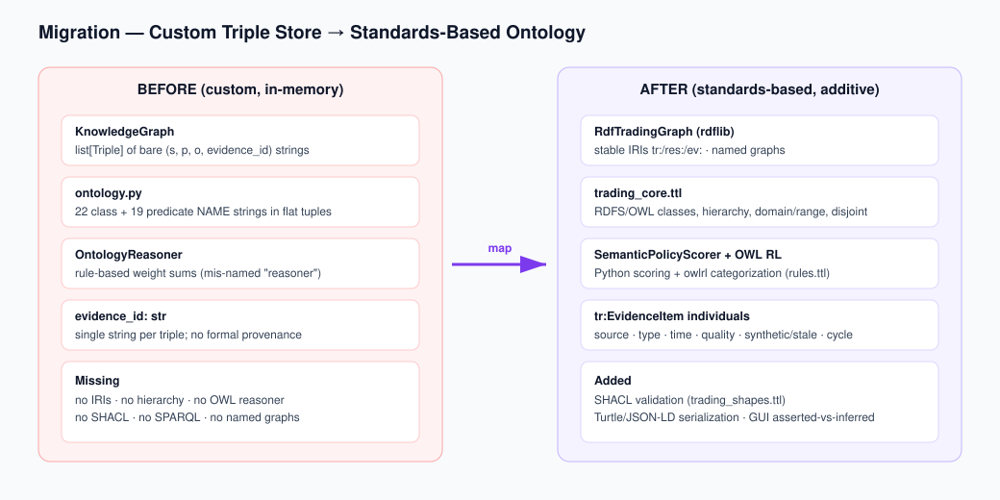

# Ontology Migration Audit (T01)

**Task:** Convert the custom in-memory triple ontology into a standards-based RDF/RDFS/OWL
framework with hybrid reasoning, **without** breaking the existing trading pipeline.

**Scope of this document:** inventory the current custom ontology/graph implementation, map its
vocabulary to the target RDF/RDFS/OWL model, list the modules that must be updated, and record the
compatibility risks. This is the reference for T02–T14.

---

## 1. Current design summary

The ontology layer lives in `src/app/graph/`. It is a **custom in-memory triple store**, not RDF:

- **`knowledge_graph.py`** — `KnowledgeGraph` wraps a `list[Triple]`.
  `Triple(subject: str, predicate: str, object: str, evidence_id: str | None)` is a frozen dataclass.
  Subjects/predicates/objects are **bare Python strings** (no IRIs, no datatypes, no namespaces).
  Provenance is a single optional `evidence_id` string attached directly to each triple.
  API: `add`, `triples`, `for_subject`, `matching`, `objects`, `reasoning_path_ids`.
- **`ontology.py`** — the "schema": two flat tuples, `CLASSES` (22 names) and `RELATIONSHIPS`
  (19 predicate names), plus `validate_triples()` which only checks that a predicate is a known
  relationship. There is **no class hierarchy, no domain/range, no disjointness, no property
  hierarchy**.
- **`reasoner.py`** — `OntologyReasoner`. Despite the name, this is a **numerical policy scorer**:
  it sums `SUPPORT_WEIGHTS` / `CONTRADICTION_WEIGHTS` / `RISK_WEIGHTS` to compute a bounded
  confidence, materializes a handful of composite triples (`_infer_buy_candidates`,
  `_infer_risk_adjustments`), and produces `TheoryVote` / `FinalActionDecision` via
  `ActionAggregator`. **This is not logical entailment.**
- **`reasoning_rules.py`**, **`trading_strategy_semantics.py`** — signal classification sets
  (positive / negative / risk) and tag→feature rules, all in Python.
- **`builders.py`**, **`event_mapper.py`**, **`semantic_builder.py`**, `time_series.py`,
  `pipeline.py` — emit string triples into a `KnowledgeGraph`.
- **`npu_classifier.py`** — `OntologyNpuLinearScorer` produces a 6-tuple
  `(support, risk, momentum, value, liquidity, confidence)` per ticker (OpenVINO NPU or NumPy CPU
  fallback). `builders.py` thresholds this tuple into support/contradiction/risk triples.

### What is missing (the reason for this migration)
No RDF IRIs, no RDFS/OWL class or property hierarchy, no OWL reasoner, no SHACL validation, no
SPARQL, no named graphs, no formal provenance model.

---

## 2. Target hybrid architecture (reasoning boundary)

| Concern | Owner after migration |
|---|---|
| Class/property hierarchy, domain/range type inference, semantic categorization, consistency | **OWL RL** (owlrl) over the RDF projection |
| Required fields, stale-quote rejection, synthetic-data blocking (live), invalid account/order state, contradictory operational states | **SHACL** (pyshacl), closed-world |
| Support/contradiction/risk/confidence scoring, ranking, thresholding, short-horizon policy, net expected return | **Python** (`SemanticPolicyScorer`, formerly `OntologyReasoner`) |
| Trading cost, tax/fee, spread/slippage, principal protection, sizing, cash checks, **final approval** | **Existing deterministic engines** (`TradingCostEngine`, `PrincipalProtectionEngine`, `RiskManager`) — unchanged |

**Strict non-goal:** an OWL-inferred `TradeEligibleAsset` / `BuyCandidate` must **never** bypass
`TradingCostEngine`, `PrincipalProtectionEngine`, `RiskManager`, or live-readiness checks.

**Integration mode (confirmed):** *additive parallel layer*. `KnowledgeGraph` stays the primary
in-memory store; it is projected into an `rdflib.Dataset`; OWL RL + SHACL run on the projection;
inferred classes and validation results are fed back as **extra** features/diagnostics. No existing
consumer or GUI field is removed.

---

## 3. Vocabulary mapping (Python strings → RDF/RDFS/OWL)

Base namespace `tr:` = `https://junsuk123.github.io/private/ontology/trading#`;
instances `res:` = `https://junsuk123.github.io/private/resource/`;
evidence `ev:` = `https://junsuk123.github.io/private/evidence/`.

### 3.1 Classes (from `ontology.CLASSES` + target minimum set)

| Current string | RDF/OWL class | Hierarchy note |
|---|---|---|
| `Company` | `tr:Company` | ⊑ `tr:TradingEntity` |
| `Stock` | `tr:Stock` | ⊑ `tr:MarketEntity`; add `tr:DomesticStock`, `tr:ForeignStock` ⊑ `tr:Stock` |
| `Sector` | `tr:Sector` | ⊑ `tr:MarketEntity` |
| `TechnicalIndicator` | `tr:TechnicalIndicator` | ⊑ `tr:Indicator`; add `tr:FundamentalIndicator`, `tr:MacroIndicator` |
| `MacroFactor` | `tr:MacroIndicator` | rename/align |
| `DisclosureEvent` | `tr:DisclosureEvent` | ⊑ `tr:MarketEvent` |
| `NewsEvent` | `tr:NewsEvent` | ⊑ `tr:MarketEvent` |
| `SentimentSignal`, `SemanticFeature` | `tr:SemanticFeature` | ⊑ `tr:EvidenceItem`-linked |
| `RiskFactor` | `tr:RiskFactor` | |
| `StrategySignal` | `tr:StrategySignal` | add `tr:PositiveSignal`, `tr:NegativeSignal`, `tr:ContradictorySignal` |
| `PortfolioState`, `Position` | `tr:AccountSnapshot`, `tr:PortfolioPosition` | + `tr:OrderableCash` |
| `OrderIntent` | `tr:OrderIntent` | add `tr:BuyOrderIntent`, `tr:SellOrderIntent` (disjoint) |
| `RiskManagerDecision` | `tr:RiskManagerDecision` | add `tr:ApprovedByRiskManager`, `tr:RejectedByRiskManager` (disjoint) |
| `FinalOrder`, `ExecutedOrder` | `tr:FinalOrder` | |
| `ReasoningPath` | `tr:ReasoningPath` (policy path) | numerical, not logical |
| *(new)* candidate objects below | `tr:CandidateAsset` + `tr:Buy/Sell/Hold/Watch/RejectedCandidate` | |
| *(new)* market snapshot / broker quote | `tr:MarketSnapshot`, `tr:BrokerQuote` | |
| *(new)* eligibility | `tr:TradeEligibleAsset` / `tr:TradeForbiddenAsset` (disjoint) | |
| *(new)* data-quality | `tr:StaleDataAsset`, `tr:SyntheticDataAsset`, `tr:HighLiquidityAsset`, `tr:LowLiquidityAsset`, `tr:HighVolatilityAsset` | |
| *(new)* cost | `tr:CostEfficientCandidate`, `tr:PrincipalProtectionBlockedCandidate` | |

### 3.2 Object strings emitted dynamically (become `tr:` individuals / signal classes)

Support signals: `EarningsGrowth`, `ProfitabilityQuality`, `NpuCompositeMomentum`,
`LiquiditySupport`, `LiveBrokerRealtimeQuote`, `FreshBrokerQuote`, `CashFitOneShare`,
`AffordableByAccountCash`, `PositiveEventImpact`, `NetProfitability`, `HeldPosition`,
`BuyCandidate`, `HoldWithTrailingStop`.
Contradiction signals: `ValuationDiscipline`, `MissingMarketData`, `OrderFlowDistribution`,
`CashBelowOneSharePrice`.
Risk signals: `VolatilityRisk`, `MacroRateRisk`, `MissingMarketDataRisk`,
`WeakMarketDataQualityRisk`, `ThinLiquidityPriceImpactRisk`, `InsufficientAccountCashRisk`,
`ConcentratedPositionRisk`, `NegativeEventRisk`, `SlippageRisk`, `SpreadRisk`, `CostBurden`,
`TradeForbidden` (→ drives `tr:TradeForbiddenAsset`), `SellCandidate`, `ReduceRiskCandidate`,
`WaitOrTakeProfit`, `RiskAdjustedSizing`.

These are represented as instances of `tr:PositiveSignal` / `tr:ContradictorySignal` /
`tr:RiskFactor`, and asset membership (e.g. `TradeForbidden` → `tr:TradeForbiddenAsset`,
synthetic/stale flags → `tr:SyntheticDataAsset` / `tr:StaleDataAsset`) is derived by `trading_rules.ttl`.

### 3.3 Predicates (`ontology.RELATIONSHIPS` + emitted, grepped from `src/app`) → `tr:` properties

**Object properties:** `belongsToSector`, `hasTicker`, `hasTechnicalIndicator`,
`affectedByMacroFactor`→`hasMacroIndicator`, `hasRecentDisclosure`→`hasDisclosureEvent`,
`hasRecentNews`→`hasNewsEvent`, `generatesSemanticFeature`→`hasSemanticFeature`, `supportsSignal`,
`contradictsSignal`, `increasesRiskOf`, `decreasesRiskOf`, `hasExposureTo`, `isIncludedInPortfolio`,
`generatesOrderIntent`, `isRejectedByRiskRule`, `isApprovedByRiskManager`, `isExecutedAs`,
`requiresSizingAdjustment`, `isListedOn`→`hasExchange`(obj), `hasDominantInvestorFlow`,
`usesFlowModel`, `hasMarketDataSource`→`hasDataSource`, plus new
`hasMarketSnapshot`, `hasAccountSnapshot`, `hasPortfolioPosition`, `hasOrderableCash`,
`hasFundamentalIndicator`, `hasBrokerQuote`, `hasEvidence`, `derivedFromEvidence`,
`hasRiskManagerDecision`, `hasFinalOrder`, `hasReasoningPath`, `hasProvenance`.
`supportsSignal`/`contradictsSignal`/`increasesRiskOf`/`decreasesRiskOf` become sub-properties of a
new `tr:hasSemanticEvidence`.

**Data properties (from `hasFlowMetric`, `hasOneSharePrice`, `hasPositionWeight`, `hasImpactScore`,
`hasMarketCurrency`, `hasAvailableCashForMarket`, etc. + target minimum set):** `hasSymbol`,
`hasMarket`, `hasExchange`, `hasCurrency`, `hasAsOfTime`, `hasLastPrice`, `hasOpen/High/Low/ClosePrice`,
`hasVolume`, `hasVolumeRatio`, `hasSpread`, `hasSlippageEstimate`, `hasTradingFeeEstimate`,
`hasTaxEstimate`, `hasBreakEvenReturn`, `hasExpectedReturn`, `hasNetExpectedReturn`, `hasConfidence`,
`hasSupportScore`, `hasContradictionScore`, `hasRiskScore`, `hasQualityScore`, `hasSourceTrustLevel`,
`hasIsSynthetic`, `hasIsStale`, `hasReason`, `hasDecision`, `hasQuantity`, `hasOrderSide`,
`hasOrderType`, `hasAvailableKRW`, `hasAvailableUSD`, `hasTotalAssetValue`,
`hasPrincipalProtectedAmount`.

### 3.4 Provenance model
Current: single `evidence_id: str` per triple. Target: explicit `ev:{evidence_id}` `tr:EvidenceItem`
individuals linked via `tr:hasEvidence` / `tr:derivedFromEvidence`, carrying source name, source
type, timestamp, data-quality score, synthetic flag, stale flag, confidence, and analysis-cycle id.
Per-cycle assertions live in a named graph within an `rdflib.Dataset` (no reification / RDF-star).

---

## 4. Modules to update

| Module | Change | Backward-compat requirement |
|---|---|---|
| `pyproject.toml`, `requirements.txt` | add `rdflib`, `owlrl`, `pyshacl` | — (done) |
| `src/app/ontology/*.ttl` (new) | core / rules / shapes ontology | — |
| `src/app/graph/rdf_graph.py`, `rdf_adapter.py` (new) | RDF store + `Triple`↔RDF↔UI adapters | reverse adapter must reproduce node/link/predicate shape used by `web.py:_graph_payload` |
| `src/app/graph/owl_reasoner.py`, `semantic_materializer.py` (new) | schema cache + OWL RL closure | — |
| `src/app/graph/shacl_validator.py` (new) | structured SHACL validation, live/paper modes | — |
| `src/app/graph/reasoner.py` | rename `OntologyReasoner`→`SemanticPolicyScorer` (+ alias) | keep `OntologyReasoner`, `OntologyReasoningPolicy` importable |
| `src/app/graph/builders.py`, `event_mapper.py`, `semantic_builder.py`, `trading_strategy_semantics.py`, `time_series.py` | additively emit RDF alongside `KnowledgeGraph` | existing string triples unchanged |
| `src/app/graph/npu_classifier.py` | represent 6-tuple as RDF evidence (behavior unchanged) | CPU fallback intact; NPU never bypasses RiskManager |
| `src/app/pipeline.py` | additive RDF build → OWL → SHACL → attach results to `AnalysisContext` | new `AnalysisContext` fields default so callers don't break |
| `src/app/web.py` | separate asserted/inferred, SHACL diagnostics, node frames | keep all existing payload fields |
| `src/app/graph/__init__.py` | export new symbols + aliases | keep `KnowledgeGraph`, `OntologyReasoner` exports |
| `README.md`, `docs/architecture.md`, `docs/ontology_standardization_report.md` (new), `src/app/ontology/README.md` (new) | documentation | — |
| `tests/test_ontology_*.py` (new) | RDF/OWL/SHACL/policy/RiskManager tests | — |

### Direct graph-layer consumers (must keep working)
`pipeline.py`, `web.py` (`_graph_payload`, `/api/ontology/graph|runtime`, `/api/research`,
`/api/market/{ticker}`), `backtesting/streaming_demo.py`, `backtesting/accelerated_demo.py`,
`goals/negotiation.py`, `strategy/goal_directed.py`, `strategy/rule_based.py`,
`strategy/candidates.py`, `strategy/candidate_factory.py`, `trading_pipeline.py`,
`realtime/acceleration.py`, `trading/mock_program.py`.

---

## 5. Compatibility risks

1. **GUI payload shape** — the frontend depends on `nodes[].{id,label,kind,importance_score,size,
   highlight,time_sensitive}`, `links[].{source,target,predicate,evidence_id}`,
   `reasoning_steps[].{path_id,ticker,nodes,links,confidence_percent}`, `runtime.*`. New
   asserted/inferred/validation data must be **added** without altering these fields.
2. **`OntologyReasoner` rename** — imported in `pipeline.py` and exported from `graph/__init__.py`;
   must keep an alias to avoid breaking callers/tests.
3. **`test_graph_memory_limits.py`** relies on `build_market_graph().triples()` and the
   `ONTOLOGY_GRAPH_*` env scoping — the additive RDF path must not change triple counts or scoping.
4. **Real-time performance** — OWL closure and SHACL are expensive; must be scoped to the candidate
   universe, schema graph cached, and per-cycle inference cached (T14). GUI must not freeze.
5. **Fail-safe semantics** — OWL/SHACL failures must fall back to non-inferred assertions and be
   surfaced in diagnostics; live trading must **never fail open** on ontology/validation error.
6. **`evidence_id` semantics** — flat string today; must round-trip through `tr:EvidenceItem` nodes
   so the UI's `links[].evidence_id` is preserved.

---

## 6. Acceptance checklist mapping

- Valid Turtle for core/rules/shapes → T02, T05.
- Build RDF assertion graph from pipeline data → T03, T07, T09.
- OWL RL materialization → T04. SHACL structured results → T05.
- Old triple graph wrapped by compatibility adapter → T03, T06, T13.
- Trading pipeline works in mock/paper mode; RiskManager final gate; NPU preserved as evidence →
  T08, T09, tests T11.
- README / architecture / report updated → T12.
- GUI distinguishes asserted / inferred / validation / policy / risk → T10.
- No live path fails open → error handling in T04/T05/T09.
