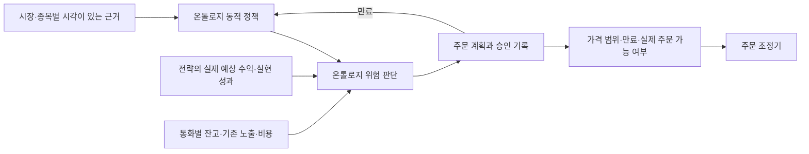

# 온톨로지 위험 판단 통합

운영 경로의 위험 판단은 `app.ontology.risk_authority`에서 한 번 수행한다. `RiskManager`는 기존 호출부와의 호환을 위한 진입점이며, 온톨로지 정책이 주입되면 이 판단기로 위임한다. 과거 재현과 별도 API를 위한 정책 미주입 경로는 기존 동작을 유지한다.

- 정책이 손실 예산, 노출 한도, 현금 비중, 비용 대비 요구 수익을 생성한다. 판단기는 실제 정수 수량과 그 수량의 비용을 함께 계산한다. 기존 고정 변동성·유동성 기준, 별도 수익성 심사, Kelly 크기 축소, 원금 보호 심사를 다시 중첩하지 않는다.
- 주문 계획은 허용 가격 범위의 가장 불리한 가격에서 평가한다. 승인 기록은 시장·종목·정책 ID·수량·가격·상품·방향·유효기간을 묶는다. 승인된 계획을 제출할 때 시장 전망이나 수익성을 다시 심사하지 않는다. 만료된 미체결 계획은 같은 선출 단계로 돌아가 갱신한다.
- 실제 주문 직전의 현금, 매도 가능 수량, 중복·진행 중 주문, 거래 가능 시간, 시세 시각, 계좌 상태와 사용자 중지 설정은 실행 계층이 확인한다. 부분 체결 후에는 남은 수량만 사용한다. 최우선 호가로 가격을 바꾸거나 기존 주문을 정정할 때도 최종 제출 가격과 수량은 같은 승인 범위 안에 있어야 한다.
- 한국과 미국의 정책을 합쳐 가장 작은 손실 한도로 전체 시장을 중지하던 경로를 제거했다. 승인 이후의 별도 시장 위험 심사와 손실 재진입 대기 심사도 운영 온톨로지 경로에서 제거했다. 전략 성과에 따른 진입 자격은 선출 전에 결정한다.
- 신규 진입을 막는 넓은 스프레드·불리한 손익비·급변 상태도 기존 포지션의 위험 판단에는 유효한 근거다. 데이터 누락이나 만료와 구별하며, 기존 손실 방어선을 넓히지는 않는다. 조기 청산 확인은 시각이 유효하고 순서가 증가하는 새 관측만 센다.
- 시장 변화 확률이 높아져도 손실이 확인된 전략의 성과 기록을 없애거나 자동으로 재승인하지 않는다. 예측은 같은 시장 문맥과 종목에 속해야 하며 NaN·무한대·미래 시각을 허용하지 않는다. 성과 기록의 시각은 시간대와 무관하게 UTC 순서로 비교한다.
- 일일 거래 횟수는 봇 주문 저널에서 실제 체결 수량이 확인된 현금 롱 진입을 센다. 부분 체결 상태의 반복 조회나 단순 제출은 집계하지 않으며, 정정으로 주문 번호가 바뀌어도 원래 진입에 연결한다. 시장별 현지 날짜와 최초 체결 확인 시각을 사용하며, 계좌 전체의 수동 거래 횟수나 거래소의 실제 체결 시각으로 오인하지 않는다.
- 거래 기록은 메모리 인덱스로 집계한다. 처음 읽는 큰 기록은 호출별 처리 예산 안에서 이어 읽고, 이후에는 추가된 부분만 처리한다. 초기 읽기가 끝나지 않았거나 기록이 불완전하면 거래 횟수를 0으로 간주하지 않고 사용 불가 상태를 전달한다.
- REST 시세 갱신은 요청 완료 후의 신뢰할 수 있는 시각으로 판단한다. 시세가 주장하는 시각으로 현재 시각을 옮기지 않는다. 잔고의 평가 가격을 사용하는 경우에도 계좌를 실제로 수집한 시각을 유지한다.

형식 온톨로지는 `RiskAuthority`, `RiskDecision`, `ApprovedRiskDecision`, `RejectedRiskDecision` 클래스를 사용한다. `OntologyRiskAuthority` 인스턴스와 `decidedBy`, `usesThresholdPolicy`, `decisionForInstrument` 객체 속성으로 판단을 연결한다. 승인 여부·수량·가격·평가 시각·만료 시각은 데이터 속성이다. 승인과 거절 클래스는 서로 배타적이라는 공리를 둔다. RDF 내보내기는 감사용이며 실시간 주문 처리 중 OWL 추론을 다시 실행하지 않는다.

정책 API의 RDF는 시장 근거·임계치·전략 관계를 내보낸다. 개별 주문의 승인 기록은 계획의 `risk_snapshot.ontology_authority`에 보존하며 `decision_receipt_to_rdf`로 별도 내보낼 수 있다. 두 그래프는 동일한 정책 ID로 연결된다.

시간외 거래의 낮은 유동성과 큰 변동성 때문에 시간대 자체보다 실제 호가·스프레드·관측 시각을 정책 근거로 사용한다. [FINRA의 시간외 거래 설명](https://www.finra.org/investors/insights/extended-hours-trading). 손절 기준 도달과 실제 체결 가격은 별개이므로, 손실 예산은 체결 손실의 보증값이 아니다. [SEC Investor.gov의 주문 유형 설명](https://www.investor.gov/introduction-investing/investing-basics/how-stock-markets-work/types-orders).

검증은 동일 승인에 대한 이중 심사가 없는지, 가격·수량·만료 범위가 지켜지는지, 불리한 최신 근거가 청산에 반영되는지, 두 시장 판단이 섞이지 않는지에 초점을 둔다. 단위·통합 테스트 통과는 수익성 입증과 구분하며 실제 주문이나 운영 모델 승격을 검증 수단으로 사용하지 않는다.
