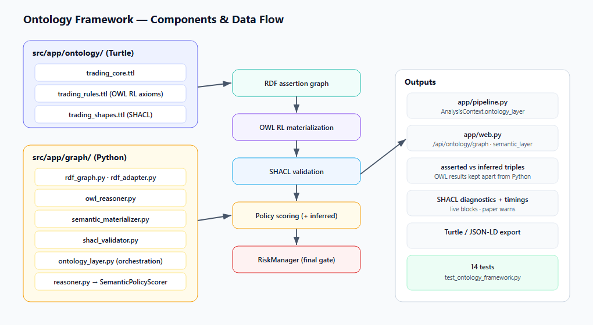

# Ontology Standardization Report

## Current Runtime Contract

As of the current `run.ps1` entry point, the system is a guarded KIS live-capable realtime runtime. KIS realtime collection, read-only account probing, periodic live short-horizon training, and the independent realtime trading loop can start automatically. Numeric ontology/candidate evidence scoring requests OpenVINO `NPU` and falls back to CPU when unavailable; final action selection, graph explanations, risk checks, order gating, idempotency, and broker submission remain deterministic CPU-controlled paths. NPU output is evidence, not trade authorization.

Conversion of the custom in-memory triple ontology into a standards-based RDF/RDFS/OWL framework with
hybrid reasoning (`rdflib` + `owlrl` + `pyshacl`), delivered on branch
`feature/standard-rdf-owl-ontology-framework`.

## Summary of what changed

An **additive** standards-based ontology layer was added alongside the existing custom
`KnowledgeGraph`. The custom graph remains the primary in-memory store consumed by the trading
pipeline and GUI; it is now also projected into an RDF assertion graph, enriched by OWL RL
materialization, validated by SHACL, and represented with formal provenance. The rule-based scorer
was renamed to make its role explicit. **No trading decision, safety gate, cost calculation, or the
RiskManager was changed.**

## Files added

- `src/app/ontology/trading_core.ttl` — RDFS/OWL classes, hierarchy, object/data properties,
  domain/range, disjointness.
- `src/app/ontology/trading_rules.ttl` — OWL 2 RL classification axioms.
- `src/app/ontology/trading_shapes.ttl` — SHACL shapes for operational validation.
- `src/app/ontology/README.md` — namespaces, modeling decisions, inference boundary, extension guide.
- `src/app/graph/rdf_graph.py` — RDF store (`rdflib.Dataset`), stable IRIs, namespace helpers, serialization.
- `src/app/graph/rdf_adapter.py` — `Triple`→RDF, NPU/account evidence, RDF→UI node/edge projection.
- `src/app/graph/owl_reasoner.py` — cached schema loading + OWL RL / RDFS closure.
- `src/app/graph/semantic_materializer.py` — merge + closure, separates inferred triples, timings.
- `src/app/graph/shacl_validator.py` — structured SHACL validation with live/paper modes.
- `src/app/graph/ontology_layer.py` — orchestration + `OntologyLayerResult` for the pipeline/GUI.
- `docs/ontology_migration_audit.md` — audit + old→new vocabulary mapping.
- `docs/ontology_standardization_report.md` — this report.
- `tests/test_ontology_framework.py` — 14 tests (RDF conversion, OWL/SHACL inference, RiskManager preservation).
- `requirements.txt` — runtime dependency mirror.

## Files modified

- `pyproject.toml` — added `rdflib`, `owlrl`, `pyshacl` to base `dependencies`.
- `src/app/graph/reasoner.py` — renamed `OntologyReasoner`→`SemanticPolicyScorer`,
  `OntologyReasoningPolicy`→`SemanticPolicyScorerConfig`; added an `inferred_classes` feature hook;
  kept backward-compatible aliases.
- `src/app/graph/__init__.py` — export new names + aliases.
- `src/app/graph/builders.py` — optional `score_sink` to surface NPU scores/backend for RDF evidence
  (KnowledgeGraph output unchanged).
- `src/app/pipeline.py` — build the additive ontology layer and attach it to `AnalysisContext`.
- `src/app/web.py` — `semantic_layer` payload (asserted vs inferred, OWL vs SHACL, timings, frames) in
  `/api/ontology/graph` and a compact summary in `/api/research/diagnostics`.
- `README.md`, `docs/architecture.md` — documentation.

Untouched safety chain: `src/app/risk/manager.py`, `src/app/risk/principal_protection.py`,
`src/app/cost/trading_cost_engine.py`, `src/app/execution/*`.

## Old ontology design

A custom in-memory list of `Triple(subject, predicate, object, evidence_id)` string tuples
(`KnowledgeGraph`), a rule-based scorer (`OntologyReasoner`) summing support/contradiction/risk weights,
and flat tuples of class/predicate name strings (`ontology.py`). No IRIs, hierarchy, OWL reasoner, SHACL,
SPARQL, named graphs, or formal provenance.

## New RDF/RDFS/OWL design

- Stable IRIs under `tr:` (schema), `res:` (instances), `ev:` (evidence).
- `trading_core.ttl`: `TradingEntity`→`MarketEntity`→`Stock`→`DomesticStock`/`ForeignStock`; candidates,
  order intents (Buy/Sell disjoint), risk-manager decisions (Approved/Rejected disjoint), final order,
  eligibility (Eligible/Forbidden disjoint), data-quality classes; object/data properties with
  domain/range; `supportsSignal`/`contradictsSignal`/`increasesRiskOf`/`decreasesRiskOf` ⊑ `hasSemanticEvidence`.
- Provenance via explicit `tr:EvidenceItem` individuals + per-cycle named graphs (no reification/RDF-star).

## OWL reasoning model used

OWL 2 RL via `owlrl.DeductiveClosure(OWLRL_Semantics)` (optional RDFS-only fast path). Semantic
categorization uses `owl:hasValue` restriction classes declared as subclasses of target categories
(`trading_rules.ttl`); under rule `cls-hv2` + `cax-sco`, asserted `x p v` entails `x a Target`. Class and
property hierarchy inference come from standard RDFS/OWL RL rules. Verified: `DomesticStock`⇒`Stock`⇒
`MarketEntity`; `supportsSignal`⊑`hasSemanticEvidence`; `BuyCandidate`, `TradeForbiddenAsset`,
`SyntheticDataAsset`, `HighVolatilityAsset` classification.

## SHACL validation model used

`pyshacl` with advanced (SPARQL) constraints over the materialized graph. Shapes: `BrokerQuoteShape`
(positive price), `AccountSnapshotShape` (cash + total), `OrderIntentShape` (side/symbol/qty/confidence/
reason), `LiveCandidateShape` (required live fields + source metadata), `FreshQuoteShape` (not stale),
`NoSyntheticLiveDataShape` (not synthetic), `RiskDecisionShape` (not approved-and-rejected),
`FinalOrderShape` (requires RM approval, not principal-protection-blocked). Live-only shapes target
`tr:LiveTradingCandidate`. `mode="live"` blocks; `mode="paper"` warns.

## Why numerical scoring remains in Python

OWL is open-world and not designed for numerical weighting, ranking, or thresholds; encoding scores as
axioms would be brittle, slow, and semantically wrong (missing data ≠ zero). Support/contradiction/risk
scoring, confidence, ranking, short-horizon policy, and net-expected-return interpretation stay in
`SemanticPolicyScorer`; OWL-inferred classes are consumed only as *additional* features.

## How RiskManager is preserved

The ontology layer is advisory: it never generates orders and never authorizes trades. Order intents
still pass the unchanged `TradingCostEngine` → `PrincipalProtectionEngine` → `RiskManager` →
live-readiness chain. A test (`test_ontology_layer_is_advisory_only`) asserts that enabling vs disabling
the RDF layer yields identical intents and RiskManager results, and `test_owl_eligibility_does_not_create_final_order`
asserts OWL never materializes a `FinalOrder`.

## Performance considerations

Schema graph cached by mtime; SHACL shapes lru-cached; materialization scoped to the candidate universe;
per-cycle result computed once and stored on the frozen `AnalysisContext`; timings exposed for RDF build,
OWL materialization, and SHACL validation. In the live runtime the context builds on a background thread,
so requests read cached payloads. `ONTOLOGY_REASONING_PROFILE=rdfs` and `ONTOLOGY_RDF_LAYER=0` provide
cheaper / off options.

## Testing summary

`tests/test_ontology_framework.py` (14 tests, all passing): TTL parse; custom-triple→RDF; Turtle/JSON-LD
round-trip; class-hierarchy and property-hierarchy inference; `hasValue` classification; stale-quote and
synthetic-data live blocking; paper-mode warns without blocking; approved+rejected conflict; policy-scorer
consumption of inferred classes; backward-compatible aliases; RiskManager-preservation invariants. The
pre-existing test suite remains green except for a cluster of RiskManager/TradingCostEngine/investor-flow
tests that fail identically on the base commit (an unrelated, in-progress cost/risk refactor) — confirmed
by stashing this branch's changes and re-running.

## Remaining limitations

- OWL open-world semantics: closed-world constraints must stay in SHACL/Python.
- OWL RL closure adds hundreds of ms per cycle; kept off the tightest tick loop.
- Provenance is per-cycle/in-memory; no persistent cross-session triple store yet.

## Future work

Incremental/delta materialization; a persistent RDF store (RDF4J/GraphDB) for durable provenance;
SPARQL-backed explainability queries; richer SHACL-SPARQL business rules; optional migration of remaining
builders to emit RDF natively rather than via projection.
