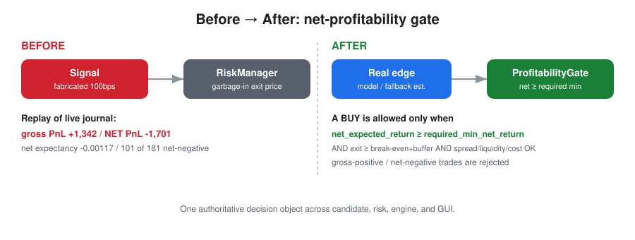

# Profitability Refactor — Phase 0 Fresh Audit

**Status:** grounding document for the unified profitability-centered refactor.
**Method:** direct source inspection (not README). Every claim below carries a `file.py:LINE`
reference to the code as it exists on `main` at commit `4511372`.

> ⚠️ This document describes the system **as it is today**. It proposes no code changes.
> It exists so the refactor is built on verified facts, not assumptions.



---

## 0. Executive summary — the five findings that reshape the plan

1. **There are two independent BUY decision surfaces, and only one is live.**
   - `StrategyCandidateFactory` (`strategy/candidate_factory.py`) computes a *correct*
     cost-aware profitability gate — but it is `paper_only=True` by default
     (`candidate_factory.py:148-149`) and **stops at `OrderIntent`**; it never reaches
     `FinalOrder`, `RiskManager`, or the live engine.
   - `SharedLiveDecisionEngine.evaluate_buy` (`shared_decision_engine.py:238`) is the **live**
     path. It **never calls `TradingCostEngine`** and **fabricates** the expected return
     (`shared_decision_engine.py:600-604, 660`).
   - **Net effect:** the good profitability math is in the code that does *not* trade; the code
     that *does* trade skips it. This is the single most important thing the refactor must fix.

2. **The live BUY expected-return is synthetic, so the downstream cost gate is fed garbage-in.**
   `expected_return_bps` defaults to `100.0` and is floored upward
   (`shared_decision_engine.py:600-604`); `expected_exit_price = price * (1 + gross_expected_return)`
   is therefore *always* ≥ entry (`shared_decision_engine.py:660`). `RiskManager` *does* run cost
   gates for BUY (`manager.py:287-376`), but on this fabricated exit price they are not meaningful.

3. **The `ShortHorizonNpuPredictor` in the spec (Phase 5) is dead relative to the live path.**
   `realtime/short_horizon_npu_predictor.py` is imported nowhere in `src/` except its own test
   (verified by grep). The live predictor used at `shared_decision_engine.py:253,1249` is a
   *different* object. Its private `_fallback_reason` is never surfaced
   (`short_horizon_npu_predictor.py:61,83`). Phase 5 must first identify the *actual* live
   predictor before retargeting anything.

4. **The ontology cannot hard-block a trade by itself — but a hard-block mechanism already exists.**
   `ActionAggregator._select` can only escalate to `HOLD`/`WATCH`
   (`action_aggregator.py:90-97`). The real no-trade enforcement is the `TradeForbidden` ontology
   tag consumed by `RiskManager` (`manager.py:85`), produced by `reasoning_rules.py:79-81` and
   `trading_strategy_semantics.py`. Phase 6 should extend this existing tag mechanism, not invent
   a new one.

5. **Thresholds live in ~70 environment variables (set in `run.ps1`), not in config files, and
   several conflict.** Code defaults and `run.ps1` values disagree (e.g. `REALTIME_HARD_STOP_LOSS`
   code default `0.08` at `shared_decision_engine.py:870` vs `run.ps1` `0.03`). There is **no**
   `config/runtime_profiles/` directory and no unified policy config (grep: zero hits).

---

## 1. Current decision flow (candidate/tick → FinalOrder → KIS)

### 1a. Live BUY path (the one that actually trades)

```
RealtimeTradingEngine.run_once() BUY loop         realtime_trading_engine.py:290-355
  ├─ buy_enabled gate (kill/daily-loss/env)        :227-234, :292-300
  ├─ held-ticker / recent-loss / rebuy cooldowns   :308-319
  ├─ core-session / market-closed / submit cooldown:320-334
  └─ decision_engine.evaluate_buy(...)             :337
       ├─ price/refresh present?                    shared_decision_engine.py:272-275
       ├─ cash for 1 share?                         :323
       ├─ volatility no-trade?                      :445-463
       ├─ model_ok / ontology_ok / fallback gates   :524-559
       ├─ signal_gap vs threshold (LOOSE: -0.18)    :586-597
       ├─ expected_return FABRICATED (100 bps floor):600-604
       ├─ expected_exit_price = price*(1+gross)     :660   ← no cost/break-even basis
       ├─ build OrderIntent                          :646-666
       └─ RiskManager(minimum_cash_reserve=0).validate() :674-676
            ├─ ~30 boolean gates                     manager.py:54-183
            ├─ quantity = floor(spend/last_price)    :189
            ├─ principal_protection_gate             :240-277
            └─ COST GATES (net/target/breakeven/     :287-376
               cost-to-alpha/spread/slippage)        ← fed fabricated exit price
  └─ if approved & final_order: _submit(...)         realtime_trading_engine.py:348-351
       └─ coordinator.submit_final_order(order)       live_execution_coordinator.py:41
            ├─ validate (LIMIT, qty>0, price>0)       :214-224
            ├─ idempotency                            :43-57
            ├─ preflight: live gates + KIS health     :59-62
            └─ broker.place_limit_order(order)        :64-91  ← actual KIS call
```

**Live-runtime safety gate** (`live_runtime_guard.py:98-100`): requires
`LIVE_TRADING_ENABLED`, `KIS_LIVE_ENABLED`, `KIS_PAPER_TRADING=false`,
`LIVE_ORDER_SUBMIT_ENABLED`, `KILL_SWITCH_ENABLED=false` plus a valid, unexpired arming file
`config/secrets/live_trading_armed.json` (TTL 900 s). Before arming, `submit` raises
`LiveExecutionBlocked`. **`scripts/arm_live_trading.py` is live-trading arming — not ARM/Raspberry
Pi support.**

### 1b. Live SELL / exit path

```
RealtimeTradingEngine.run_once() SELL loop         realtime_trading_engine.py:257-285
  └─ decision_engine.evaluate_exit_for_holding(...)  :257
       ├─ pnl_rate = (price-avg_cost)/avg_cost       shared_decision_engine.py:766
       ├─ cost floor via TradingCostEngine().estimate _exit_cost_floor :1139  ← cost engine IS used here
       ├─ profitable_after_cost gate                 :814
       ├─ EXIT PRECEDENCE (first match wins)         :923-1001  (see §3b)
       └─ RiskManager.validate() → FinalOrder        :1083
  └─ _amend_open_sell / _submit                       :270-285, :407-465
```

### 1c. Paper-only candidate path (correct math, never trades live)

```
StrategyCandidateFactory.build()                    candidate_factory.py:145  (paper_only=True :148)
  └─ _rank_or_filter()                               :212
       └─ cost_engine.estimate()                     :222   ← real cost breakdown
            └─ hard rejects on net/breakeven/cost/   :217-244
               spread/liquidity
  └─ RankedStrategyCandidate.to_order_intent()       :66-108  → OrderIntent  (STOPS HERE)
```

---

## 2. Where each profitability concept is computed today (inventory)

| Concept | Live BUY (`shared_decision_engine`) | Exit (`shared_decision_engine`) | Factory (`candidate_factory`) | Cost engine (`trading_cost_engine`) |
|---|---|---|---|---|
| gross expected return | **fabricated** :600-604 | via cost floor | `cost.gross_expected_return` | `:116` |
| net expected return | **not computed** | `net_pnl_rate` :840 | `cost.net_expected_return` :248 | `:139` |
| break-even price/rate | **not computed** | `required_exit_price` :812 | `cost.break_even_return` :237 | `:129-135` |
| all-in cost rate | **not computed** | `round_trip_cost_rate` :839 | via cost | `:124-125` |
| cost-to-alpha ratio | **not computed** | — | `:239` | `:140` (uses `abs()`) |
| spread | `spread_bps` :407 | — | `spread_rate` :241 | `:248-249` (empty book → `1.0`) |
| liquidity score | `log1p(adtv)` :404 | — | clamped feature :286 | — |

**Three different liquidity-score definitions, three target-net-return sources, and inconsistent
spread units (rate vs bps)** — see §4.

---

## 3. Thresholds, exits, and loss-exit gating (as actually run)

### 3a. Effective values (code default → `run.ps1` override)

| Env var | Code default | `run.ps1` | Meaning |
|---|---|---|---|
| `REALTIME_TAKE_PROFIT` | 0.0025 | (unset) | engine take-profit → adaptive |
| `REALTIME_STOP_LOSS` | 0.010 | (unset) | engine stop → adaptive `dynamic_stop` |
| `REALTIME_QUICK_TAKE_PROFIT_NET` | 0.008 | **0.012** | quick net TP |
| `REALTIME_MIN_NET_PROFIT_EXIT` | 0.004 | **0.008** | min net profit to time-exit |
| `REALTIME_STOP_LOSS_NET` | 0.0 (off) | **0.004** | net tight stop |
| `REALTIME_HARD_STOP_LOSS` | 0.08 | **0.03** | gross hard stop |
| `REALTIME_EMERGENCY_STOP_LOSS` | 0.05 | **0.035** | emergency stop |
| `REALTIME_PROFIT_LOCK_ARM_NET` | 0.010 | **0.012** | profit-lock arm |
| `REALTIME_PROFIT_LOCK_GIVEBACK` | 0.35 | **0.30** | trailing giveback |
| `REALTIME_ALLOW_LOSS_EXIT` | false | false | master loss-exit switch |
| `REALTIME_BLOCK_SELL_BELOW_BREAKEVEN` | false | **true** | block below-BE sells |
| `REALTIME_SMALL_ACCOUNT_MODE` | false | **true** | small-account posture |
| `REALTIME_SMALL_ACCOUNT_EQUITY_KRW` | 300000 | 300000 | small-account ceiling |
| `REALTIME_BUY_WEIGHT` | 0.01 | **0.003** | per-order weight |
| `REALTIME_MIN_BUY_NET_RETURN_KR` | — | **0.008** | KR min buy net return |
| `REALTIME_MIN_BUY_NET_RETURN_US` | — | **0.012** | US min buy net return |

### 3b. Exit precedence (first match wins) — `shared_decision_engine.py:923-1001`

1. take-profit amount (KRW 20 / USD 0.05) :923
2. quick take-profit (net ≥ threshold) :926
3. profit-lock trailing (armed at peak, gives back fraction) :929-937
4. profit time-exit :938-948
5. ontology-strong profit exit (`ontology_score ≤ -0.55`, net+) :949
6. routine profit exit :953
7. net stop (only if `STOP_LOSS_NET>0`) :957 — fires regardless of `allow_loss_exit`
8. hard stop (`pnl ≤ -HARD_STOP_LOSS`) :962 — fires regardless of `allow_loss_exit`
9. **else if `pnl ≤ -stop_loss` and not `allow_loss_exit` → HOLD (blocked)** :967
10. domestic-emergency / loss / drawdown-reduce / concentration / trailing — all require `allow_loss_exit` :972-981
11. time-exit only if profitable :982-986
12. ontology invalid-signal exit only if profitable; else HOLD :987-989

### 3c. When a losing position CAN / CANNOT exit (current defaults)

- **CAN:** `STOP_LOSS_NET>0` breached; OR `pnl ≤ -HARD_STOP_LOSS`; OR `ALLOW_LOSS_EXIT=true`
  and a domestic-emergency/reduce/trailing trigger fires.
- **CANNOT:** `pnl ≤ -stop_loss` with `ALLOW_LOSS_EXIT=false` and no hard/net stop
  (`LOSS_EXIT_DISABLED`, :967); OR `BLOCK_SELL_BELOW_BREAKEVEN=true` and not hard/emergency and
  not profitable-after-cost (:1013); OR small-account 1-share loss block (:876); OR unprofitable
  ontology sell (:989).
- **With `run.ps1` defaults** (`ALLOW_LOSS_EXIT=false`, `STOP_LOSS_NET=0.004`,
  `HARD_STOP_LOSS=0.03`): a net loss ≥ 0.4% *can* trigger the net stop; otherwise the position is
  held until the 3% hard stop. This is the "trap losing positions" risk the spec calls out — it is
  real but partially mitigated by `STOP_LOSS_NET=0.004`.

---

## 4. Inconsistencies & duplications (the refactor's target list)

| # | Issue | Locations |
|---|---|---|
| 1 | `max_cost_to_alpha_ratio` has 3 values (0.5 / 1.0 / 0.5-unused) | `candidate_factory.py:39`; `trading_cost_engine.py:34,224` |
| 2 | `safety_margin` default 0.0001 vs 0.001 (10×) | `trading_cost_engine.py:32,223`; `candidate_factory.py:323` |
| 3 | slippage default 0.00005 vs 0.0005 (10×) | `trading_cost_engine.py:29,208` |
| 4 | target-net-return has 3 sources | `candidate_factory.py:38`; `trading_cost_engine.py:35`; `shared_decision_engine.py:782` |
| 5 | max-spread in rate vs bps, TCE gate value unused | `candidate_factory.py:41`; `trading_cost_engine.py:36`; `shared_decision_engine.py:179-181` |
| 6 | net-edge polarity differs: factory strict `>target`, live allows `signal_gap ≥ -0.18`, TCE only `>0` | `candidate_factory.py:235`; `shared_decision_engine.py:586-589`; `trading_cost_engine.py:146` |
| 7 | buy vs exit use different price bases (fabricated vs cost break-even) | `shared_decision_engine.py:604,660` vs `:812` |
| 8 | liquidity score computed 3 ways | `candidate_factory.py:286`; `shared_decision_engine.py:404,408` |
| 9 | two take-profit systems (0.0025 adaptive vs 0.008/0.012 net) | `realtime_trading_engine.py:73`+`adaptive_exit_policy.py:78` vs `shared_decision_engine.py:856` |
| 10 | ≥4 overlapping stop concepts, `stop_loss=0.010` effectively inert | `shared_decision_engine.py:816,864,870,967` |
| 11 | `TradingCostEngine` gate config (`max_cost_to_alpha_ratio` etc.) never referenced inside `estimate()` — dead config | `trading_cost_engine.py:143-150` |
| 12 | small-account 300000 literal duplicated | `manager.py:193`; `shared_decision_engine.py:872` |

---

## 5. GUI gap analysis (Phase 7 target)

| Panel | Present? | Evidence |
|---|---|---|
| realized PnL (broker gross) | ✅ | `account_dashboard.js:55`; `web.py:2206-2216` |
| realized PnL **after estimated costs** | ❌ | no cost-netting label anywhere |
| unrealized / total PnL | ✅ | `account_dashboard.js:54,96-97` |
| break-even price | ❌ | only graph node labels `web.py:6545-6546` |
| expected net return | ⚠️ computed server-side, **no UI consumer** | preview endpoint `web.py:2442` uncalled |
| cost breakdown (fee/tax/slippage/spread/impact) | ❌ | trades table drops fee/tax cols `web_account_routes.py:169` |
| expectancy / win-rate / payoff | ❌ | tokens absent from all UI code |
| rejection reasons | ⚠️ raw codes on account/main; Korean text only on kiosk | `account_dashboard.js:210-221`; `web.py:2836-2852,8661-8686` |
| NPU/model provider & fallback | ✅ main dashboard only | `web.py:7531-7549`, `/api/realtime/runtime` |
| data freshness / synthetic warnings | ✅ freshness / ❌ synthetic | `account_dashboard.py:122,425-435`; `web.py:846` |
| armed/disarmed | ⚠️ partial, no button | `web.py:2058-2069,8651-8658` |

**Opportunity:** the `/api/.../preview-order` endpoint already returns a full `cost.as_dict()`
(`web.py:2442`) that no front-end consumes. Much of Phase 7 is *surfacing existing data*, not
computing new data.

---

## 6. Config & runtime-profile state (Phases 8 / config)

- Trading thresholds live **only** in env vars (~70, set in `run.ps1`), not config files.
- JSON config: `trading_costs.json`, `principal_protection.json`, `live_trading_safety.json`
  (`minimum_expected_net_return_bps=10`, `require_manual_arming=false`), `order_execution.json`.
- YAML config: `short_horizon_strategies.yaml` (per-theory `target_net_return`, `max_spread_rate`,
  `max_cost_to_alpha_ratio`, `min_liquidity_score`; `execution.default_mode=paper_trading`).
- **No `config/runtime_profiles/` directory.** `run.ps1` is Windows/Intel-NPU only
  (`Get-NetTCPConnection`, `OPENVINO_DEVICE=NPU`). A Raspberry Pi counterpart exists at
  `packaging/raspberrypi/run.sh`.
- Doc gap: `docs/live_trading_setup.md:82-88` implies manual arming is enforced, but
  `require_manual_arming=false` in `live_trading_safety.json:22` means it is **not** enforced under
  default `run.ps1`.

---

## 7. Gap analysis vs the 10-phase plan

| Phase | Spec assumption | Reality | Adjustment needed |
|---|---|---|---|
| 1 ProfitabilityGate | "checks fragmented" | correct; **live BUY has none** | Build gate; wire into **live** `evaluate_buy`, not just factory |
| 2 DynamicExitPolicy | "scattered fixed exits" | correct; `adaptive_exit_policy.py` already dynamic-ish | Consolidate the 12 threshold sources; don't discard adaptive logic |
| 3 ExecutionQuality | "add layer" | coordinator has **zero** market-quality checks | Greenfield; safe to add |
| 4 Position sizing | "fixed weight" | weight × multipliers exist; no Kelly | Add `position_sizing.py`; feed from gate expectancy |
| 5 NPU retarget | "predictor falls back" | audited predictor is **dead code** | First find the *live* predictor; correct the premise |
| 6 Ontology no-trade | "only BUY votes" | `TradeForbidden` tag mechanism **already exists** | Extend existing tags, not new nodes from scratch |
| 7 GUI | "must add panels" | much data exists but **unconsumed** | Surface `preview-order`/cost data; add expectancy calc |
| 8 Runtime profiles | "confusing ARM" | no profiles dir; Pi script exists | Add `config/runtime_profiles/`; document arming vs ARM |
| 9 Tests | — | test dir exists | Add gate/exit/sizing unit + integration tests |
| 10 Docs | — | docs mostly accurate, arming gap | Fix arming doc; add new-component docs |

---

## 8. Recommended sequencing & risk notes

1. **Phase 1 first, and make it the spine.** The highest-leverage, highest-risk change is routing
   the *live* `evaluate_buy` through a real `ProfitabilityGate` fed by `TradingCostEngine` with a
   *real* `expected_exit_price` (from the live predictor, §finding-3). Everything else depends on
   this. Ship it behind a feature flag with paper-mode parity so it can be validated before arming.
2. **Do not remove existing safety gates before the replacement is proven** (spec constraint). The
   `signal_gap ≥ -0.18` and fabricated-return behaviors must be replaced by strict net-edge logic,
   but keep the old path togglable during validation.
3. **Unify thresholds into config, but preserve env-var backward compatibility** and log resolved
   values (spec Phase 2 requirement) — the 12 conflicts in §4 must resolve to one logged source.
4. **Phase 5 needs a discovery step** before any retargeting: identify the live predictor object
   at `shared_decision_engine.py:253,1249`.
5. **Validation is the acceptance criterion**, not trade count: build the before/after replay
   report (Phase 9) on real `logs/live-orders.jsonl` and paper logs.

---

*End of Phase 0 audit. No source files were modified in producing this document.*
